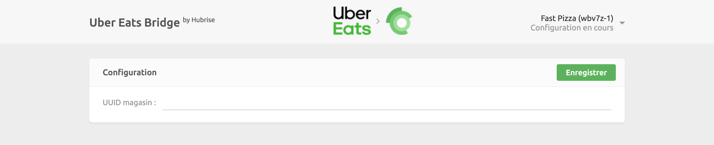

La connexion d'Uber Eats à HubRise s'effectue en quelques étapes simples. Vous pouvez connecter deux types de boutiques Uber Eats, en fonction de vos besoins :

- Votre restaurant hébergé sur la plateforme principale d'Uber Eats, accessible sur www.ubereats.com
- Votre boutique en ligne personnalisée sur Uber Eats, identifiable par une URL commençant par www.order.store

---

**REMARQUE IMPORTANTE :** Si vous ne possédez pas encore de compte HubRise, rendez-vous sur la [page d'inscription à HubRise](https://manager.hubrise.com/signup). L'inscription ne prend qu'une minute !

---

## 1. Activez HubRise dans Uber Eats

---

**REMARQUE IMPORTANTE :** Si vous avez une boutique en ligne personnalisée sur Uber Eats (URL commençant par www.order.store), assurez-vous d'avoir lu notre [FAQ](/apps/uber-eats/faqs/connect-webstore) avant de continuer.

---

Dans un premier temps, l'intégration de HubRise doit être activée sur votre compte Uber Eats.

Contactez-nous à support@hubrise.com en fournissant les informations suivantes :

- Le lien URL vers la page de votre restaurant sur le site Uber Eats. Exemple : https://www.ubereats.com/fr/store/sushik-pizza/nzisHcL5S6C5ODzz0D3EnA.
- Le nom et l'identifiant de votre point de vente HubRise. Exemple : `Fast Pizza Paris z6q31-0`.
- Le mode d'acceptation des commandes que vous souhaitez utiliser pour votre restaurant : `Manual accept` (acceptation manuelle) ou `Offered state` (état proposé). Pour plus de détails, voir notre [FAQ](/apps/uber-eats/faqs/send-orders-to-epos-without-tablet).

Avec ces informations en main, nous demanderons à l'assistance Uber Eats d'activer la connexion HubRise pour votre restaurant et de fournir l'UUID du magasin Uber Eats, par exemple : dc638853-bff1-411c-adba-8aa4d7abddd2\`.

## 2. Connectez Uber Eats Bridge

Maintenant que vous disposez de votre UUID de restaurant Uber Eats, vous pouvez connecter Uber Eats Bridge :

1. Connectez-vous à votre [compte HubRise](https://manager.hubrise.com).
2. Dans le menu déroulant, sélectionnez le point de vente que vous souhaitez connecter.
3. Sélectionnez **CONNEXIONS**, puis **Voir les apps disponibles**.
4. Dans la liste des apps, sélectionnez **Uber Eats**.
5. Cliquez sur **Connecter**.
6. Cliquez sur **Autoriser** pour autoriser Uber Eats Bridge à accéder à votre point de vente enregistré sur HubRise. Si votre compte possède plusieurs points de vente, développez **Choisissez le point de vente**, sélectionnez le point de vente à connecter, puis cliquez sur **Autoriser**.
7. Sur une nouvelle page, vous êtes invité à indiquer votre UUID de restaurant Uber Eats. Saisissez l'UUID de votre restaurant, puis cliquez sur **Enregistrer** pour terminer le processus de connexion.

## 3. Configurez vos préférences

Une fois la connexion du bridge effectuée, vous devez renseigner quelques paramètres sur la page **Configuration** afin que les commandes soient transmises correctement à votre logiciel de caisse.

Pour plus d'informations sur la page Configuration et la manière d'y accéder, voir [Page de configuration](/apps/uber-eats/user-interface#configuration). Pour plus de détails sur la configuration des paramètres d'Uber Eats Bridge, voir [Configuration](/apps/uber-eats/configuration).

## 4. Associez les codes ref des produits

La plupart des applications ont besoin des codes ref des produits pour que les commandes soient correctement traitées. Pour savoir comment associer les codes ref sur Uber Eats, voir [Associer les codes ref](/apps/uber-eats/map-ref-codes).

## 5. Testez la réception des commandes

Avant de commencer à recevoir des commandes réelles, nous vous recommandons de tester l'ensemble du flux d'intégration.

Passez quelques commandes sur votre restaurant Uber Eats, afin de vous assurer qu'elles sont bien reçues dans votre logiciel de caisse, puis annulez-les pour en obtenir le remboursement. Vous aurez ainsi l'assurance que votre restaurant est prêt à être mis en ligne.

Vous pourrez également, si vous le souhaitez, abandonner votre tablette Uber Eats en passant à une intégration directe.
Pour plus de détails, voir [Puis-je recevoir les commandes directement sur mon logiciel de caisse sans utiliser les tablettes Uber Eats ?](/apps/uber-eats/faqs/send-orders-to-epos-without-tablet)

Si vous rencontrez des difficultés durant ces tests, contactez-nous à l'adresse : support@hubrise.com.
