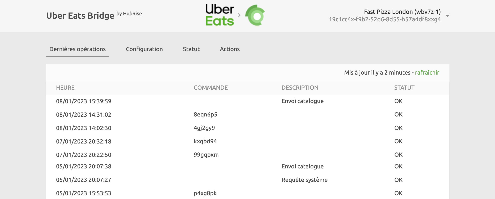
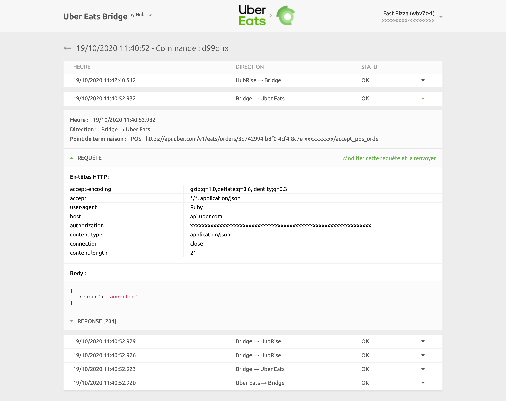

Sur la page principale d'Uber Eats Bridge, vous pouvez consulter les requêtes d'API échangées entre HubRise et Uber Eats, et accéder à la page de configuration de l'intégration.

## Page des opérations

La page principale affiche les dernières opérations d'API échangées entre HubRise, Uber Eats et Uber Eats Bridge.

Ces opérations peuvent soit être liées à une commande spécifique, soit être des requêtes système génériques exécutées par Uber Eats Bridge.

Chaque ligne de cette page affiche les informations relatives à une opération :

- **HEURE** : date et heure de la commande.
- **COMMANDE** : identifiant de la commande HubRise, pour les opérations de commande.
- **STATUT** : statut de la commande. La valeur OK indique que la commande a été envoyée avec succès. Dans le cas contraire, un message explique le type de l'erreur qui est survenue.

Le libellé "Requête système" indique que l'opération n'est pas liée à une commande spécifique.

En cliquant sur une ligne, vous ouvrez une nouvelle page affichant les requêtes d'API associées à l'opération.

## Page de commande

En cliquant sur une opération de commande, vous accédez aux requêtes d'API échangées entre HubRise et Uber Eats pour cette commande.

Les requêtes sont classées par ordre chronologique inverse, et les requêtes liées au même événement de commande (commande reçue, commande annulée, etc.) sont regroupées visuellement.

Chaque ligne de requête d'API contient les informations suivantes :

- **HEURE** : date et l'heure d'envoi de la requête.
- **DIRECTION** : applications qui envoient et reçoivent la requête, selon le format Origine → Destination.
- **STATUT** : statut de la requête. La valeur OK indique que la requête a été reçue avec succès. Dans le cas contraire, un message explique le type de l'erreur qui est survenue.

Cliquez sur une requête pour la développer et révéler le détail des échanges.

Les requêtes d'API sont un bon outil de débogage en cas d'incident. Pour comprendre comment lire ces requêtes, voir [Comprendre les logs HubRise (en anglais)](/docs/hubrise-logs/).

## Page de requête système

La mise en page est identique à celle d'une page de commande.

Les requêtes système sont généralement envoyées par Uber Eats Bridge pour informer HubRise d'une modification de la configuration, ou pour mettre à jour l'interface utilisateur. À titre d'exemple, l'image suivante illustre une requête de mise à jour du callback d'Uber Eats Bridge après un changement de configuration.

Les pages de requête système fournissent des informations de débogage utiles aux équipes d'assistance, mais elles sont généralement peu utiles pour les autres utilisateurs.

## Langue et navigation

Dans le coin supérieur droit de la page principale, vous pouvez cliquer sur la flèche <InlineImage width="20" height="20"></InlineImage> pour développer le menu. De là, vous pouvez alterner l'affichage de la page en anglais ou en français.

Pour revenir à la page principale, cliquez sur les logos d'Uber Eats et de HubRise en haut de n'importe quelle page d'Uber Eats Bridge.

## Page de configuration

Pour accéder à la page de configuration d'Uber Eats Bridge, cliquez sur la flèche <InlineImage width="20" height="20"></InlineImage> dans le coin supérieur droit de la page pour développer le menu, puis cliquez sur **Configuration**.

Cette page vous permet de personnaliser le comportement d'Uber Eats Bridge. Pour plus de détails, voir [Configuration](/apps/uber-eats/configuration).
