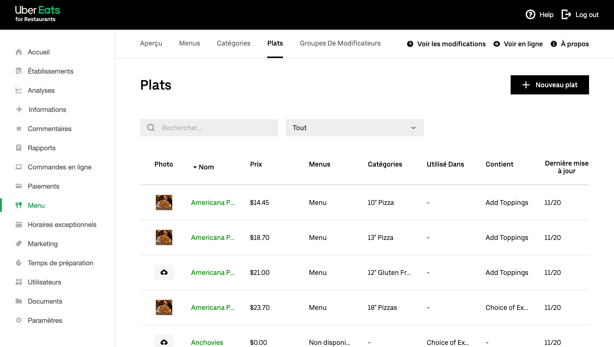
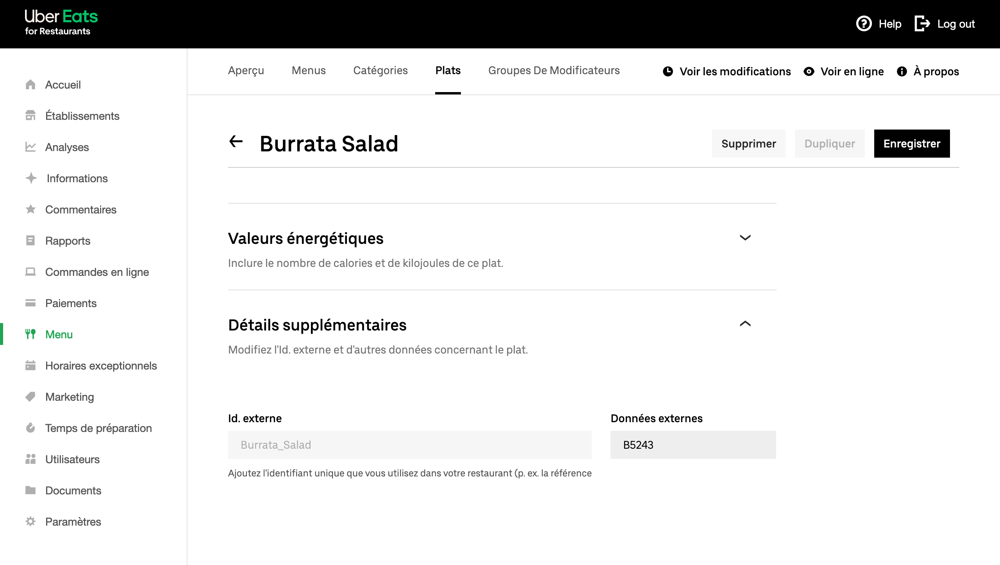

Pour traiter correctement les commandes, la plupart des logiciels de caisse exigent un code ref pour chaque produit. Lorsque vous créez votre menu sur Uber Eats, vous devez donc vous assurer que chaque produit est associé à un code ref correct.

Pour attribuer des codes ref à vos produits Uber Eats, procédez comme suit :

1. Connectez-vous à votre [back-office Uber Eats](https://restaurant.uber.com).
2. Si vous n'avez qu'un seul restaurant Uber Eats, sélectionnez **Menu** dans le menu de gauche. Si vous en avez plusieurs, choisissez le bon dans le menu déroulant, puis sélectionnez **Menu**.
3. Dans le menu du haut, sélectionnez **Plats**.
   
4. Cliquez sur le produit ou l'option que vous souhaitez modifier dans la liste des plats, puis faites défiler la page vers le bas.
5. Cliquez sur la section **Détails supplémentaires** pour la développer.
   
6. Saisissez le code ref dans le champ **Données externes**.
7. Cliquez sur **Enregistrer** pour revenir à la liste des plats.

Répétez cette procédure pour chacun de vos plats.

Notez que les éléments sous l'onglet **Groupes De Modificateurs** comportent également un champ **Données externes**. Il n'est cependant pas nécessaire d'indiquer de valeur puisqu'elle ne sera pas envoyée à votre logiciel de caisse.

## SKU

Les SKU dans HubRise sont des variantes d'un même produit, comme la taille d'une pizza.

Les menus Uber Eats ne prennent pas nativement en charge les variantes, mais vous pouvez utiliser des modificateurs pour créer un produit avec variantes. Consultez pour cela notre guide détaillé [Comment créer un produit avec variantes dans Uber Eats ?](/apps/uber-eats/faqs/create-product-with-skus)

## Promotions

Les menus Uber Eats ne prennent pas nativement en charge les promotions, par exemple une combinaison pizza + boisson à un tarif promotionnel.

Cependant, vous pouvez utiliser des modificateurs avec une structure spécifique afin de créer un produit qui fonctionne comme une promotion. Consultez pour cela notre guide détaillé [Comment créer une promotion dans Uber Eats ?](/apps/uber-eats/faqs/create-deal-in-uber-eats)

## Notes de préparation

Les notes de préparation sont des commentaires que les clients peuvent ajouter à certains produits lorsqu'ils passent une commande. Il s'agit généralement d'instructions de cuisson.

---

**REMARQUE IMPORTANTE :** Les notes de préparation sont automatiquement désactivées sur votre restaurant Uber Eats lorsque vous vous connectez à HubRise.

---

HubRise prend en charge les notes de préparation, mais ce n'est pas le cas de tous les logiciels de caisse et intégrations. Afin d'éviter une expérience client négative liée au fait que les notes de préparation ne sont pas envoyées à votre logiciel de caisse, celles-ci sont automatiquement désactivées lorsque vous connectez pour la première fois votre restaurant Uber Eats à HubRise.

Si vous comptez sur ces avis pour les instructions de préparation ou de présentation (par exemple "Cuisson à point" ou "Couper en tranches"), vous devez ajouter les articles correspondants dans votre logiciel de caisse, puis les inclure en tant qu'options dans le menu Uber Eats. Ils seront ainsi correctement encodés.

Toutefois, si votre logiciel de caisse prend en charge les notes de préparation, ou si vous disposez d'un autre moyen de les consulter (par exemple depuis votre tablette Uber Eats), vous pouvez demander au service d'assistance Uber Eats de les réactiver sur votre restaurant.
