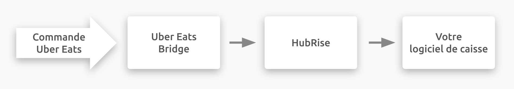

## Description

Uber Eats est une plateforme de commande et de livraison de repas en ligne appartenant à Uber Technologies, Inc.
Elle est présente dans plus de 30 pays.

Uber Eats se connecte à votre compte HubRise via Uber Eats Bridge, une application développée par HubRise.

## Fonctionnalités de l'intégration

Connecter Uber Eats Bridge permet à HubRise de :

- Recevoir les commandes d'Uber Eats, dont le statut de commande.
- Recevoir les informations clients d'Uber Eats, pour les commandes livrées par le restaurant.
- Envoyer un catalogue vers Uber Eats, avec support des variantes.
- Récupérer un catalogue depuis Uber Eats.
- Synchroniser l'inventaire avec HubRise.

Uber Eats Bridge permet de recevoir les commandes avec la tablette Uber Eats éteinte.

Uber Eats Bridge peut être connecté à HubRise depuis le back-office de HubRise.

## Pourquoi se connecter ?

La connexion de votre restaurant Uber Eats à HubRise vous permet de recevoir les commandes Uber Eats directement dans votre logiciel de caisse connecté à HubRise.
Vous pouvez ainsi gérer les commandes Uber Eats en toute transparence à partir de votre configuration existante, comme vous le feriez pour toutes les autres commandes.

Avec HubRise, synchronisez votre menu, vos informations clients et vos commandes avec votre solution de commande en ligne, les plateformes de livraison de repas (dont Deliveroo, Uber Eats et Just Eat), les solutions de gestion de livreurs, les services de livraison, les solutions d'e-marketing (SMS/e-mailing) et de business intelligence, les systèmes de gestion de stock et de fidélisation client, et bien plus encore. Le nombre d'applications compatibles augmente chaque mois. Pour voir les applications que vous pouvez connecter, consultez notre [page Apps](/apps).

## Prérequis

Pour permettre la connexion entre Uber Eats et HubRise, votre restaurant doit être partenaire d'Uber Eats.
