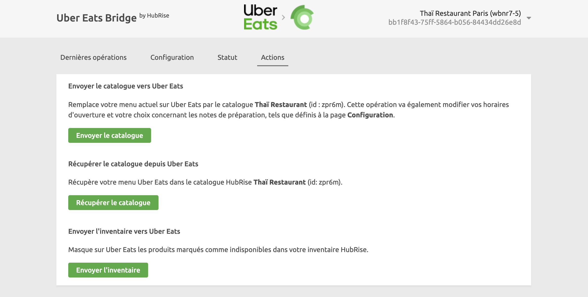

Avec Uber Eats Bridge, vous pouvez envoyer votre catalogue HubRise vers votre restaurant Uber Eats en un seul clic.

Vous pouvez également configurer le bridge de manière à envoyer votre catalogue vers Uber Eats à chaque fois qu'il est modifié sur HubRise. Pour plus d'informations, voir [Catalogue](/apps/uber-eats/configuration#catalog).

Cette page explique comment envoyer votre catalogue et quelles informations sont envoyées à Uber Eats.

## Alimenter un catalogue HubRise

Pour mettre à jour votre menu Uber Eats, vous devez préalablement avoir un catalogue dans HubRise. De nombreuses applications connectées à HubRise, par exemple les logiciels de caisse, les solutions de commande en ligne et les plateformes de livraison de reps offrent la possibilité d'envoyer leur menu dans HubRise. Pour le vérifier, reportez-vous à la documentation de votre application sur la [page Apps](/apps) de HubRise.

Vous pouvez aussi alimenter un catalogue HubRise en récupérant un menu depuis un restaurant Deliveroo ou Uber Eats existant. Pour plus d'informations, consultez ces liens :

- [Récupérer le catalogue depuis Deliveroo](/apps/deliveroo/pull-catalog)
- [Récupérer le catalogue depuis Uber Eats](/apps/uber-eats/pull-catalog)

## Envoi manuel du catalogue

Une fois que votre catalogue a été alimenté dans HubRise, vous pouvez l'envoyer manuellement vers votre restaurant Uber Eats en suivant ces étapes :

1. Connectez-vous à votre [compte HubRise](https://manager.hubrise.com).
2. Sélectionnez le compte HubRise et le point de vente connecté à votre restaurant Uber Eats.
3. Ouvrez la page **CONNEXIONS**, puis sélectionnez **Uber Eats Bridge** dans la liste des applications connectées.
4. Dans Uber Eats Bridge, sélectionnez l'onglet **Actions**, vérifiez le nom et l'ID du catalogue HubRise, puis cliquez sur **Envoyer le catalogue**.
5. Vérifiez votre menu Uber Eats en ligne.

---

**REMARQUE IMPORTANTE :** L'envoi d'un catalogue met également à jour vos paramètres Uber Eats **Horaires d'ouverture** et **Notes de préparation**, tels que définis sur la page **Configuration**. Avant d'envoyer le catalogue, assurez-vous qu'ils sont corrects.

---

## Envoi automatique du catalogue

Uber Eats Bridge peut envoyer automatiquement votre catalogue à Uber Eats à chaque fois qu'il est mis à jour sur HubRise. Par défaut, cette option est désactivée. Vous pouvez l'activer en suivant ces étapes :

1. Connectez-vous à votre [compte HubRise](https://manager.hubrise.com).
2. Sélectionnez le compte HubRise et le point de vente connecté à votre restaurant Uber Eats.
3. Ouvrez la page **CONNEXIONS**, puis sélectionnez **Uber Eats Bridge** dans la liste des applications connectées.
4. Dans Uber Eats Bridge, sélectionnez l'onglet **Configuration**.
5. Dans la section **Catalogue**, cochez **Activer l'envoi automatique du catalogue**.
6. Cliquez sur **Enregistrer**.

## Informations envoyées à Uber Eats {#information-sent-to-uber-eats}

Les sections suivantes expliquent en détail comment votre catalogue HubRise est associé à Uber Eats.

### Catégories

Uber Eats Bridge associe les catégories HubRise aux catégories Uber Eats. Le nom de la catégorie, son code ref et sa description sont envoyés à Uber Eats. Par défaut, les catégories sont aplaties.

Pour les commerces de détail, le mode deux niveaux peut être activé. Dans ce mode, les catégories principales sont envoyées sous forme de menus, et leurs sous-catégories respectives sont incluses dans chaque menu. Dans Uber Eats, les menus apparaissent comme des catégories principales, de la même manière que des rayons de supermarchés (par exemple, Boissons → Sodas, Bières).

Le mode deux niveaux n'est disponible que pour les commerces de détail. Il doit être activé par le support Uber Eats et activé dans la [Page de configuration](/apps/uber-eats/configuration#category-structure).

### Produits et SKU

Uber Eats Bridge associe les produits à SKU unique et les produits sur Uber Eats, en envoyant les informations suivantes :

- Nom de la SKU
- Code ref de la SKU
- Description
- Images
- Prix
- Options
- Tags indiquant des allergènes

Pour les produits ayant plusieurs SKU, Uber Eats Bridge crée un produit avec un modificateur pour chaque SKU.
Les options sont associées à chaque SKU sous forme de couche supplémentaire de modificateurs.

### Liste d'options et options

Uber Eats Bridge associe les listes d'options et les options sur Uber Eats.

### Promotions

Uber Eats Bridge associe les promotions HubRise et les produits avec modificateurs sur Uber Eats.

### Images

Uber Eats exige que les images soient au format 320x320 pixels.

## Référence technique

Les sections suivantes décrivent en détail comment Uber Eats Bridge associe les catalogues HubRise à Uber Eats.

### Catégories

Pour chaque catégorie, Uber Eats Bridge envoie les champs HubRise suivants à Uber Eats :

- `name` : nom de la catégorie
- `ref` : code ref de la catégorie
- `description` : description de la catégorie

L'ordre d'affichage des catégories et des produits dans HubRise est conservé dans Uber Eats.

### Produits et SKU

Pour chaque [produit](/developers/api/catalogs#products) avec plusieurs SKU, Uber Eats Bridge envoie les informations suivantes à Uber Eats :

- `ref` : la valeur MULTISKU est utilisée pour tous les produits.
- `name` : nom du produit
- `description` : description du produit
- `price` : prix minimum de tous les SKU
- `image` : adresse URL de l'image du produit parent
- `tags` : tags décrivant les caractéristiques et les restrictions du produit, telles que les allergènes ou la saveur épicée. Pour consulter la liste des tags disponibles sur Uber Eats, voir [Tags produit](#product-tags).
- `barcodes` : seul le premier code-barres est envoyé, s'il est présent.

La liste des SKU est associée au produit sous forme de tableau de modificateurs.

Pour chaque objet `sku` dans un produit, Uber Eats Bridge envoie les informations suivantes à Uber Eats :

- `ref` : code ref de la SKU, qui sera transmis dans les commandes
- `name` : nom de la SKU
- `price` : différence éventuelle de prix avec le produit principal
- `option_list_refs` : liste des options rattachées à la SKU

Pour plus d'informations sur les SKU dans le catalogue HubRise, voir [Skus](/developers/api/catalogs#skus) (en anglais).

### Tags produit {#product-tags}

Le tableau ci-dessous répertorie les tags qui peuvent être définis sur les produits.

| Tag                                  | Description                                                                            |
| ------------------------------------ | -------------------------------------------------------------------------------------- |
| `alcoholic`                          | Contient de l'alcool.                                                  |
| `deal_only`                          | Ne peut être commandé que dans le cadre d'une promotion.               |
| `gluten_free`                        | Ne contient pas de gluten.                                             |
| `vegan`                              | Ne contient aucun produit animal.                                      |
| `vegetarian`                         | Ne contient pas de viande.                                             |
| `allergen_celery`                    | Contient l'allergène indiqué.                                          |
| `allergen_crustaceans`               | Contient l'allergène indiqué.                                          |
| `allergen_eggs`                      | Contient l'allergène indiqué.                                          |
| `allergen_fish`                      | Contient l'allergène indiqué.                                          |
| `allergen_gluten`                    | Contient l'allergène indiqué.                                          |
| `allergen_lupin`                     | Contient l'allergène indiqué.                                          |
| `allergen_milk`                      | Contient l'allergène indiqué.                                          |
| `allergen_molluscs`                  | Contient l'allergène indiqué.                                          |
| `allergen_mustard`                   | Contient l'allergène indiqué.                                          |
| `allergen_nuts`                      | Contient l'allergène indiqué.                                          |
| `allergen_peanuts`                   | Contient l'allergène indiqué.                                          |
| `allergen_sesame_seeds`              | Contient l'allergène indiqué.                                          |
| `allergen_soybeans`                  | Contient l'allergène indiqué.                                          |
| `allergen_sulphur_dioxide_sulphites` | Contient l'allergène indiqué.                                          |
| `deposit_cc`                         | Nécessite un acompte. `cc` est un montant en centimes. |

### Options

Pour chaque liste d'options du catalogue, Uber Eats Bridge envoie les informations suivantes à Uber Eats :

- `name` : nom de la liste d'options
- `min_selections` : nombre minimum d'options que les clients peuvent sélectionner
- `max_selections` : nombre maximum d'options que les clients peuvent sélectionner

Pour chaque option d'une liste, Uber Eats Bridge envoie les informations suivantes à Uber Eats :

- `ref` : code ref de l'option
- `name` : nom de l'option
- `price` : prix unitaire de l'option

### Promotions

Pour chaque promotion du catalogue, Uber Eats Bridge crée un produit Uber Eats avec les détails suivants :

- `name` : le nom de la promotion devient le nom du produit.
- `category_ref` : si le champ est vide, Uber Eats Bridge crée une catégorie par défaut dans Uber Eats appelée "Offres".
- `ref` : le code ref de la promotion devient le code ref du produit, précédé de `DEAL-`. Par exemple, pour une promotion avec le code ref `abc123`, Uber Eats Bridge crée un produit Uber Eats avec le plu `DEAL-abc123`.
- `lines` : pour chaque objet du tableau, Uber Eats Bridge crée une liste de modificateurs, avec pour nom `lines.name`.

Par défaut, lorsque les clients commandent une promotion, ils doivent choisir un produit pour chaque ligne de la promotion.

### Disponibilité

À chaque fois que vous envoyez votre catalogue à Uber Eats, vous actualisez également les horaires d'ouverture, suivant les valeurs que vous avez définies sur la [page Configuration](/apps/uber-eats/configuration#location).
