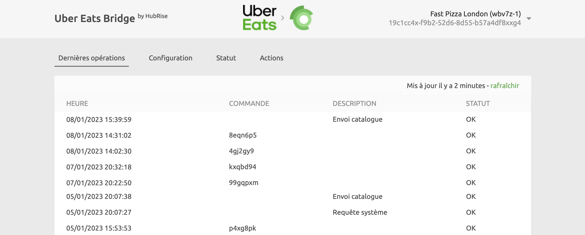
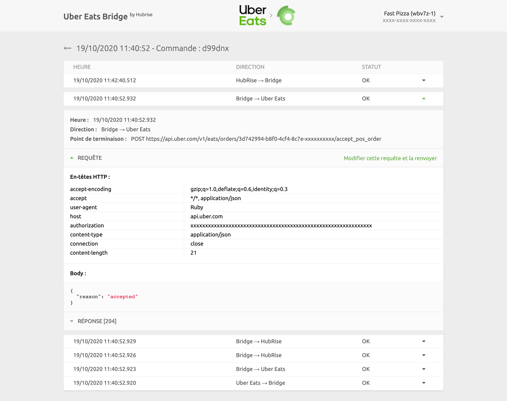
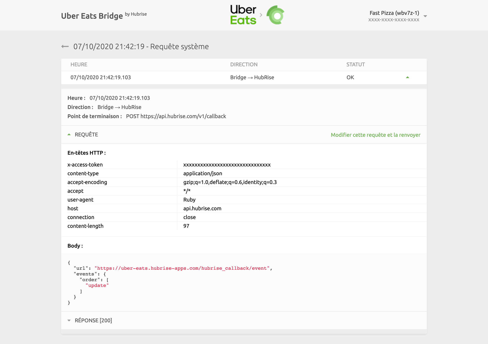
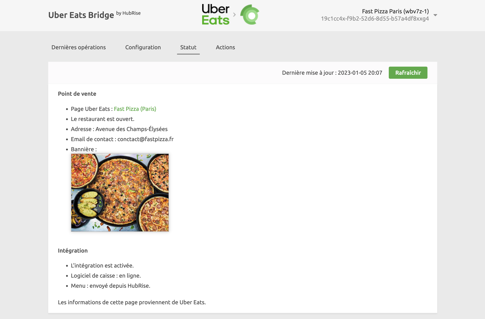

Dans Uber Eats Bridge, vous pouvez consulter les logs de toutes les opérations entre HubRise et Uber Eats, et accéder à la page de configuration de l'intégration.

## Dernières opérations

Il s'agit de la page qui s'affiche lorsque vous ouvrez Uber Eats Bridge. Elle contient les dernières opérations d'API échangées entre HubRise, Uber Eats et Uber Eats Bridge.

Ces opérations peuvent soit être liées à une commande spécifique, soit être des requêtes système génériques exécutées par Uber Eats Bridge.

Chaque ligne de la page affiche les informations relatives à une opération :

- **HEURE** : date et heure de la commande
- **COMMANDE** : identifiant HubRise de la commande, pour les opérations de commande
- **DESCRIPTION** : description facultative pour les opérations qui ne sont pas liées à une commande spécifique. Cette colonne peut être vide, ou afficher `Requête système` ou `Envoi catalogue`.
- **STATUT** : statut de la commande. La valeur `OK` indique que la commande a bien été envoyée. Dans le cas contraire, un code d'erreur s'affiche en rouge.

Le libellé "Requête système" indique que l'opération n'est pas liée à une commande spécifique.

Cliquez sur une ligne pour afficher une page avec les logs associés à l'opération.

### Opération de commande

Sélectionnez une opération de commande dans la liste de la page principale pour afficher tous les logs des requêtes d'API échangées entre HubRise et Uber Eats via Uber Eats Bridge.

Les requêtes sont classées par ordre chronologique inverse, et celles liées au même événement de commande (commande reçue, commande annulée, etc.) sont regroupées.

Dans les logs, chaque ligne contient les informations suivantes :

- **Heure** : date et heure d'envoi de la requête
- **Direction** : applications qui envoient et reçoivent la requête, selon le format Origine → Destination
- **Point de terminaison** : statut de la requête. La valeur `OK` indique que la requête a bien été reçue. Dans le cas contraire, un message précise le type d'erreur survenue.

Cliquez sur une requête pour la développer et afficher le détail des échanges.

Les logs constituent un puissant outil de débogage en cas d'incident. Pour comprendre comment lire ces logs, voir [Comprendre les logs HubRise](/docs/hubrise-logs/overview).

### Opération de requête système

Une page de requête système se présente de la même manière qu'une page de commande.

Les requêtes système sont généralement envoyées par Uber Eats Bridge pour informer HubRise d'une modification de la configuration ou pour récupérer les informations les plus récentes. À titre d'exemple, l'image suivante illustre une requête de mise à jour du callback d'Uber Eats Bridge après un changement de configuration.

Les pages de requête système fournissent des informations de débogage utiles aux équipes d'assistance. Mais elles ont généralement peu d'intérêt pour les autres utilisateurs.

## Configuration {#configuration}

Pour accéder à la page de configuration d'Uber Eats Bridge, cliquez sur **Configuration** en haut de l'écran.

Cette page vous permet de personnaliser le comportement d'Uber Eats Bridge. Pour plus de détails, voir [Configuration](/apps/uber-eats/configuration).

## Statut

Les informations de la page **Statut** proviennent de l'API Uber Eats. La page présente la configuration de l'intégration du côté d'Uber Eats.

Pour voir le statut actuel, vous devez rafraîchir la page en cliquant sur **Rafraîchir** en haut à droite. La date de **Dernière mise à jour** est alors actualisée.

La section **Point de vente** affiche le restaurant Uber Eats connecté à Uber Eats Bridge, avec les informations correspondantes : lien URL, adresse postale, e-mail de contact et bannière affichée sur le site internet Uber Eats. Elle précise si le restaurant est ouvert ou fermé au moment du rafraîchissement de la page.

La section **Intégration** indique si l'intégration HubRise est activée et si HubRise, considéré par Uber Eats comme un logiciel de caisse, est en ligne. Elle précise aussi si un menu Uber Eats a été envoyé depuis HubRise. HubRise ne peut mettre à jour qu'un seul menu par restaurant : si vous avez plus d'un menu sur Uber Eats, cette section affiche un avertissement.

## Actions

Pour accéder à la page des actions, cliquez sur **Actions** en haut de l'écran. Si le lien n'est pas visible, terminez d'abord la configuration d'Uber Eats Bridge.

Cette page vous permet d'effectuer les actions suivantes :

- **Envoyer le catalogue** : envoie le catalogue vers Uber Eats. Pour plus de détails, voir [Envoyer le catalogue](/apps/uber-eats/push-catalog).
- **Récupérer le catalogue** : récupère le catalogue depuis Uber Eats. Pour plus de détails, voir [Récupérer le catalogue](/apps/uber-eats/pull-catalog).
- **Envoyer l'inventaire** : envoie l'inventaire HubRise vers Uber Eats.

## Langue et navigation

En haut à droite de l'écran, vous pouvez cliquer sur la flèche <InlineImage width="20" height="20"></InlineImage> pour développer le menu et modifier la langue de la page en anglais ou en français.

Un clic sur le logo d'Uber Eats ou de HubRise en haut de n'importe quelle page d'Uber Eats Bridge vous ramène à la page **Dernières opérations**.
