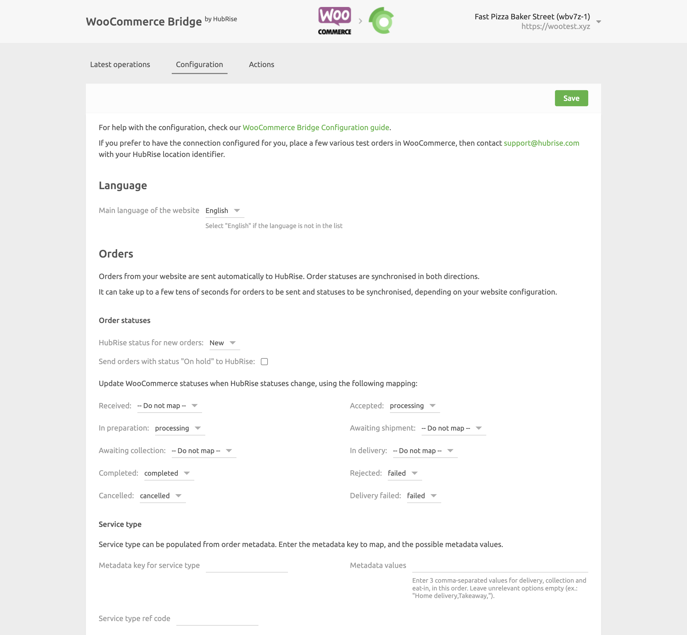
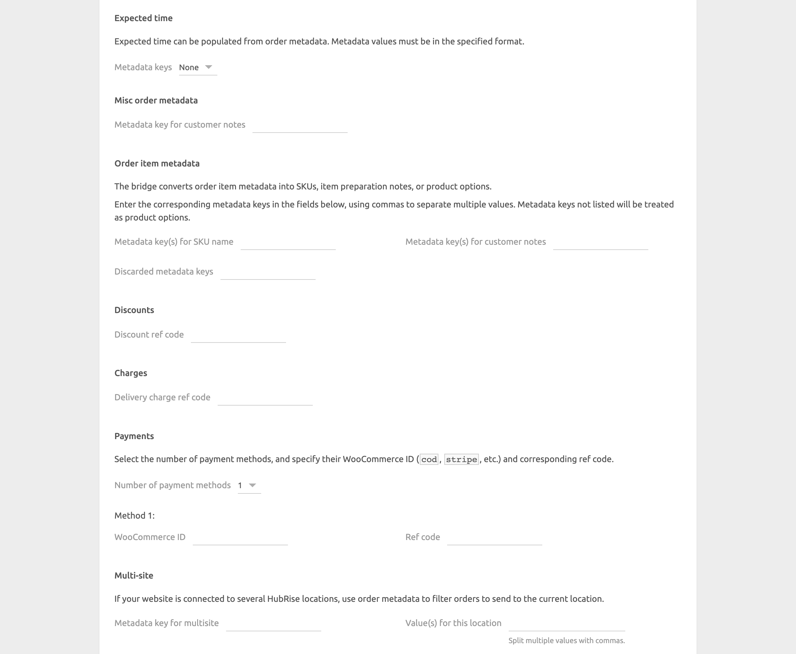
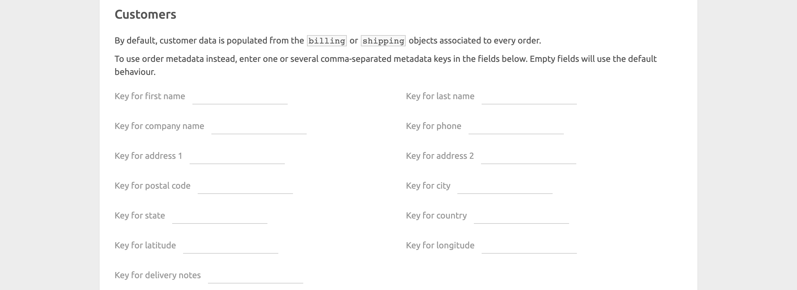
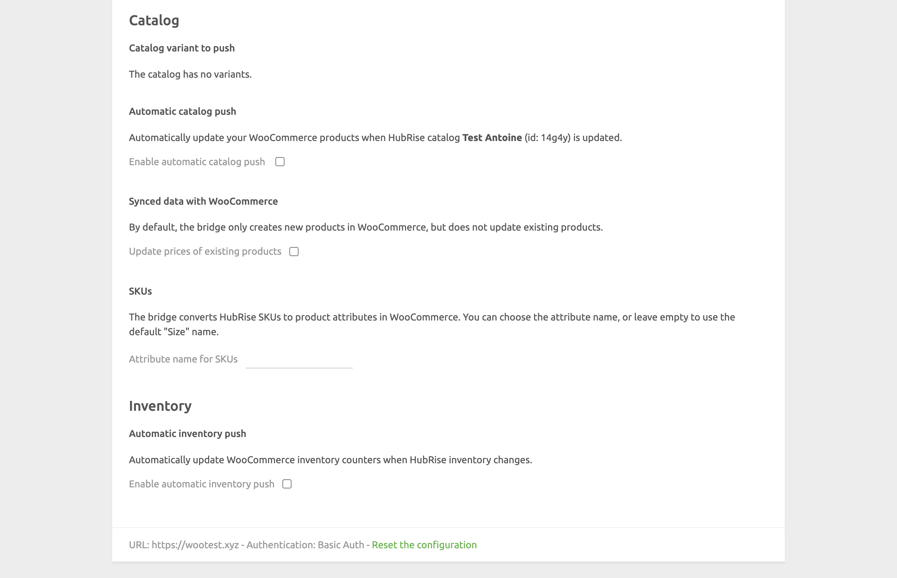

The configuration page allows you to customise the behaviour of WooCommerce Bridge based on your preferences.
These are divided into different sections for an easier navigation.

## Language

Choose the language to use for generic items such as `Delivery charge`. These names may appear in your EPOS and in customer receipts.

## Orders

The **Orders** section lets you customise how WooCommerce orders are sent to HubRise.

### Order Statuses

Depending on the payment type, new WooCommerce orders are created with different statuses:

- For credit card payments, the initial order status is `processing`.
- For wire transfer payments, the initial order status is `on-hold`, and the order requires a manual status change to `processing` when the payment is confirmed.

Orders in `processing` status are always pushed to HubRise. To also push `on-hold` orders, tick the **Send orders with status "On hold" to HubRise** checkbox.

From the **HubRise status for new orders** drop-down menu, select the HubRise status that you want to assign to new orders coming from WooCommerce. This status applies to `processing` orders and, when enabled, `on-hold` orders.

Then, configure how you want order status updates on HubRise to be reflected on WooCommerce.
For each HubRise status in the section, select the corresponding status that you want to apply in WooCommerce.
For example, you can choose to mark orders as `Completed` in WooCommerce when they reach the status `completed` in HubRise.

### Service Types

Choose if you want to receive the service type information from the WooCommerce metadata.
Your WooCommerce installation must be able to send to HubRise a metadata key and up to three values, corresponding to delivery, collection, and eat-in, in this order.

In the **Service type ref code** field, enter the ref code for the service that your EPOS expects.
Refer to your EPOS documentation on the HubRise website to verify your EPOS requirements.

### Expected time

From the **Metadata keys** drop-down menu, select if you want to use metadata to push the order expected time to HubRise.

Depending on the plugin you use, WooCommerce can encode the the expected time in one or two metadata fields.

If your plugin uses one metadata, the supported formats are the following:

- ISO 8601. For example: `2021-07-22T12:00:30+02:00`.
- Unix timestamp. For example: `1642422302`.

If your plugin uses two metadata, the supported formats are the following:

- The date must be in the `dd/mm/yyyy` format.
- The time must be in the `hh:mm` format.

### Misc Order Metadata

In this section, you can specify the metadata key that WooCommerce uses for the customer notes at the order level.

### Order Item Metadata

WooCommerce encodes item information as metadata, which can be further extended by various plugins.

By default, HubRise converts each key-value pair as an option. In this section, you can modify the default behaviour by entering specific metadata:

- In the **Metadata key(s) for SKU name** field, enter the metadata key that you want to use as the SKU name, for example "Size" with values like "Large" or "Medium".
- In the **Metadata key(s) for customer notes** field, enter the metadata key that you want to use as the customer notes at the item level, for example "Cooking Preference" with values like "Well Done".
- In the **Discarded metadata keys** field, enter the metadata key(s) that HubRise should ignore.

In each field, you can indicate multiple keys separated by a comma.

### Discounts

**Discount ref code** is the ref code associated with WooCommerce discounts in your EPOS.
Refer to your EPOS documentation on the HubRise website to know how to handle discounts in your EPOS.

### Charges

**Delivery charge ref code** is the ref code associated with WooCommerce delivery charge in your EPOS.
Refer to your EPOS documentation on the HubRise website to verify.

### Payments

Every payment method that you support on WooCommerce is identified by a standard and non-configurable ID.

To correctly parse the payment method in your orders, the **Payments** section lets you specify the WooCommerce ID and ref code for up to 15 payment methods.
Refer to your EPOS documentation on the HubRise website to verify the ref codes required by your EPOS.

The following are typical WooCommerce payment method IDs:

- Cash on delivery: `cod`
- Check payments: `cheque`
- Direct bank transfer: `bacs`
- Stripe payment: `stripe`

To find the WooCommerce ID for other payment methods, follow these steps:

1. In your WooCommerce back office, click **Settings** > **Payments**.
2. Click the payment method name to open its details page.
3. On the payment method page, look at URL of the page, and note the value after the `section=` key. For example, if the URL of the page is `https://mywoocommercestore.com/wp-admin/admin.php?page=wc-settings&tab=checkout&section=cod`, the ID of the payment method is `cod`.

### Multi-site

If you support multiple stores from the same WooCommerce website, you need to configure the **Multi-site** section.

Each store must be connected to its own unique WooCommerce Bridge and identified by a unique metadata value included in the order payload sent to HubRise. Orders are only forwarded to the location associated with the bridge when there's a metadata value match; otherwise, the order is disregarded.

In the **Metadata key for multisite** field, specify the metadata key used to identify the stores.

In the **Value(s) for this location** field, specify the value associated with the store connected to this WooCommerce Bridge. You can specify multiple values separated by a comma.

## Customers

The **Customers** section lets you customise the way that WooCommerce sends the customer information to HubRise.
By default, WooCommerce sends the customer information in the `billing` and `shipping` objects of the order payload, and no change is required in the WooCommerce Bridge configuration.
However, if you use specialised plugins to store and manage the customer information of your WooCommerce store, you might need to specify the order metadata where this information is encoded.

To verify if you need to configure metadata keys in this section, place some test orders from your WooCommerce store and check the order logs in your HubRise back-office.

## Catalog {#catalog}

The **Catalog** section lets you customise how you send the HubRise catalog to WooCommerce.

If you have variants in your catalog, select which catalog variant you want to push to WooCommerce from the **Variant** drop-down menu.

If you want to automatically update your WooCommerce products every time your HubRise catalog is updated, tick the **Enable automatic catalog push** checkbox.

By default, when you push a catalog into WooCommerce, WooCommerce Bridge creates new products in WooCommerce but does not update existing products.
To update prices of existing products, tick the **Update prices of existing products** checkbox.

By default, WooCommerce Bridge converts HubRise SKUs to product attributes in WooCommerce with the label `"Size"`.
To use a different label for your attributes, for example `"Colour"`, enter the value in the **Attribute name for SKUs** field.

## Inventory

The **Inventory** section lets you configure automatic updates of the WooCommerce inventory counters when the HubRise inventory changes.
To enable this feature, tick the **Enable automatic inventory push** checkbox.

## Save the Configuration

To save the configuration, click **Save** at the top of the page.

## Reset the Configuration

If you need to reset the configuration, click **Reset the configuration** at the bottom of the page.

---

**IMPORTANT NOTE:** Resetting the configuration will instantly disconnect the bridge from WooCommerce.

---

Resetting the configuration does not delete the operation logs displayed in the main page.
