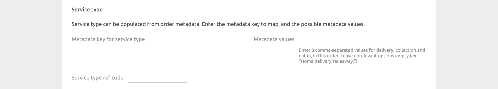
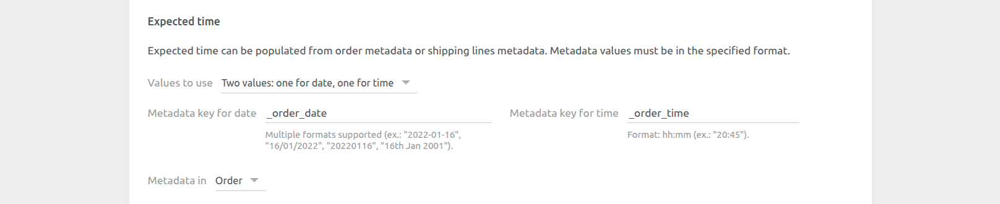

The configuration page allows you to customise the behaviour of WooCommerce Bridge based on your preferences.

---

**IMPORTANT NOTE:** Due to its very customisable nature, WooCommerce Bridge requires a certain level of technical knowledge to configure. If you are not comfortable with the configuration, place a few different test orders, with various payment methods, and contact us at support@hubrise.com, mentioning the EPOS you are using. We will be happy to help you!

---

## Language

Choose the language to use for generic items such as `Delivery charge`. These names may appear in your EPOS and in customer receipts.

## Orders

The **Orders** section lets you customise how WooCommerce orders are sent to HubRise.

### Order Statuses

---

**IMPORTANT NOTE:** In this section, we capitalise the first letter of WooCommerce statuses to make them easier to distinguish from HubRise status names. For example, `Processing` is a WooCommerce status, while `accepted` is a HubRise status.

---

Depending on the payment type, new WooCommerce orders are created with different statuses:

- For credit card payments, the initial order status is `Processing`.
- For wire transfer payments, the initial order status is `On-hold`, and the order requires a manual status change to `Processing` when the payment is confirmed.

Orders in `Processing` status are always pushed to HubRise. To also push `On-hold` orders, tick the **Send orders with status "On hold" to HubRise** checkbox.

From the **HubRise status for new orders** drop-down menu, select the HubRise status that you want to assign to new orders coming from WooCommerce. This status applies to `Processing` orders and, when enabled, `On-hold` orders.

Then, configure how you want order status updates on HubRise to be reflected on WooCommerce.
For each HubRise status in the section, select the corresponding status that you want to apply in WooCommerce.
For example, you can choose to mark orders as `Completed` in WooCommerce when they reach the status `completed` in HubRise.

### Service Types

Choose if you want to receive the service type information from the WooCommerce metadata.
Your WooCommerce installation must be able to send to HubRise a metadata key and up to three values, corresponding to delivery, collection, and eat-in, in this order.

In the **Service type ref code** field, enter the ref code for the service that your EPOS expects. Refer to your EPOS documentation on our [Apps page](/apps) to check requirements.

### Expected time

Support for expected times in WooCommerce requires a plugin, as WooCommerce does not natively support this feature.

If you do not use expected times, leave the **Metadata keys** drop-down menu set to **None**.

Otherwise, you will have to decide between two options for how expected times are encoded by your plugin: **One value containing both date and time**, or **Two values: one for date, one for time**.

To determine how your plugin encodes the expected time, place a test order and review the logs on the [Orders page](/docs/data#orders). Look for the `meta_data` field at the topmost JSON level of the order. This is not to be confused with `meta_data` fields that might be nested under `line_items` JSON elements. Identify the attribute(s) within this field that contains the expected date and time. If you cannot find the expected time in the `meta_data` field, contact the plugin developer for support.

Based on the selected option in the **Metadata keys** drop-down, one or two fields will appear, where you can specify the metadata key name(s) that contain the expected date and time.

If your plugin uses one metadata key, the supported formats are the following:

- ISO 8601. For example: `2021-07-22T12:00:30+02:00`.
- Unix timestamp. For example: `1642422302`.

If your plugin uses two metadata keys, the supported formats are the following:

- The date must be a parsable date or time, for example: `dd/mm/yyyy`, `yyyy-mm-dd`, or an ISO 8601 string where the time part is ignored.
- The time must be a parsable time, for example: `hh:mm:ss`, `hh:mm`, or an ISO 8601 string where the date part is ignored.

### Misc Order Metadata

In this section, you can specify the metadata key that WooCommerce uses for the customer notes at the order level.

### Order Item Metadata {#order-item-metadata}

WooCommerce encodes item information as metadata, which can be further extended by various plugins.

By default, HubRise converts each key-value pair as an option. In this section, you can modify the default behaviour by entering specific metadata:

- In the **Metadata key(s) for SKU name** field, enter the metadata key that you want to use as the SKU name, for example "Size" with values like "Large" or "Medium".
- In the **Metadata key(s) for customer notes** field, enter the metadata key that you want to use as the customer notes at the item level, for example "Cooking Preference" with values like "Well Done".
- In the **Discarded metadata keys** field, enter the metadata key(s) that HubRise should ignore.

In each field, you can indicate multiple keys separated by a comma.

### Discounts

**Discount ref code** is the ref code associated with WooCommerce discounts in your EPOS.
Refer to your EPOS documentation on the HubRise website [Apps page](/apps) to know how to handle discounts in your EPOS.

### Charges

**Delivery charge ref code** is the ref code associated with WooCommerce delivery charge in your EPOS.
Refer to your EPOS documentation on the HubRise website [Apps page](/apps) to verify.

### Payments

The **Payments** section lets you specify the WooCommerce ID and corresponding ref code for up to 15 payment methods.

The following are typical WooCommerce payment method IDs:

- Cash on delivery: `cod`
- Check payments: `cheque`
- Direct bank transfer: `bacs`
- Stripe payment: `stripe`

To find the WooCommerce ID for other payment methods, follow these steps:

1. In your WooCommerce back office, click **Settings** > **Payments**.
2. Click the payment method name to open its details page.
3. On the payment method page, look at URL of the page, and note the value after the `section=` key. For example, if the URL of the page is `https://mywoocommercestore.com/wp-admin/admin.php?page=wc-settings&tab=checkout&section=cod`, the ID of the payment method is `cod`.

To find the ref codes to use, refer to your EPOS documentation on our [Apps page](/apps).

### Multi-site

Configure this section if you support multiple stores from the same WooCommerce website.

Each location must be connected to WooCommerce Bridge and identified by a unique metadata value included in the order payload sent to HubRise. Orders are only forwarded to the location that matches the configured value.

In the **Metadata key for multi-site** field, specify the metadata key used to identify the location.

In the **Value(s) for this location** field, specify the value associated with the location. You can specify multiple values separated by a comma.

## Customers

The **Customers** section lets you customise the way that WooCommerce sends the customer information to HubRise. By default, customer data is sourced from the shipping address, or the billing address if the shipping address is missing.

Enable **Always use the billing address** to use the billing address, even if the shipping address is present.

If you use plugins that store customer information in metadata, use the **Key for (...)** fields to associate metadata keys with customer fields in HubRise. To help you identify the correct metadata keys, place some test orders from your WooCommerce store and check the order logs in the **Latest operations** tab.

## Catalog {#catalog}

### Catalog Variant to Push

Catalog variants give you the flexibility to disable specific items or adjust prices for your WooCommerce website.

If your catalog includes variants, you have the option to select which one to use. When **(none)** is selected, the default items along with their standard prices are used. If your catalog has no variants, the menu will be hidden and a message will be displayed.

### Automatic Catalog Push

If you want to automatically update your WooCommerce products every time your HubRise catalog is updated, tick the **Enable automatic catalog push** checkbox.

### Synced Data with WooCommerce

By default, when you push a catalog into WooCommerce, WooCommerce Bridge creates new products in WooCommerce but does not update existing products.
To update prices of existing products, tick the **Update prices of existing products** checkbox.

### SKUs

By default, WooCommerce Bridge converts HubRise SKUs to product attributes in WooCommerce with the label `"Size"`.
To use a different label for your attributes, for example `"Colour"`, enter the value in the **Attribute name for SKUs** field.

## Inventory

The **Inventory** section lets you configure automatic updates of the WooCommerce inventory counters when the HubRise inventory changes.
To enable this feature, tick the **Enable automatic inventory push** checkbox.

## Save the Configuration

To save the configuration, click **Save** at the top of the page.

## Reset the Configuration {#reset}

If you need to reset the configuration, click **Reset the configuration** at the bottom of the page.

---

**IMPORTANT NOTE:** Resetting the configuration will instantly disconnect the bridge from WooCommerce.

---

Resetting the configuration does not delete the operation logs displayed in the main page.
