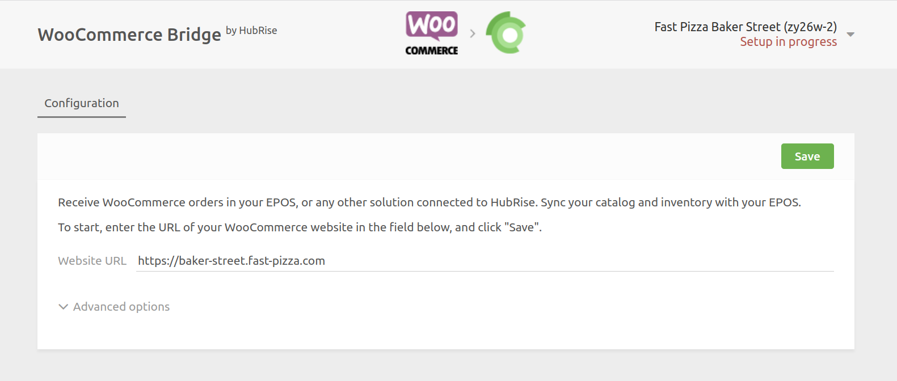
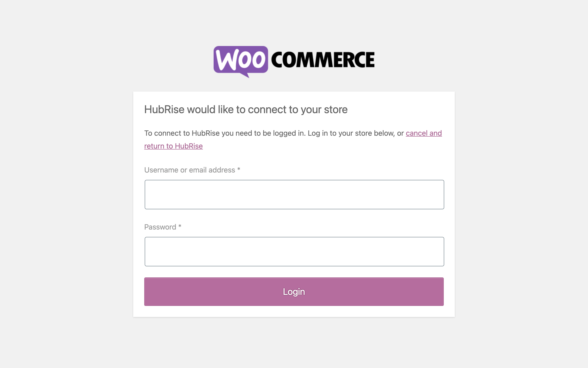
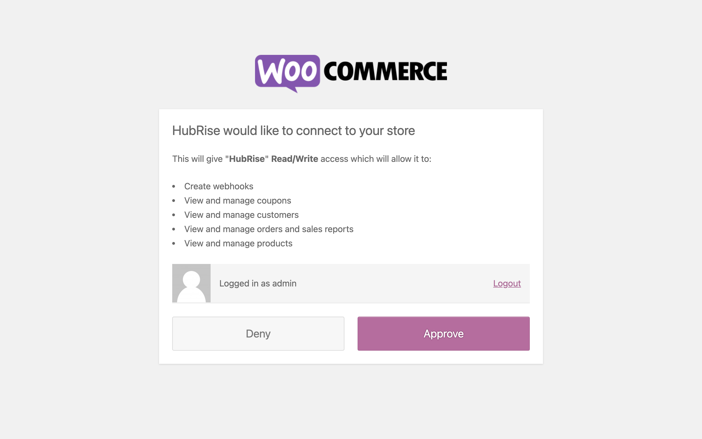

You can connect WooCommerce to HubRise with a few simple steps.

---

**IMPORTANT NOTE:** If you do not have a HubRise account yet, register on our [Signup Page](https://manager.hubrise.com/signup). It only takes a minute!

---

## 1. Connect WooCommerce Bridge

To connect WooCommerce Bridge to HubRise, follow these steps:

1. Log in to your [HubRise account](https://manager.hubrise.com).
1. Select the location you want to connect from the dropdown menu.
1. Select **CONNECTIONS**, then **View available apps**.
1. Select **WooCommerce Bridge** from the list of apps.
1. Click **Connect**.
1. Click **Allow** to grant WooCommerce Bridge access to your registered location on HubRise. If your account has multiple locations, expand the **Choose location** section to select the desired location, and then click **Allow**.
1. Enter the URL of your WooCommerce store:
   
1. If you have previously encountered connection issues, you may adjust the **Advanced options**. If not, leave them unchanged. For more information, refer to our [Troubleshooting](/apps/woocommerce/troubleshooting) guide.
1. Click **Save** to confirm.
1. Click **Connect WooCommerce**. You will be redirected to the WooCommerce authorisation page.
   - If you are not logged in to WooCommerce, enter your username and password, then click **Login**.
     
   - Click **Approve** to authorise the connection with HubRise.
     
1. You will be redirected to the WooCommerce Bridge Configuration page, where you can customise your connection with HubRise.

## 2. Configure Your Preferences

After connecting the Bridge, you need to configure a few parameters in the Configuration page to send orders correctly to your EPOS.

For more information about the configuration page and how to navigate to it, see the Configuration section in [User Interface](/apps/woocommerce/user-interface#configuration). For details on how to set up the parameters of WooCommerce Bridge, see [Configuration](/apps/woocommerce/configuration).

## 3. Configure WooCommerce Webhooks

After connecting WooCommerce Bridge, configure your WooCommerce webhooks for order transmission to HubRise.

### Enable Synchronous Webhook Delivery (Optional) {#enable-synchronous-webhook-delivery}

By default, WooCommerce processes webhooks asynchronously through a background process called a **cron**. This process runs every few minutes and can delay order transmission to HubRise.

To transmit orders immediately without waiting for the cron, you can enable synchronous webhook delivery:

1. Access your WordPress site files using an FTP client or your hosting control panel's file manager.
2. Navigate to the `wp-content/themes/[your-theme]` directory, where `[your-theme]` is the folder of your active theme.
3. Open the `functions.php` file and append the following code snippet at the end of the file:
   ```php
   add_filter( 'woocommerce_webhook_deliver_async', '__return_false' );
   ```
4. Save the file and the changes will take effect immediately.

---

**IMPORTANT NOTE:** This setting affects all webhooks in your WooCommerce store. Ensure your webhooks process requests quickly to avoid slowing down checkout.

---

### Prevent Automatic Webhook Disabling (Recommended) {#prevent-automatic-webhook-disabling}

By default, WooCommerce automatically disables webhooks after 5 consecutive failed delivery attempts. This can interrupt your connection with HubRise if the bridge is temporarily disabled, or in case of network issues.

To prevent WooCommerce from automatically disabling webhooks:

1. Access your WordPress site files using an FTP client or your hosting control panel's file manager.
2. Navigate to the `wp-content/themes/[your-theme]` directory.
3. Open the `functions.php` file and add the following code:
   ```php
   add_filter( 'woocommerce_max_webhook_delivery_failures', function() {
       return PHP_INT_MAX; // Effectively unlimited retries
   } );
   ```
4. Save the file.

---

**IMPORTANT NOTE:** This setting affects all webhooks in your WooCommerce store. Setting it to PHP_INT_MAX provides effectively unlimited retries.

---

If you are not sure how to edit the `functions.php` file, contact the developer of your WooCommerce website.

## 4. Upload Your Menu

If you have a catalog of products on HubRise, you can upload it to your WooCommerce store with a single click.

For more information on HubRise catalogs, see [Catalogs](/docs/catalog).
To learn how to push your HubRise catalog into WooCommerce, see [Push the Catalog](/apps/woocommerce/push-catalog).
