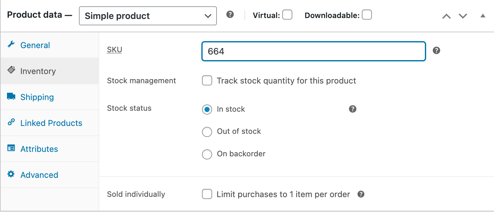
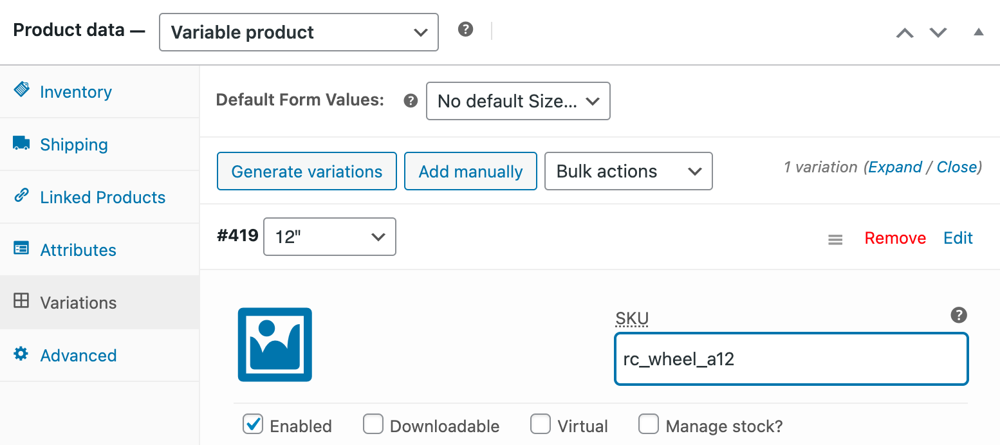

Most EPOS solutions require a ref code for each product to properly interpret orders. Therefore, you need to make sure that each product on WooCommerce is assigned to the correct ref code.

This page explains how to configure ref codes manually in WooCommerce. Some EPOS solutions offer the ability to export their catalog to HubRise, allowing you to populate WooCommerce products automatically with the correct ref codes. For more details, see [Push the Catalog](/apps/woocommerce/push-catalog).

## Products and SKUs

To assign ref codes to your WooCommerce products, follow these steps:

1. Log in to your WooCommerce back office.
1. From the menu, select **Products** > **All products**.
1. From the list of products, find the product for which you want to add the ref code, and click **Edit**.
1. Depending on whether your product is a simple or variable product, follow the respective instructions below.
1. Click **Update** to confirm.
1. Repeat this procedure for each product.

### Simple Products

For product without variations:

- Open the **Inventory** tab.
- Enter the HubRise SKU ref code in the **SKU** field.
  

### Variable Products

For products with variations:

- Open the **Variations** tab.
- Click on the desired variation to expand the form.
- Enter the HubRise SKU ref code in the **SKU** field.
  

## Options

WooCommerce does not support Options. Use Products and SKUS instead.
