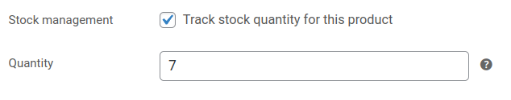

WooCommerce Bridge can synchronise your HubRise inventory with WooCommerce.

## Inventory Synchronisation

When HubRise inventory is updated, WooCommerce Bridge can automatically adjust inventory counters in WooCommerce.

Only items with the **Track stock quantity** checkbox enabled are updated. To check if this option is enabled for a specific product, follow these steps:

1. In your WooCommerce account, open the **Products** page.
2. Find the product you want to check and click **Edit**.
3. In the **Product data** section, select **Inventory**.
5. Ensure that the **Track stock quantity for this product** checkbox is ticked.

Some EPOS and inventory management solutions can update the inventory data in HubRise. To check whether a specific app supports inventory synchronisation, refer to its documentation on our [Apps page](/apps). Alternatively, you can manage your inventory using [OrderLine](/apps/orderline/overview).

## Manual Inventory Push

To push your HubRise inventory into WooCommerce, follow these steps:

1. Log in to your [HubRise account](https://manager.hubrise.com).
1. Select the HubRise account and location connected with your WooCommerce store.
1. Open the **CONNECTIONS** page, then select **WooCommerce Bridge** from the list of connected apps.
1. In WooCommerce Bridge, select the **Actions** tab.
1. In the **Synchronise your inventory with WooCommerce** section, click **Push inventory**.

## Automatic Inventory Push

WooCommerce Bridge can push your inventory into WooCommerce every time it is updated in HubRise. To enable this option, follow these steps:

1. Log in to your [HubRise account](https://manager.hubrise.com).
1. Select the HubRise account and location connected with your WooCommerce store.
1. Open the **CONNECTIONS** page, then select **WooCommerce Bridge** from the list of connected apps.
1. In WooCommerce Bridge, select the **Configuration** tab.
1. In the **Inventory** section, tick **Enable automatic inventory push**.
1. Click **Save**.
