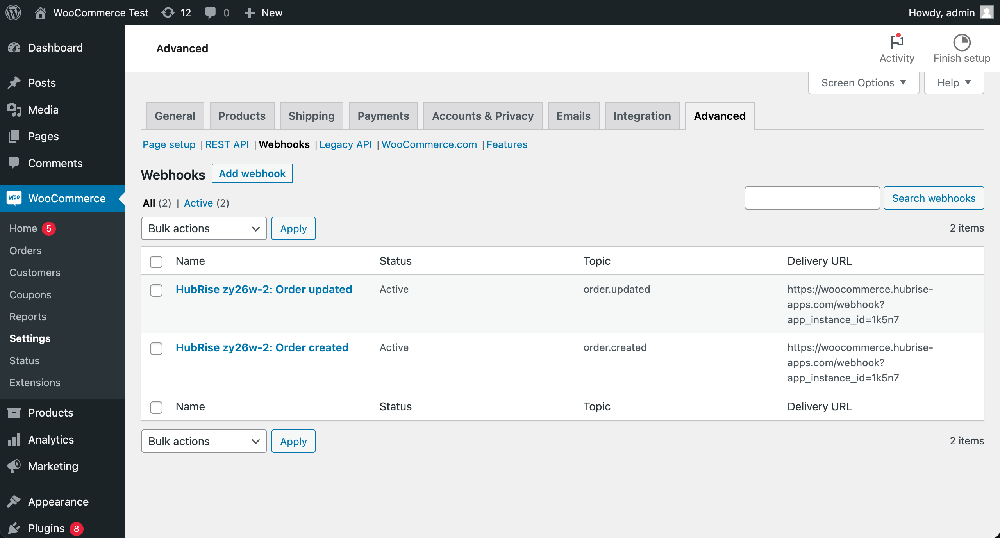
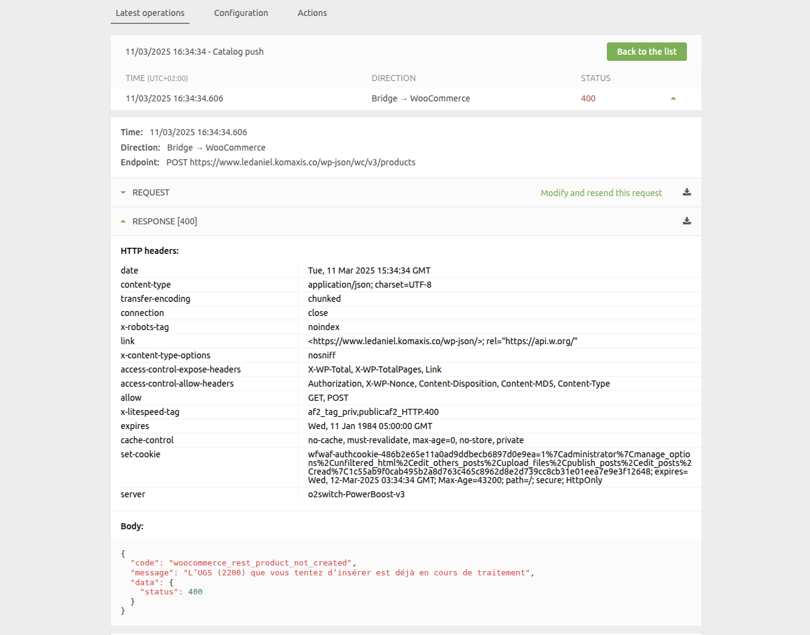
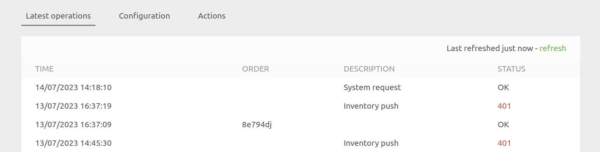
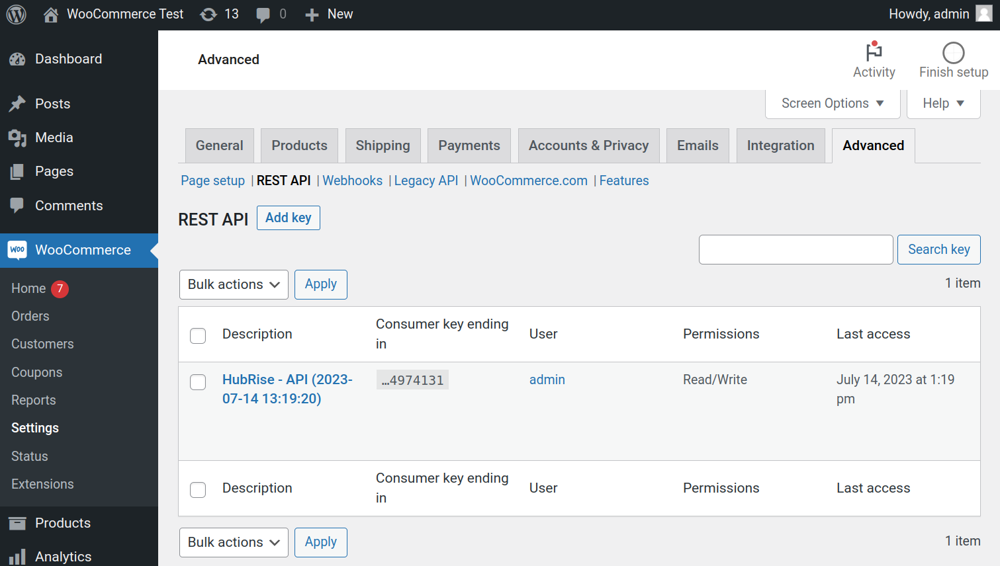
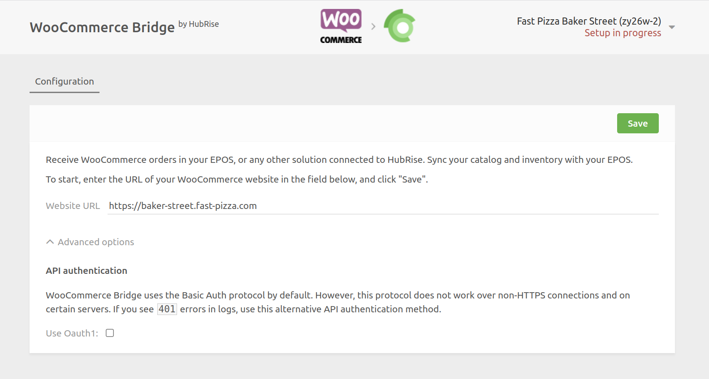

## Orders Not Received in HubRise

The first step to receive orders in HubRise is to connect WooCommerce to HubRise. If you have not done so, follow the steps in [Connect to HubRise](/apps/woocommerce/connect-hubrise) first.

If you have connected WooCommerce to HubRise, but you are not receiving orders in HubRise, check the following common issues.

### Check WooCommerce Webhooks {#check-woocommerce-webhooks}

When you connect WooCommerce Bridge, it creates two webhooks on your WooCommerce website. These webhooks are essential to transmit orders from WooCommerce to HubRise.

Not only should you verify the presence of these webhooks, but you also need to ensure that their status is **Active**. If the status is **Inactive**, the webhooks will not work. You will need to reactivate them by clicking on their names.

If you find the webhooks have been disabled, this often indicates that WooCommerce has not been configured to prevent automatic webhook disabling - see [Webhooks Automatically Disabled](#webhooks-automatically-disabled) below.

To check that the webhooks have been created:

1. Open your WooCommerce back office.
1. From the left navigation panel, click **WooCommerce** > **Settings** > **Advanced**.
1. Then click on **Webhooks**.
   
1. Find two entries with the following names:
   - `HubRise {{your_location_id}}: Order updated`
   - `HubRise {{your_location_id}}: Order created`
1. Check the status of each entry. If any of them are set to **Inactive**, click on their names to change the status to **Active**.

If these entries are present and active, it is a good sign that the connection to HubRise was successfully established. You can proceed to the next verification step.

If you cannot find the two entries, you need to reconnect the bridge and check WooCommerce webhooks again. For more information on connecting the bridge, see [Connect to HubRise](/apps/woocommerce/connect-hubrise).

### Webhooks Automatically Disabled {#webhooks-automatically-disabled}

If your WooCommerce webhooks are being automatically disabled, this is likely due to repeated delivery failures. By default, WooCommerce disables webhooks after 5 consecutive failed attempts.

To prevent webhooks from being disabled automatically, see detailed instructions in [Prevent Automatic Webhook Disabling](/apps/woocommerce/connect-hubrise#prevent-automatic-webhook-disabling) in the Connect to HubRise documentation.

If webhooks have already been disabled, you'll need to manually reactivate them by following the steps in [Check WooCommerce Webhooks](#check-woocommerce-webhooks) above.

### Error 422 - Private Ref Already Used

When WooCommerce orders fail to sync with HubRise, you may encounter a `422` error with the following response body:

```json
{
  "message": "Validation failed",
  "errors": [
    {
      "field": "/private_ref",
      "message": "is already used ('21824' given)"
    }
  ],
  "error_type": "unprocessable_entity"
}
```

This error indicates that the order ID (`private_ref`) being sent is already in use. This typically happens after a database restore in WooCommerce, which resets the auto-increment value for the `wp_posts` table, causing new orders to have duplicate IDs.

To resolve this issue:

1. Use the SQL query tool to find the highest ID in your posts table (see [Using the SQL Query Tool](#using-sql-query-tool)).
2. Update the auto-increment value to be 1 higher than the current highest ID.
3. Place a test order to verify the issue is resolved.

### Place a Test Order in WooCommerce

To verify the connection between WooCommerce and HubRise, place a test order in WooCommerce and check that it is transmitted to HubRise.

1. Open your WooCommerce back office.
1. From the top menu, click **Visit Store**. This will open your WooCommerce website.
1. Place an order on your WooCommerce website.
1. Return to your WooCommerce back office, and from the left navigation panel click **WooCommerce** > **Orders**. The new order will be present.

When WooCommerce is connected to HubRise, orders placed in WooCommerce should be transmitted to HubRise immediately.

To verify that your test order was transmitted to HubRise, follow these steps:

1. Open your HubRise back office.
1. Navigate to the **DATA** > **ORDERS** page.
1. Find your test order within.

If you can see the order, the connection between WooCommerce and HubRise is working correctly.

## Orders Received in HubRise With a Delay

By default, WooCommerce processes webhooks asynchronously, which can delay order transmission to HubRise by several minutes.

To enable immediate order transmission, you need to configure synchronous webhook delivery. For detailed instructions, see [Enable Synchronous Webhook Delivery](/apps/woocommerce/connect-hubrise#enable-synchronous-webhook-delivery) in the Connect to HubRise documentation.

## Catalog Updates Not Working

### Orphaned Records

If catalog updates from HubRise to WooCommerce are failing, this could be caused by orphaned records in the `wp_wc_product_meta_lookup` table, a [known WooCommerce bug](https://github.com/woocommerce/woocommerce/pull/55097) fixed in version 9.8.

To confirm this is the problem:

1. In WooCommerce Bridge, find the failing Catalog push operation (showing error code `400`).
2. Click on the operation to view its details.
3. Expand the **RESPONSE** section to view the error details.



If you see an error message like the following, this confirms the orphaned records issue:

```json
{
  "code": "woocommerce_rest_product_not_created",
  "message": "L'UGS (2200) que vous tentez d'insérer est déjà en cours de traitement",
  "data": {
    "status": 400
  }
}
```

The error indicates that the SKU you're trying to insert is already being processed, which happens due to orphaned records in the database.

To clean the orphaned records:

1. Install the SQL query tool. Refer to [Using the SQL Query Tool](#using-sql-query-tool).

2. Run this SQL query (replace `wp_` with your table prefix):

   ```sql
   DELETE pm FROM wp_wc_product_meta_lookup pm
   LEFT JOIN wp_posts p ON pm.product_id = p.ID
   WHERE p.ID IS NULL OR p.post_status = 'trash'
   ```

3. Try your catalog update again. It should work now.

To prevent new orphaned records, update WooCommerce to version 9.8 or later, which includes a fix for this issue.

## 401 Errors

If you see `401` errors in WooCommerce Bridge, it means that WooCommerce Bridge is unable to authenticate with WooCommerce.



There are three common causes for `401` errors:

### API Key Removed

If the API key for HubRise has been removed in WooCommerce, it will lead to `401` errors. To check this:

1. Open your WordPress dashboard.
1. Navigate to **WooCommerce** > **Settings** > **Advanced** > **REST API**.
1. Verify if there is an API key named `HubRise - API`.



If the `HubRise - API` key is not present, it means it has been removed, and you need to reconnect the bridge. For more information on connecting the bridge, see [Connect to HubRise](/apps/woocommerce/connect-hubrise).

### HTTP Basic Authentication Fail

If your WooCommerce setup does not work with the default HTTP Basic authentication method, it may also result in `401` errors. In such cases, you need to switch to the fallback OAuth1 method.

To do this:

1. Reset the configuration of WooCommerce Bridge.
1. Configure the bridge again from scratch, but when you reach the first step of the configuration, unfold **Advanced Options**.
1. Select the **Use OAuth1** option.
   
1. Proceed with the configuration as described in [Connect to HubRise](/apps/woocommerce/connect-hubrise).

After making this change, verify if the `401` errors are resolved.

### Incorrect URL During Setup

---

**IMPORTANT NOTE:** This issue is only relevant if you are using the OAuth1 authentication method.

---

During the OAuth1 setup, if you added an extra `www` or omitted it from your website URL, the WooCommerce API will respond with the JSON message below:

```json
{
  "code": "woocommerce_rest_authentication_error",
  "message": "Signature non valide - La signature fournie ne correspond pas.",
  "data": {
    "status": 401
  }
}
```

In this case, the error message indicates that the signature provided does not match due to an incorrect URL input. This issue arises only with OAuth1 setup, because it requires the exact URL to compute the request signature, unlike Basic Auth which does not use the URL in the authentication of each request. To resolve this, you need to reconnect and use the exact URL of your website (either with or without the `www`, as per your actual website URL).

Here is how to correct this:

1. Reset the WooCommerce Bridge configuration, see [Reset the Configuration](/apps/woocommerce/configuration#reset) for instructions.
1. Configure the bridge again from scratch. When you reach the first step of the configuration, enter the correct URL of your WooCommerce store, ensuring the URL matches exactly with your website (pay attention to whether your website uses `www` or not).
1. Proceed with the configuration as described in [Connect to HubRise](/apps/woocommerce/connect-hubrise).

## Using the SQL Query Tool {#using-sql-query-tool}

Several troubleshooting steps require running SQL queries directly on your WooCommerce database. Here's how to do this safely:

### Installing the SQL Query Tool

1. Install the [Run SQL Query](https://wordpress.com/plugins/run-sql-query) plugin from your WordPress Admin Panel.
2. Once installed, navigate to **Tools** > **Run SQL Query**.

The interface will look like this:


### Finding Your Table Prefix

WooCommerce tables may have a custom prefix instead of the default `wp_`. To find your prefix:

1. Look at the list of tables shown in the SQL query tool.
2. Find a table ending with `_posts` (e.g., `mod488_posts`).
3. The prefix is everything before `_posts`. In the example `mod488_posts`, the prefix is `mod488_`.

### Running SQL Queries

When following troubleshooting steps:

1. Replace the `wp_` prefix in the SQL queries with your actual table prefix.
2. Copy the complete SQL query into the query box.
3. Click **Run Query** to execute.

For example, if your prefix is `mod488_`, you would replace `wp_posts` with `mod488_posts`.

## Need More Help?

If you're still encountering issues after following these steps, feel free to contact support@hubrise.com for further assistance.
