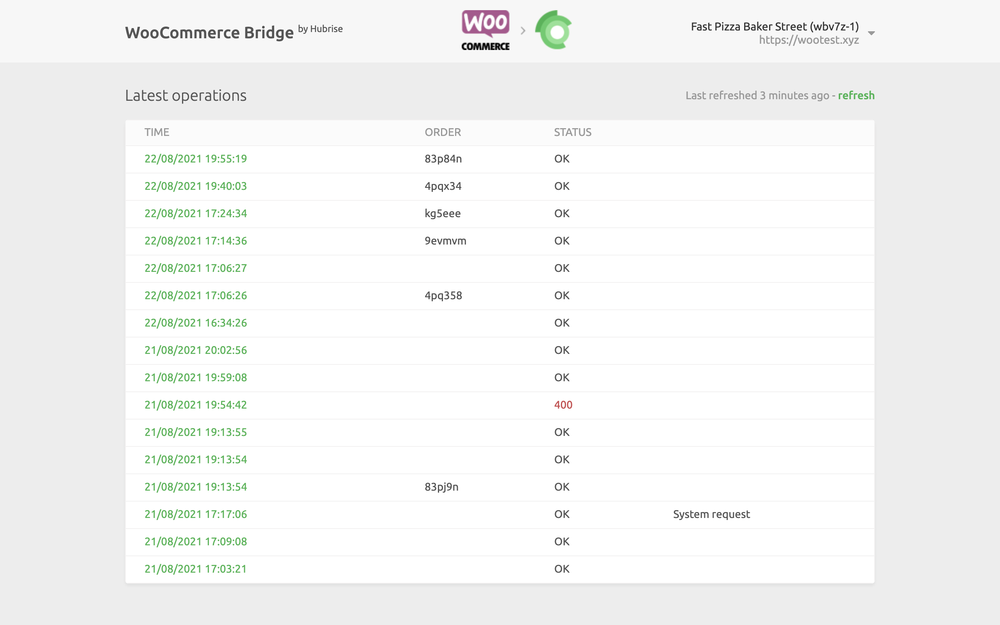
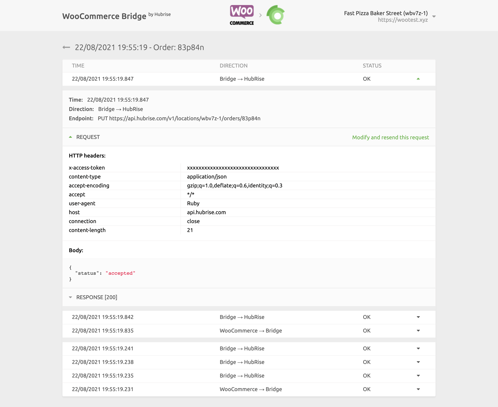
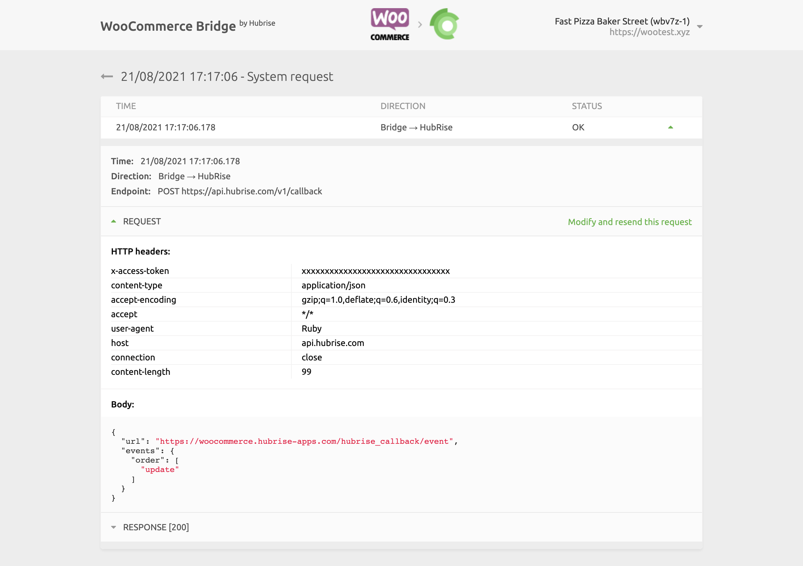
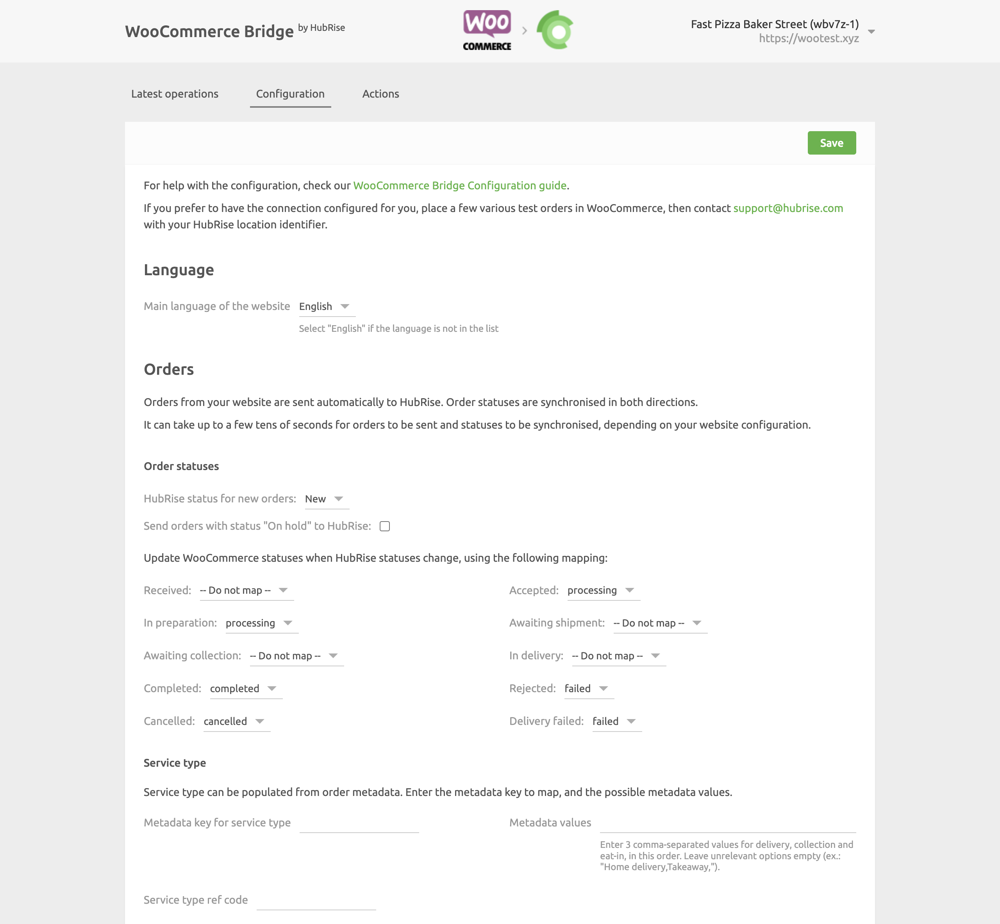

From WooCommerce Bridge, you can read the logs of all the operations between HubRise and WooCommerce, and access the configuration settings of the integration.

## Latest Operations

This is the default page when you open WooCommerce bridge. It displays the latest API operations between HubRise, WooCommerce, and WooCommerce Bridge.

Operations can either be related to a specific order, or be generic system requests performed by WooCommerce Bridge.

Each row in the page shows the following information about an operation:

- **TIME**: The date and time of the order.
- **ORDER**: The HubRise order ID, for order operations.
- **DESCRIPTION**: An optional description for operations that are not related to a specific order. It could be empty, or inform of a `System request` or a `Catalog push`.
- **STATUS**: The status of the order. The value `OK` indicates that the order has been successfully transmitted. If there is an issue, an error code will be displayed in red, such as `400`.

The **System request** label indicates that the operation is not related to a specific order.

Clicking on a row will open a new page displaying the logs associated with the operation.

### Order Operation

Selecting an order operation from the list in the main page will display all the logs of the API requests exchanged between HubRise and WooCommerce via WooCommerce Bridge.

Requests are ordered with the latest on top, and those related to the same order event (order received, order cancelled, etc.) are visually grouped together.

Each row in the logs displays the following information:

- **Time**: The date and time the request was sent.
- **Direction**: The apps sending and receiving the request, in the format Origin → Destination.
- **Endpoint**: The status of the request. The value `OK` indicates that the request has been successfully received, otherwise a message will explain the type of error occurred.

Clicking on a request will expand it to reveal the detailed logs of the request and its response.

Logs are a powerful debugging tool in case of issues. To understand in detail how to read logs, see [Understanding HubRise Logs](/docs/hubrise-logs/overview).

### System Request Operation

System request pages can provide useful debugging insights to support teams, but are rarely of interest to other users.
The layout this page is identical to that of an order page.

System requests are generally sent by WooCommerce Bridge to notify HubRise about a change in the configuration or to fetch the most up-to-date information. For instance, we might observe a request to update the WooCommerce Bridge callback after a configuration change.

## Actions

To access the actions page, click **Actions** at the top of the screen. If the link is not visible, first complete the configuration of WooCommerce Bridge.

From the actions page, you can push the catalog to WooCommerce. For more details, see [Push Catalog](/apps/woocommerce/push-catalog).

## Configuration {#configuration}

To access the WooCommerce Bridge configuration page, click **Configuration** at the top of the screen. From this page, you will be able to customise the behaviour of WooCommerce Bridge. For more details, see [Configuration](/apps/woocommerce/configuration).

## Language and Navigation

In the top right corner of the screen, you can click on the arrow to expand the menu. From there, you can change the language of the page to English or French.

Clicking on the WooCommerce and HubRise logos on top of any page of WooCommerce Bridge will bring you back to the **Latest Operations** page.
