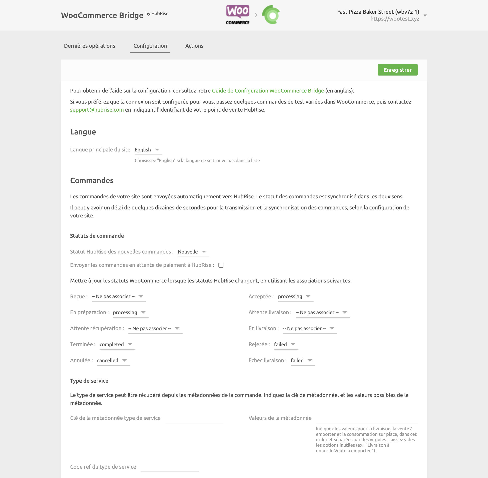
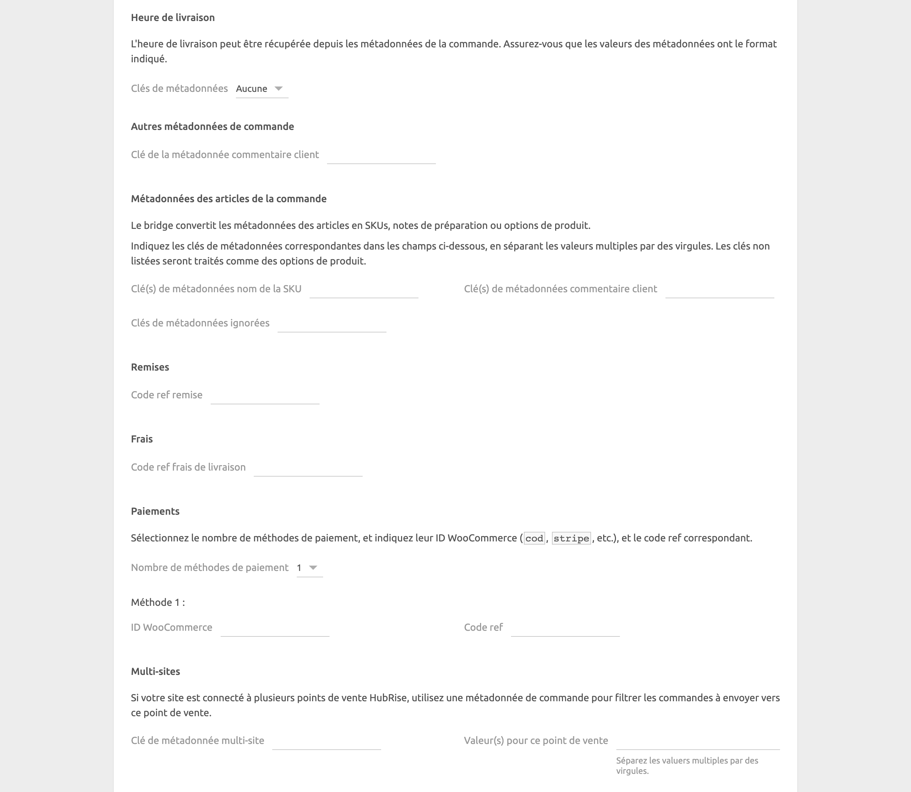
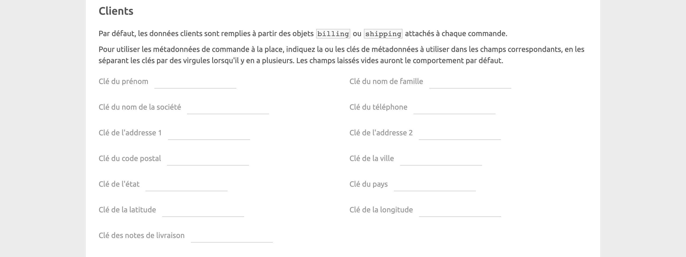
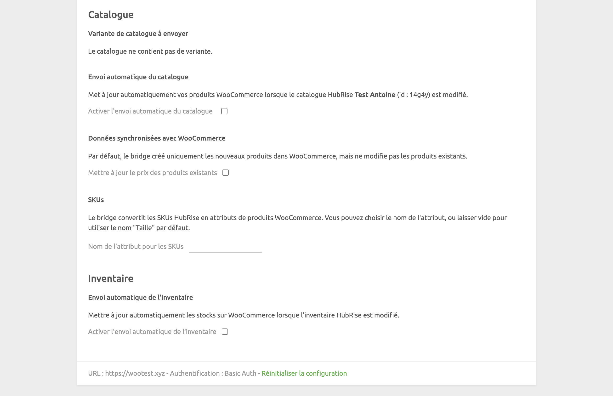

La page de configuration permet de personnaliser le comportement de WooCommerce Bridge.
Elle est divisée en plusieurs sections pour faciliter la navigation.

## Langue

Choisissez la langue à utiliser pour les éléments génériques tels que `Delivery charge` (Frais de livraison). Ces noms peuvent apparaître dans votre logiciel de caisse et sur les reçus des clients.

## Commandes

La section **Commandes** permet de personnaliser la façon dont les commandes WooCommerce sont envoyées à HubRise.

### Statuts de commande

***

**REMARQUE IMPORTANTE :** Dans cette section, nous mettons en majuscule la première lettre des statuts WooCommerce pour les distinguer plus facilement des noms de statuts HubRise. Par exemple, `Processing` (En cours de traitement) est un statut WooCommerce, tandis que `acceptée` est un statut HubRise.

***

Selon le type de paiement, les nouvelles commandes WooCommerce sont créées avec des statuts différents :

- Pour les paiements par carte, le statut initial de la commande est `Processing` (en cours de traitement).
- Pour les paiements par virement bancaire, le statut initial de la commande est `On-hold` (En attente). Le statut doit être passé manuellement à `Processing` une fois le paiement confirmé.

Les commandes avec le statut `Processing` sont systématiquement envoyées à HubRise. Pour envoyer également les commandes `On-hold`, cochez la case **Envoyer les commandes en attente de paiement à HubRise**.

Dans le menu déroulant **Statut HubRise des nouvelles commandes**, sélectionnez le statut HubRise que vous souhaitez attribuer aux nouvelles commandes provenant de WooCommerce. Ce statut s'applique aux commandes `Processing` et, lorsqu'il est activé, aux commandes `On-hold`.

Configurez ensuite comment les mises à jour des statuts de commande dans HubRise sont reflétées dans WooCommerce.
Pour chaque statut HubRise de la section, sélectionnez le statut correspondant à appliquer dans WooCommerce.
Par exemple, vous pouvez choisir d'indiquer que les commandes sont `Completed` (Terminée) dans WooCommerce lorsqu'elles passent au statut `completed` dans HubRise.

### Types de service

Choisissez si vous souhaitez recevoir les informations sur le type de service depuis les métadonnées WooCommerce.
Votre installation WooCommerce doit pouvoir envoyer à HubRise une clé de métadonnée et jusqu'à trois valeurs correspondant à la livraison, la vente à emporter et la consommation sur place, dans cet ordre.

Dans le champ **Code ref du type de service**, saisissez le code ref du service attendu par votre logiciel de caisse.
Pour connaître ses exigences, reportez-vous à la documentation de votre logiciel de caisse sur la [page Apps](/apps) du site internet de HubRise.

### Heure de livraison

Dans le menu déroulant **Clés de métadonnées**, choisissez si vous voulez utiliser les métadonnées pour envoyer l'heure de livraison à HubRise.

Selon le plugin que vous utilisez, WooCommerce peut encoder l'heure de livraison dans un ou deux champs de métadonnées.

Si votre plugin utilise une métadonnée, les formats pris en charge sont les suivants :

- ISO 8601. Par exemple : `2021-07-22T12:00:30+02:00`.
- Horodatage Unix. Par exemple : `1642422302`.

Si votre plugin utilise deux métadonnées, les formats pris en charge sont les suivants :

- La date doit être au format `dd/mm/yyyy`.
- L'heure doit être au format `hh:mm`.

### Autres métadonnées de commande

Dans cette section, vous pouvez spécifier la clé de métadonnée que WooCommerce utilise pour les notes de préparation du client au niveau de la commande.

### Métadonnées des articles de la commande

WooCommerce encode les informations sur les articles sous forme de métadonnées, qui peuvent être prolongées par divers plugins.

Par défaut, HubRise convertit chaque paire clé-valeur en option. Dans cette section, vous pouvez modifier le comportement par défaut en saisissant les métadonnées spécifiques :

- Dans le champ **Clé(s) de métadonnées nom de la SKU**, saisissez la clé de métadonnée que vous voulez utiliser comme nom de SKU, par exemple "Taille" avec des valeurs telles que "Grande" ou "Moyenne".
- Dans le champ **Clé(s) de métadonnées commentaire client**, saisissez la clé de métadonnée que vous voulez utiliser comme notes de préparation du client au niveau de l'article. par exemple "Préférences de cuisson" avec des valeurs comme "Bien cuit".
- Dans le champ **Clés de métadonnées ignorées**, saisissez la clé de métadonnées que HubRise doit ignorer.

Dans chaque champ, vous pouvez indiquer plusieurs clés séparées par une virgule.

### Remises

Le **Code ref remise** est le code ref associé aux remises WooCommerce dans votre logiciel de caisse.
Pour savoir comment gérer les remises dans celui-ci, reportez-vous à sa documentation sur la [page Apps](/apps) du site internet de HubRise.

### Frais

Le **Code ref frais de livraison** est le code ref associé aux frais de livraison WooCommerce dans votre logiciel de caisse.
Pour vérifier, référez-vous à la documentation de votre logiciel de caisse sur la [page Apps](/apps) du site internet de HubRise.

### Paiements

Chaque méthode de paiement que vous prenez en charge sur WooCommerce est identifiée par un ID standard et non configurable.

Dans la section **Paiements**, spécifiez l'ID WooCommerce et le code ref des méthodes de paiement (jusqu'à 15), ce qui permet leur analyse correcte dans vos commandes.
Pour connaître les codes ref requis par votre logiciel de caisse, consultez sa documentation sur la [page Apps](/apps) du site internet de HubRise.

Voici des exemples d'ID de méthodes de paiement WooCommerce :

- Paiement à la livraison : `cod`
- Paiement par chèque : `cheque`
- Virement bancaire : `bacs`
- Paiement Stripe : `stripe`

Pour trouver l'ID WooCommerce d'autres méthodes de paiement, suivez ces étapes :

1. Dans votre back-office WooCommerce, cliquez sur **Réglages** > **Paiements**.
2. Cliquez sur le nom de la méthode de paiement pour afficher ses informations détaillées.
3. Sur la page qui s'affiche, notez dans l'URL la valeur située après la clé `section=`. Par exemple, si l'URL de la page est `https://mywoocommercestore.com/wp-admin/admin.php?page=wc-settings&tab=checkout&section=cod`, l'ID de la méthode de paiement est `cod`.

### Multisite

Si vous prenez en charge plusieurs boutiques du même site internet WooCommerce, vous devez configurer la section **Multisites**.

Chaque point de vente doit être connecté à son propre WooCommerce Bridge et identifiée par une valeur de métadonnée unique incluse dans la requête de commande envoyée à HubRise. Les commandes ne sont transmises au point de vente que lorsqu'il y a une correspondance de valeur de métadonnées.

Dans le champ **Clé de métadonnée multisite**, spécifiez la clé de métadonnée utilisée pour identifier les points de vente.

Dans le champ **Valeur(s) pour ce point de vente**, indiquez la valeur associée au point de vente. Si vous spécifiez plusieurs valeurs, séparez-les par des virgules.

## Clients

Dans la section **Clients**, vous pouvez personnaliser la façon dont WooCommerce envoie les données clients à HubRise. Par défaut, les données client proviennent de l'adresse de livraison, ou de l'adresse de facturation si l'adresse de livraison n'est pas renseignée.

Cochez la case **Toujours utiliser l'adresse de facturation** pour que l'adresse de facturation soit utilisée même si l'adresse de livraison est renseignée.

Si vous utilisez des plugins qui stockent les informations clients dans les métadonnées, utilisez les champs **Clé de (...)** pour associer vos clés de métadonnées aux champs clients dans HubRise. Pour vous aider à identifier les bonnes clés de métadonnées, passez quelques commandes de test depuis votre boutique WooCommerce et consultez les logs des commandes dans l'onglet **Dernières opérations**.

## Catalogue {#catalog}

Dans la section **Catalogue**, vous pouvez personnaliser la façon dont vous envoyez le catalogue HubRise à WooCommerce.

Si votre catalogue présente des variantes, sélectionnez la variante de catalogue que vous souhaitez envoyer à WooCommerce dans le menu déroulant **Variante**.

Pour mettre à jour automatiquement vos produits WooCommerce à chaque mise à jour de votre catalogue HubRise, cochez la case **Activer l'envoi automatique du catalogue**.

Par défaut, lorsque vous envoyez un catalogue dans WooCommerce, WooCommerce Bridge crée de nouveaux produits dans WooCommerce, mais ne met pas à jour les produits existants.
Pour mettre à jour le prix des produits existants, cochez la case **Mettre à jour le prix des produits existants**.

Par défaut, WooCommerce Bridge convertit les SKU HubRise en attributs de produits dans WooCommerce avec le nom `Taille`.
Pour utiliser un nom différent pour vos attributs, par exemple `Couleur`, saisissez la valeur souhaitée dans le champ **Nom de l'attribut pour les SKUs**.

## Inventaire

Dans la section **Inventaire**, vous pouvez configurer les mises à jour automatiques des compteurs d'inventaire WooCommerce lorsque l'inventaire HubRise change.
Pour activer cette fonctionnalité, cochez la case **Activer l'envoi automatique de l'inventaire**.

## Enregistrer la configuration

Pour enregistrer la configuration, cliquez sur **Enregistrer** en haut de la page.

## Réinitialiser la configuration {#reset}

Si vous avez besoin de réinitialiser la configuration, cliquez sur **Réinitialiser la configuration** en bas de la page.

***

**REMARQUE IMPORTANTE** : La réinitialisation de la configuration déconnectera instantanément le bridge de WooCommerce.

***

La réinitialisation de la configuration ne supprime pas les logs des opérations affichés sur la page principale.
