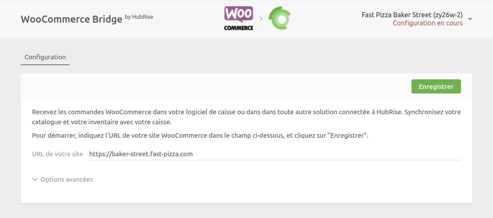
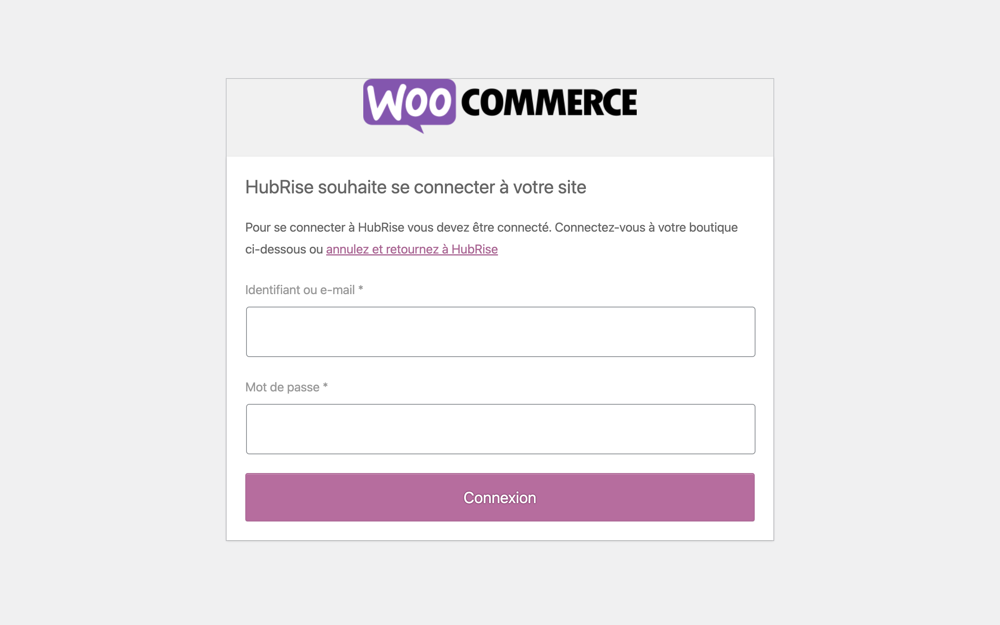
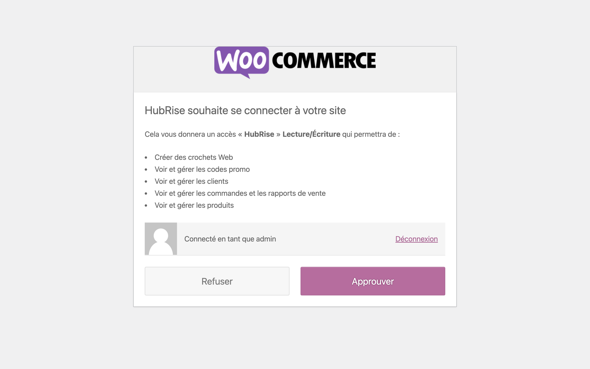

Vous pouvez connecter WooCommerce à HubRise en quelques étapes simples.

***

**REMARQUE IMPORTANTE :** Si vous ne possédez pas encore de compte HubRise, rendez-vous sur la [page d'inscription à HubRise](https://manager.hubrise.com/signup). L'inscription ne prend qu'une minute !

***

## 1. Connecter WooCommerce Bridge

Pour connecter WooCommerce Bridge à HubRise, suivez ces étapes :

1. Connectez-vous à votre [compte HubRise](https://manager.hubrise.com).
2. Dans le menu déroulant, sélectionnez le point de vente que vous souhaitez connecter.
3. Sélectionnez **CONNEXIONS**, puis **Voir les apps disponibles**.
4. Sélectionnez **WooCommerce Bridge** dans la liste des applications.
5. Cliquez sur **Connecter**.
6. Cliquez sur **Autoriser** pour autoriser WooCommerce Bridge à accéder à votre point de vente enregistré sur HubRise. Si votre compte possède plusieurs points de vente, développez **Choisissez le point de vente**, sélectionnez le point de vente à connecter, puis cliquez sur **Autoriser**.
7. Saisissez l'URL de votre boutique WooCommerce :
   .
8. Si vous avez déjà rencontré des problèmes de connexion, vous pouvez configurer les **Options avancées**. Sinon, ne les modifiez pas. Pour plus d'informations, consultez notre guide de [Dépannage](/apps/woocommerce/depannage).
9. Cliquez sur **Enregistrer** pour confirmer.
10. Cliquez sur **Connecter WooCommerce**. Vous êtes redirigé vers la page d'autorisation WooCommerce.
    - Si vous n'êtes pas connecté à WooCommerce, saisissez vos identifiant et mot de passe, puis cliquez sur **Connexion**.
      
    - Cliquez sur **Approuver** pour autoriser la connexion à HubRise.
      
11. Vous êtes redirigé vers la page de configuration de WooCommerce Bridge, où vous pouvez personnaliser votre connexion à HubRise.

## 2) Configurer vos préférences

Une fois la connexion effectuée, vous devez renseigner quelques paramètres sur la page Configuration afin que les commandes soient transmises correctement à votre logiciel de caisse.

Pour plus d'informations sur la page Configuration et la manière d'y accéder, voir [Configuration](/apps/woocommerce/interface-utilisateur#configuration). Pour plus de détails sur la configuration des paramètres WooCommerce Bridge, voir la rubrique [Configuration](/apps/woocommerce/configuration).

## 3. Envoyer votre menu

Si vous disposez d'un catalogue de produits sur HubRise, vous pouvez l'envoyer dans votre boutique WooCommerce d'un seul clic.

Pour plus d'informations sur les catalogues HubRise, voir la rubrique [Catalogues] (/docs/catalogues).
Pour savoir comment envoyer votre catalogue HubRise dans WooCommerce, voir [Envoyer le catalogue](/apps/woocommerce/envoi-catalogue).
