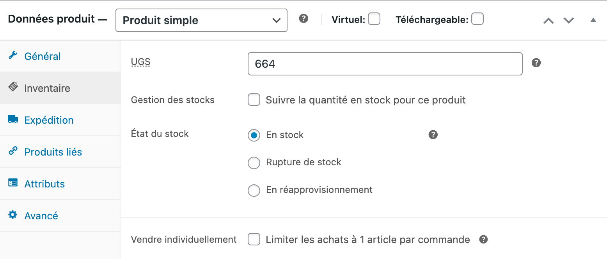
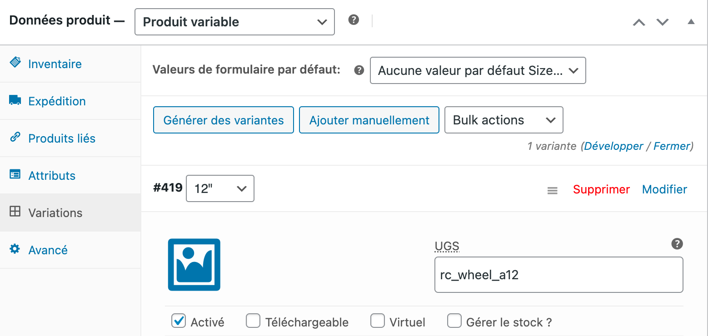

Pour traiter correctement les commandes, la plupart des logiciels de caisse exigent un code ref pour chaque produit. Vous devez donc vérifier que chaque produit dans WooCommerce est associé au bon code ref.

Cette page explique comment configurer manuellement les codes ref dans WooCommerce. Certains logiciels de caisse offrent la possibilité d'exporter leur catalogue vers HubRise, ce qui permet de renseigner automatiquement les bons codes ref des produits WooCommerce. Pour plus de détails, voir [Envoyer le catalogue](/apps/woocommerce/push-catalog).

## Produits et SKU

Pour attribuer des codes ref à vos produits WooCommerce, suivez ces étapes :

1. Connectez-vous à votre back-office WooCommerce.
2. Dans le menu, sélectionnez **Produits** > **Tous les produits**.
3. Dans la liste des produits, trouvez celui pour lequel vous voulez ajouter le code ref, et cliquez sur **Modifier**.
4. Si le produit n'a pas de variante, suivez les instructions suivantes :
   - Ouvrez l'onglet **Inventaire**.
   - Saisissez le code ref SKU HubRise dans le champ **UGS**.
     
5. Si le produit a des variantes, suivez les instructions suivantes :
   - Ouvrez l'onglet **Variations**.
   - Cliquez sur la variante souhaitée afin de développer le formulaire.
   - Saisissez le code ref SKU HubRise dans le champ **UGS**.
     
6. Cliquez sur **Enregistrer les modifications** pour confirmer.

Répétez cette procédure pour chacun de vos produits.

## Options

WooCommerce ne prend pas en charge les options. Utilisez plutôt les produits et les SKU.
