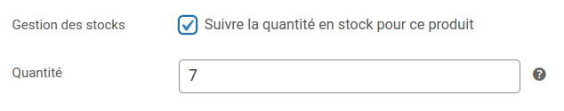

Avec WooCommerce Bridge, vous pouvez synchroniser votre inventaire HubRise avec WooCommerce.

Certains logiciels de caisse et de gestion des stocks peuvent mettre à jour les données d'inventaire dans HubRise. Pour vérifier si une application spécifique prend en charge la synchronisation de l'inventaire, reportez-vous à sa documentation sur notre [page Apps](/apps). Vous pouvez également gérer votre inventaire en utilisant [OrderLine](/apps/orderline/overview).

## Synchronisation de l'inventaire

Lorsque l'inventaire HubRise est mis à jour, WooCommerce Bridge peut ajuster automatiquement les compteurs d'inventaire dans WooCommerce.

Pour vérifier si le suivi des stocks est activé pour un produit, suivez ces étapes :

1. Dans votre compte WooCommerce, ouvrez la page **Produits**.
2. Trouvez le produit à vérifier et cliquez sur **Modifier**.
3. Dans la section **Données produit** :

   - Pour les produits simples, sélectionnez **Inventaire** et assurez-vous que la case **Suivre la quantité en stock pour ce produit** est cochée.
     

   - Pour les produits variables, la case dans la section **Inventaire** doit rester décochée. Allez plutôt dans **Variations**, dépliez les variations correspondantes, et cochez la case **Gérer le stock ?** pour chaque variation.

## Envoi manuel de l'inventaire

Pour envoyer votre inventaire sur WooCommerce, suivez ces étapes :

1. Connectez-vous à votre [compte HubRise](https://manager.hubrise.com).
2. Sélectionnez le compte HubRise et le point de vente connecté à votre boutique WooCommerce.
3. Ouvrez la page **CONNEXIONS**, puis sélectionnez **WooCommerce Bridge** dans la liste des applications connectées.
4. Dans WooCommerce Bridge, sélectionnez l'onglet **Actions**.
5. Dans la section **Envoyer l'inventaire vers WooCommerce**, cliquez sur **Envoyer l'inventaire**.

## Envoi automatique de l'inventaire

WooCommerce Bridge peut envoyer votre inventaire vers WooCommerce à chaque fois qu'il est mis à jour dans HubRise. Pour activer cette option, suivez ces étapes :

1. Connectez-vous à votre [compte HubRise](https://manager.hubrise.com).
2. Sélectionnez le compte HubRise et le point de vente connecté à votre boutique WooCommerce.
3. Ouvrez la page **CONNEXIONS**, puis sélectionnez **WooCommerce Bridge** dans la liste des applications connectées.
4. Dans WooCommerce Bridge, sélectionnez l'onglet **Configuration**.
5. Dans la section **Inventaire**, cochez **Activer l'envoi automatique de l'inventaire**.
6. Cliquez sur **Enregistrer**.
