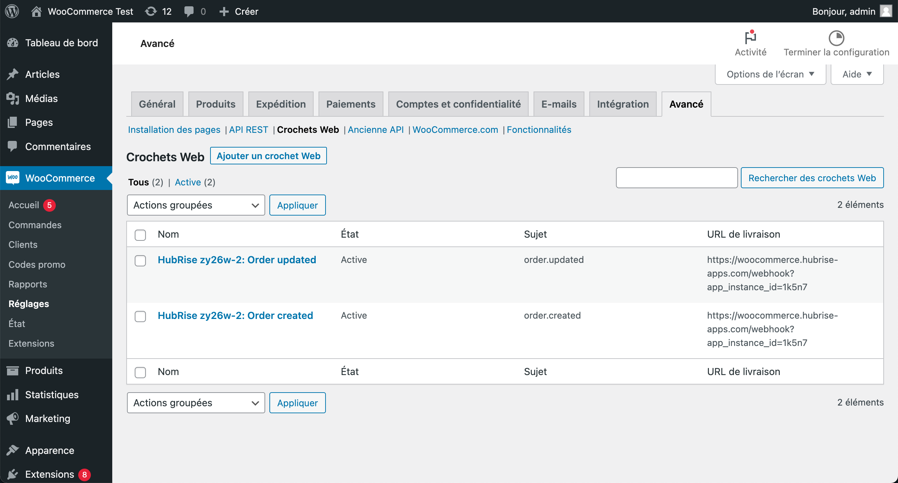
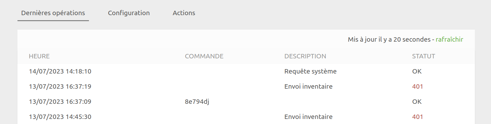
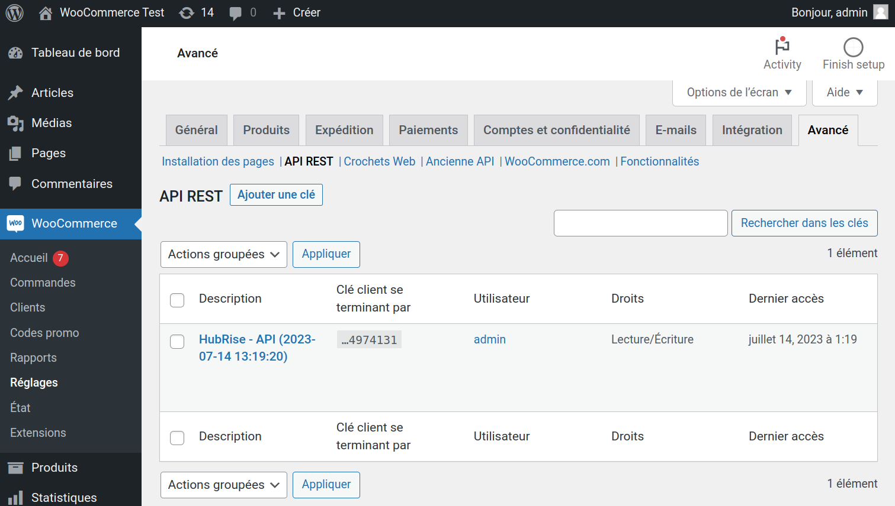
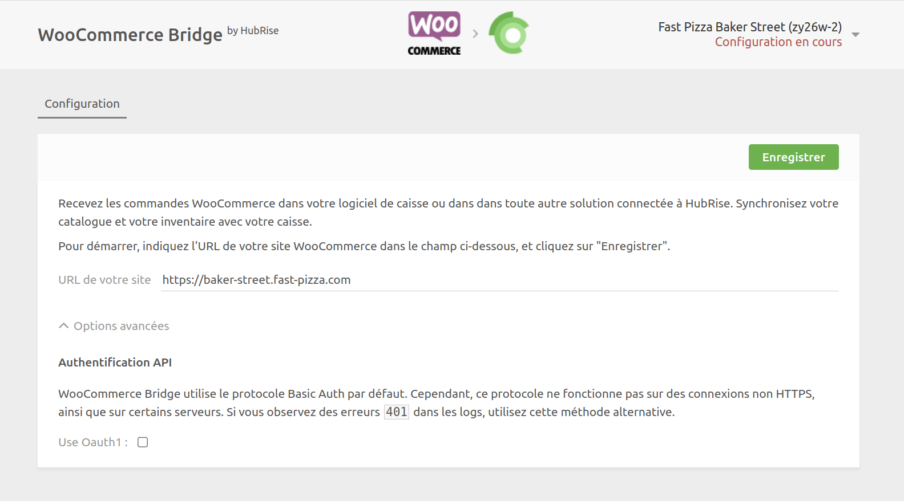

## Commandes non reçues dans HubRise

Pour recevoir des commandes dans HubRise, la première étape consiste à connecter WooCommerce à HubRise. Si ce n'est pas fait, suivez les étapes dans [Connexion à HubRise](/apps/woocommerce/connect-hubrise).

Si vous avez connecté WooCommerce à HubRise, mais vous ne recevez pas de commandes dans HubRise, vérifiez les éléments suivants.

### Vérifier les crochets Web WooCommerce

Lorsque vous connectez WooCommerce Bridge, il crée deux crochets Web sur votre site internet WooCommerce. Ceux-ci sont essentiels pour transmettre les commandes de WooCommerce à HubRise.

Vous devez vérifier la présence de ces crochets Web, mais aussi vous assurer que leur statut est **Active**. Si leur statut est **Inactive**, ils ne fonctionneront pas. Vous devrez les réactiver en cliquant sur leur nom.

Pour vérifier que les crochets Web ont été créés :

1. Ouvrez votre back-office WooCommerce.
2. Dans le panneau de navigation de gauche, cliquez sur **WooCommerce** > **Réglages** > **Avancé**.
3. Ensuite, cliquez sur **Crochets Web**.
   
4. Trouvez les deux entrées suivantes :
   - `HubRise {{id_point_de_vente}}: Order updated`
   - `HubRise {{id_point_de_vente}}: Order created`
5. Vérifiez le statut de chaque entrée. Si l'un d'entre eux est défini sur **Inactive**, cliquez sur son nom pour changer le statut en **Active**.

Si ces entrées sont présentes et actives, c'est signe que la connexion avec HubRise a bien été établie. Vous pouvez passer à l'étape suivante.

Si vous ne trouvez pas les deux entrées, vous devez reconnecter le bridge et vérifier à nouveau les crochets Web WooCommerce. Pour plus d'informations sur la connexion du bridge, voir [Connexion à HubRise](/apps/woocommerce/connect-hubrise).

### Passer une commande fictive dans WooCommerce

Pour vérifier la connexion entre WooCommerce et HubRise, passez une commande fictive dans WooCommerce et vérifiez qu'elle est transmise à HubRise.

1. Ouvrez votre back-office WooCommerce.
2. Dans le menu du haut, cliquez sur **Visiter la boutique**. Cela ouvre votre site internet WooCommerce.
3. Passez une commande sur votre site WooCommerce.
4. Retournez dans le back-office WooCommerce, et cliquez sur **WooCommerce** > **Commandes** dans le panneau de navigation de gauche. Votre nouvelle commande doit être présente.

Lorsque WooCommerce est connecté à HubRise, les commandes passées dans WooCommerce doivent être immédiatement transmises à HubRise.

Pour vérifier que votre commande fictive a bien été transmise à HubRise, suivez ces étapes :

1. Connectez-vous à votre back-office HubRise.
2. Naviguez vers la page **DONNÉES** > **COMMANDES**.
3. Trouvez votre commande de test dans cette page.

Si vous voyez la commande, la connexion entre WooCommerce et HubRise fonctionne correctement.

## Commandes reçues dans HubRise avec du retard

Par défaut, les commandes sont transmises de WooCommerce à HubRise par un processus appelé **cron**. Il s'exécute très régulièrement et transmet toutes les commandes qui ne l'ont pas encore été. Cela peut retarder la création des commandes et la mise à jour des statuts.

Vous pouvez choisir de transmettre les commandes immédiatement, sans attendre l'exécution du cron. On parle dans ce cas de **crochets Web synchrones**. Pour activer les crochets Web synchrones, suivez ces étapes :

1. Accédez aux fichiers de votre site WordPress en utilisant un client FTP ou le gestionnaire de fichiers du panneau de commande de l'hébergeur.
2. Accédez au répertoire `wp-content/themes/[votre-thème]`, où `[votre-thème]` représente le dossier de votre thème actif.
3. Ouvrez le fichier `functions.php` et ajoutez l'extrait de code suivant à la fin du fichier :
   ```
   add_filter( 'woocommerce_webhook_deliver_async', '__return_false' );
   ```
4. Enregistrez le fichier. Les modifications prendront effet immédiatement.

Si vous n'êtes pas sûr de savoir comment modifier le fichier `functions.php`, contactez le développeur de votre site WooCommerce.

## Erreurs 401

Si vous constatez des erreurs 401 dans WooCommerce Bridge, cela signifie que celui-ci est incapable de s'authentifier avec WooCommerce.



Il y a trois causes courantes d'erreurs 401 :

### Clé API supprimée

Si la clé API de HubRise a été supprimée dans WooCommerce, cela conduit à des erreurs 401. Pour le vérifier :

1. Ouvrez votre tableau de bord WordPress.
2. Accédez à **WooCommerce** > **Réglages** > **Avancé** > **API REST**.
3. Vérifiez qu'il existe bien une clé API nommée `HubRise - API`.



S'il n'y a pas de clé `HubRise - API`, cela signifie qu'elle a été supprimée. Vous devez alors reconnecter le bridge. Pour plus d'informations sur la connexion du bridge, voir [Connexion à HubRise](/apps/woocommerce/connect-hubrise).

### Échec de l'authentification de base HTTP

Si votre configuration WooCommerce ne fonctionne pas avec la méthode d'authentification de base HTTP par défaut, cela peut également entraîner des erreurs 401. Vous devez alors passer à la méthode OAuth1.

Suivez ces étapes :

1. Réinitialisez la configuration de WooCommerce Bridge.
2. Reprenez la configuration du bridge depuis le début, et à la première étape développez **Options avancées**.
3. Sélectionnez l'option **Use OAuth1**.
   
4. Poursuivez la configuration telle qu'elle est décrite dans la rubrique [Connexion à HubRise](/apps/woocommerce/connect-hubrise).

Vérifiez si cette modification a permis de résoudre les erreurs 401. Si ce n'est pas le cas, consultez les autres étapes de dépannage ou contactez HubRise sur [support@hubrise.com](mailto:support@hubrise.com).

### URL incorrecte lors de la configuration

***

**REMARQUE IMPORTANTE :** Ce problème n'est pertinent que si vous utilisez la méthode d'authentification OAuth1.

***

Lors de la configuration de la méthode OAuth1, si vous avez ajouté un `www` supplémentaire ou si vous avez oublié d'en inclure un dans l'URL de votre site internet, l'API WooCommerce répond avec le message JSON ci-dessous :

```json
{
  "code": "woocommerce_rest_authentication_error",
  "message": "Signature non valide - La signature fournie ne correspond pas.",
  "data": {
    "status": 401
  }
}
```

Dans ce cas, le message d'erreur indique que la signature fournie ne correspond pas en raison de la saisie d'une URL incorrecte. Ce problème ne survient qu'avec la configuration de la méthode OAuth1, car l'URL exacte est alors nécessaire pour calculer la signature de la requête, contrairement à Basic Auth qui n'utilise pas l'URL dans l'authentification de chaque requête. Pour résoudre le problème, vous devez vous reconnecter et utiliser l'URL exacte de votre site internet (avec ou sans le `www`, selon le cas).

Voici comment effectuer la correction :

1. Réinitialiser la configuration de WooCommerce Bridge. Pour savoir comment faire, voir [Réinitialiser la configuration](/apps/woocommerce/configuration#reset).
2. Reprenez la configuration du bridge depuis le début. À la première étape, saisissez l'URL de votre boutique WooCommerce, en veillant à ce qu'elle corresponde exactement à votre site internet (attention à la présence ou non de `www`).
3. Poursuivez la configuration telle qu'elle est décrite dans [Connexion à HubRise](/apps/woocommerce/connect-hubrise).
