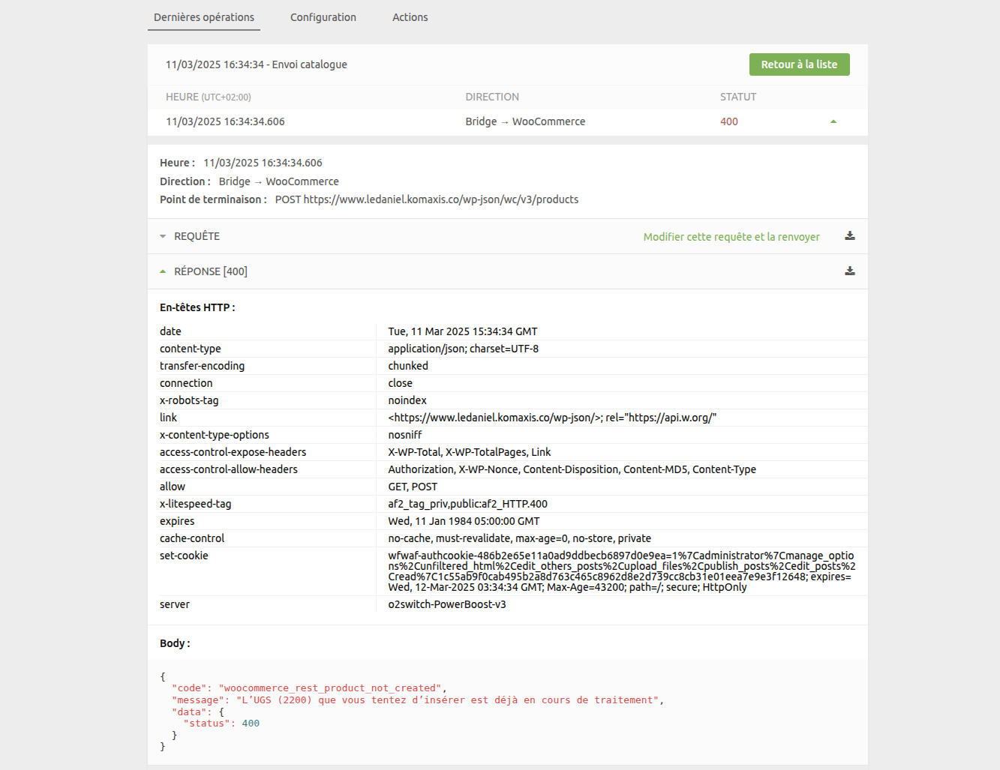
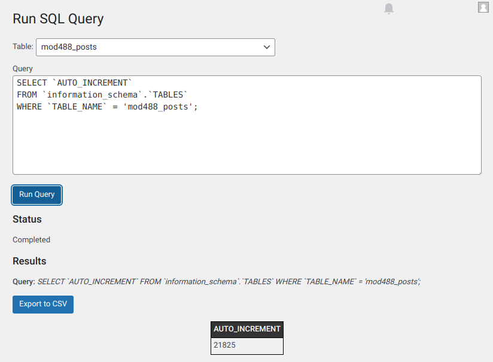

## Commandes non reçues dans HubRise

Pour recevoir des commandes dans HubRise, la première étape consiste à connecter WooCommerce à HubRise. Si ce n'est pas fait, suivez les étapes dans [Connexion à HubRise](/apps/woocommerce/connect-hubrise).

Si vous avez connecté WooCommerce à HubRise mais que vous ne recevez pas de commandes dans HubRise, vérifiez les problèmes courants suivants.

### Vérifier les crochets Web WooCommerce {#check-woocommerce-webhooks}

Lorsque vous connectez WooCommerce Bridge, il crée deux crochets Web sur votre site internet WooCommerce. Ceux-ci sont essentiels pour transmettre les commandes de WooCommerce à HubRise.

Vous devez vérifier la présence de ces crochets Web, mais aussi vous assurer que leur statut est **Active**. Si leur statut est **Inactive**, ils ne fonctionneront pas. Vous devrez les réactiver en cliquant sur leur nom.

Si vous constatez que les crochets Web ont été désactivés, il est probable que WooCommerce n'a pas été configuré pour empêcher leur désactivation automatique - voir [Crochets Web automatiquement désactivés](#webhooks-automatically-disabled) ci-dessous.

Pour vérifier que les crochets Web ont été créés :

1. Ouvrez votre back-office WooCommerce.
2. Dans le panneau de navigation de gauche, cliquez sur **WooCommerce** > **Réglages** > **Avancé**.
3. Ensuite, cliquez sur **Crochets Web**.
   
4. Trouvez les deux entrées suivantes :

- `HubRise {{id_point_de_vente}}: Order updated`
- `HubRise {{id_point_de_vente}}: Order created`

5. Vérifiez le statut de chaque entrée. Si l'un d'entre eux est défini sur **Inactive**, cliquez sur son nom pour changer le statut en **Active**.

Si ces entrées sont présentes et actives, c'est signe que la connexion avec HubRise a bien été établie. Vous pouvez passer à l'étape suivante.

Si vous ne trouvez pas les deux entrées, vous devez reconnecter le bridge et vérifier à nouveau les crochets Web WooCommerce. Pour plus d'informations sur la connexion du bridge, voir [Connexion à HubRise](/apps/woocommerce/connect-hubrise).

### Crochets Web automatiquement désactivés {#webhooks-automatically-disabled}

Si vos crochets Web WooCommerce sont automatiquement désactivés, cela est probablement dû à des échecs d'envoi répétés. Par défaut, WooCommerce désactive les crochets Web après 5 échecs consécutifs.

Pour empêcher la désactivation automatique des crochets Web, consultez les instructions détaillées dans [Empêcher la désactivation automatique des crochets Web](/apps/woocommerce/connect-hubrise#prevent-automatic-webhook-disabling) dans la documentation Connexion à HubRise.

Si les crochets Web ont déjà été désactivés, vous devrez les réactiver manuellement en suivant les étapes de [Vérifier les crochets Web WooCommerce](#check-woocommerce-webhooks) ci-dessus.

### Erreur 422 - Private Ref déjà utilisée

Lorsque la synchronisation des commandes WooCommerce avec HubRise échoue, vous pouvez rencontrer une erreur `422` avec le corps de réponse suivant :

```json
{
  "message": "Validation failed",
  "errors": [
    {
      "field": "/private_ref",
      "message": "is already used ('21824' given)"
    }
  ],
  "error_type": "unprocessable_entity"
}
```

Cette erreur indique que l'ID de commande (`private_ref`) envoyé est déjà utilisé. Cela se produit généralement après une restauration de base de données dans WooCommerce, qui réinitialise la valeur d'auto-incrémentation de la table `wp_posts`, provoquant des ID en double pour les nouvelles commandes.

Pour résoudre ce problème :

1. Utilisez SQL Query Tool pour trouver l'ID le plus élevé dans votre table des articles (voir [Utilisation de SQL Query Tool](#using-sql-query-tool)).
2. Mettez à jour la valeur d'auto-incrémentation pour qu'elle soit supérieure de 1 à l'ID le plus élevé actuel.
3. Passez une commande de test pour vérifier que le problème est résolu.

### Passer une commande fictive dans WooCommerce

Pour vérifier la connexion entre WooCommerce et HubRise, passez une commande fictive dans WooCommerce et vérifiez qu'elle est transmise à HubRise.

1. Ouvrez votre back-office WooCommerce.
2. Dans le menu du haut, cliquez sur **Visiter la boutique**. Cela ouvre votre site internet WooCommerce.
3. Passez une commande sur votre site WooCommerce.
4. Retournez dans le back-office WooCommerce, et cliquez sur **WooCommerce** > **Commandes** dans le panneau de navigation de gauche. Votre nouvelle commande doit être présente.

Lorsque WooCommerce est connecté à HubRise, les commandes passées dans WooCommerce doivent être immédiatement transmises à HubRise.

Pour vérifier que votre commande fictive a bien été transmise à HubRise, suivez ces étapes :

1. Connectez-vous à votre back-office HubRise.
2. Naviguez vers la page **DONNÉES** > **COMMANDES**.
3. Trouvez votre commande de test dans cette page.

Si vous voyez la commande, la connexion entre WooCommerce et HubRise fonctionne correctement.

## Commandes reçues dans HubRise avec du retard

Par défaut, WooCommerce traite les crochets Web de manière asynchrone, ce qui peut retarder la transmission des commandes vers HubRise de plusieurs minutes.

Pour activer la transmission immédiate des commandes, vous devez configurer l'envoi synchrone des crochets Web. Pour des instructions détaillées, voir [Activer l'envoi synchrone des crochets Web](/apps/woocommerce/connect-hubrise#enable-synchronous-webhook-delivery) dans la documentation Connexion à HubRise.

## Les mises à jour du catalogue ne fonctionnent pas

### Enregistrements orphelins

Si les mises à jour du catalogue de HubRise vers WooCommerce échouent, cela peut être dû à des enregistrements orphelins dans la table `wp_wc_product_meta_lookup`, un [bug connu de WooCommerce](https://github.com/woocommerce/woocommerce/pull/55097) corrigé dans la version 9.8.

Pour confirmer qu'il s'agit bien de ce problème :

1. Dans WooCommerce Bridge, trouvez l'opération de push du catalogue échouée (affichant le code d'erreur `400`).
2. Cliquez sur l'opération pour afficher ses détails.
3. Développez la section **RESPONSE** pour voir les détails de l'erreur.



Si vous voyez un message d'erreur comme le suivant, cela confirme le problème d'enregistrements orphelins :

```json
{
  "code": "woocommerce_rest_product_not_created",
  "message": "L'UGS (2200) que vous tentez d'insérer est déjà en cours de traitement",
  "data": {
    "status": 400
  }
}
```

L'erreur indique que l'UGS que vous essayez d'insérer est déjà en cours de traitement, ce qui est dû à des enregistrements orphelins dans la base de données.

Pour supprimer les enregistrements orphelins :

1. Installez SQL Query Tool. Consultez [Utilisation de SQL Query Tool](#using-sql-query-tool).

2. Exécutez cette requête SQL (remplacez `wp_` par le préfixe de vos tables) :

```sql
DELETE pm FROM wp_wc_product_meta_lookup pm
LEFT JOIN wp_posts p ON pm.product_id = p.ID
WHERE p.ID IS NULL OR p.post_status = 'trash'
```

3. Essayez à nouveau votre mise à jour du catalogue. Elle devrait fonctionner correctement.

Pour éviter la création de nouveaux enregistrements orphelins, mettez à jour WooCommerce vers la version 9.8 ou une version ultérieure, qui inclut une correction pour ce problème.

## Erreurs 401

Si vous constatez des erreurs `401` dans WooCommerce Bridge, cela signifie que celui-ci est incapable de s'authentifier avec WooCommerce.


Il existe trois causes courantes pour les erreurs `401` :

### Clé API supprimée

Si la clé API pour HubRise a été supprimée dans WooCommerce, cela entraînera des erreurs `401`. Pour le vérifier :

1. Ouvrez votre tableau de bord WordPress.
2. Accédez à **WooCommerce** > **Réglages** > **Avancé** > **API REST**.
3. Vérifiez qu'il existe bien une clé API nommée `HubRise - API`.


S'il n'y a pas de clé `HubRise - API`, cela signifie qu'elle a été supprimée. Vous devez alors reconnecter le bridge. Pour plus d'informations sur la connexion du bridge, voir [Connexion à HubRise](/apps/woocommerce/connect-hubrise).

### Échec de l'authentification Basic HTTP

Si votre configuration WooCommerce ne fonctionne pas avec la méthode d'authentification de base HTTP par défaut, cela peut également entraîner des erreurs `401`. Vous devez alors passer à la méthode OAuth1.

Suivez ces étapes :

1. Réinitialisez la configuration de WooCommerce Bridge.
2. Reprenez la configuration du bridge depuis le début, et à la première étape développez **Options avancées**.
3. Sélectionnez l'option **Use OAuth1**.
   
4. Poursuivez la configuration telle qu'elle est décrite dans [Connexion à HubRise](/apps/woocommerce/connect-hubrise).

Vérifiez si cette modification a permis de résoudre les erreurs `401`.

### URL incorrecte lors de la configuration

---

**REMARQUE IMPORTANTE :** Ce problème n'est pertinent que si vous utilisez la méthode d'authentification OAuth1.

---

Lors de la configuration de la méthode OAuth1, si vous avez ajouté un `www` supplémentaire ou si vous avez oublié d'en inclure un dans l'URL de votre site internet, l'API WooCommerce répond avec le message JSON ci-dessous :

```json
{
  "code": "woocommerce_rest_authentication_error",
  "message": "Signature non valide - La signature fournie ne correspond pas.",
  "data": {
    "status": 401
  }
}
```

Dans ce cas, le message d'erreur indique que la signature fournie ne correspond pas en raison de la saisie d'une URL incorrecte. Ce problème ne survient qu'avec la configuration de la méthode OAuth1, car l'URL exacte est alors nécessaire pour calculer la signature de la requête, contrairement à Basic Auth qui n'utilise pas l'URL dans l'authentification de chaque requête. Pour résoudre le problème, vous devez vous reconnecter et utiliser l'URL exacte de votre site internet (avec ou sans le `www`, selon le cas).

Voici comment effectuer la correction :

1. Réinitialiser la configuration du bridge WooCommerce, voir [Réinitialiser la configuration](/apps/woocommerce/configuration#reset) pour les instructions.
2. Reprenez la configuration du bridge depuis le début. À la première étape, saisissez l'URL de votre boutique WooCommerce, en veillant à ce qu'elle corresponde exactement à votre site internet (attention à la présence ou non de `www`).
3. Poursuivez la configuration telle qu'elle est décrite dans [Connexion à HubRise](/apps/woocommerce/connect-hubrise).

## Utilisation de SQL Query Tool {#using-sql-query-tool}

Plusieurs procédures de dépannage nécessitent l'exécution de requêtes SQL directement sur votre base de données WooCommerce. Voici comment procéder en toute sécurité :

### Installation de SQL Query Tool

1. Installez le plugin [Run SQL Query](https://wordpress.com/plugins/run-sql-query) depuis votre panneau d'administration WordPress.
2. Une fois installé, allez dans **Outils** > **Run SQL Query**.

L'interface ressemblera à ceci :



### Recherche du préfixe de vos tables

Les tables WooCommerce peuvent avoir un préfixe personnalisé au lieu du préfixe `wp_` par défaut. Pour trouver votre préfixe :

1. Consultez la liste des tables affichées dans SQL Query Tool.
2. Trouvez une table se terminant par `_posts` (par exemple, `mod488_posts`).
3. Le préfixe correspond à tout ce qui précède `_posts`. Dans l'exemple `mod488_posts`, le préfixe est `mod488_`.

### Exécution des requêtes SQL

Lors de l'exécution des procédures de dépannage :

1. Remplacez le préfixe `wp_` dans les requêtes SQL par votre préfixe de table réel.
2. Copiez la requête SQL complète dans la zone de requête.
3. Cliquez sur **Run Query** pour exécuter la requête.

Par exemple, si votre préfixe est `mod488_`, vous remplacerez `wp_posts` par `mod488_posts`.

## Besoin d'aide supplémentaire ?

Si vous rencontrez toujours des problèmes après avoir suivi ces étapes, n'hésitez pas à contacter support@hubrise.com pour obtenir de l'aide.
