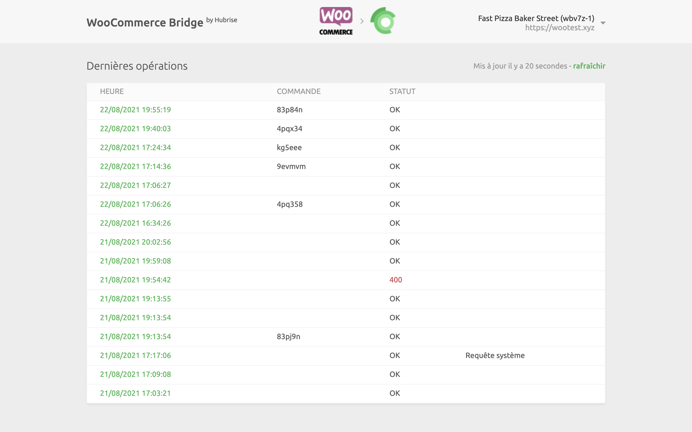
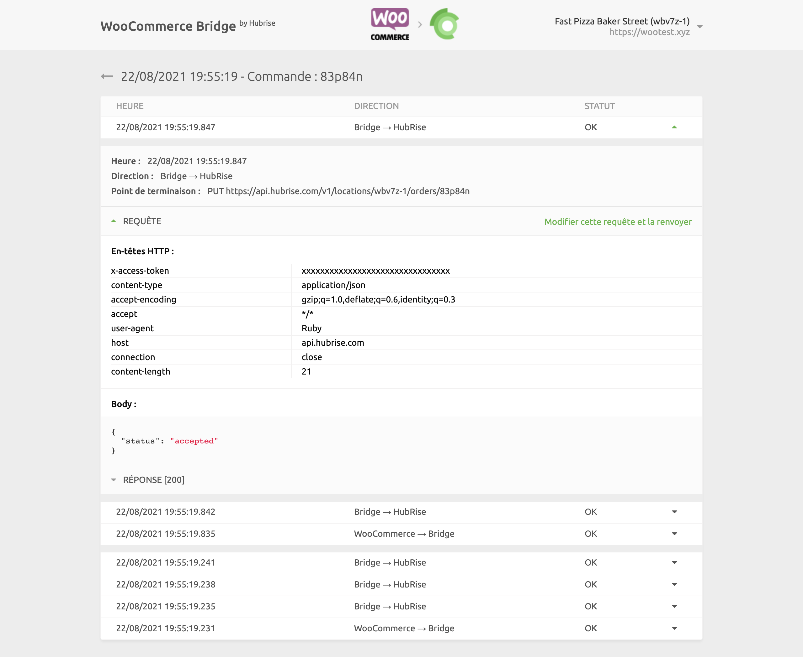
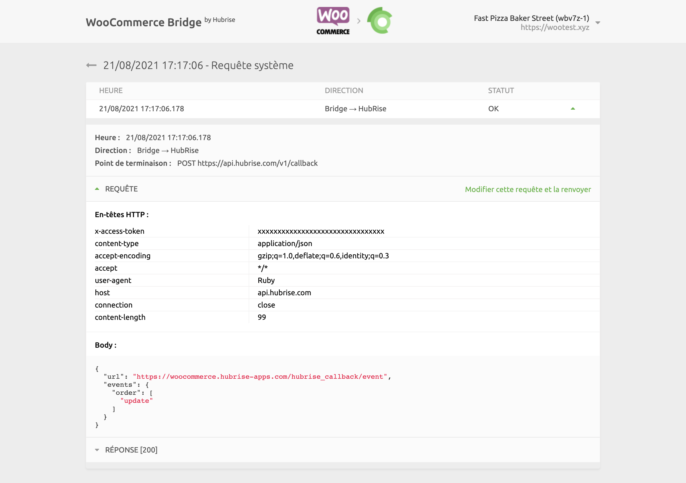
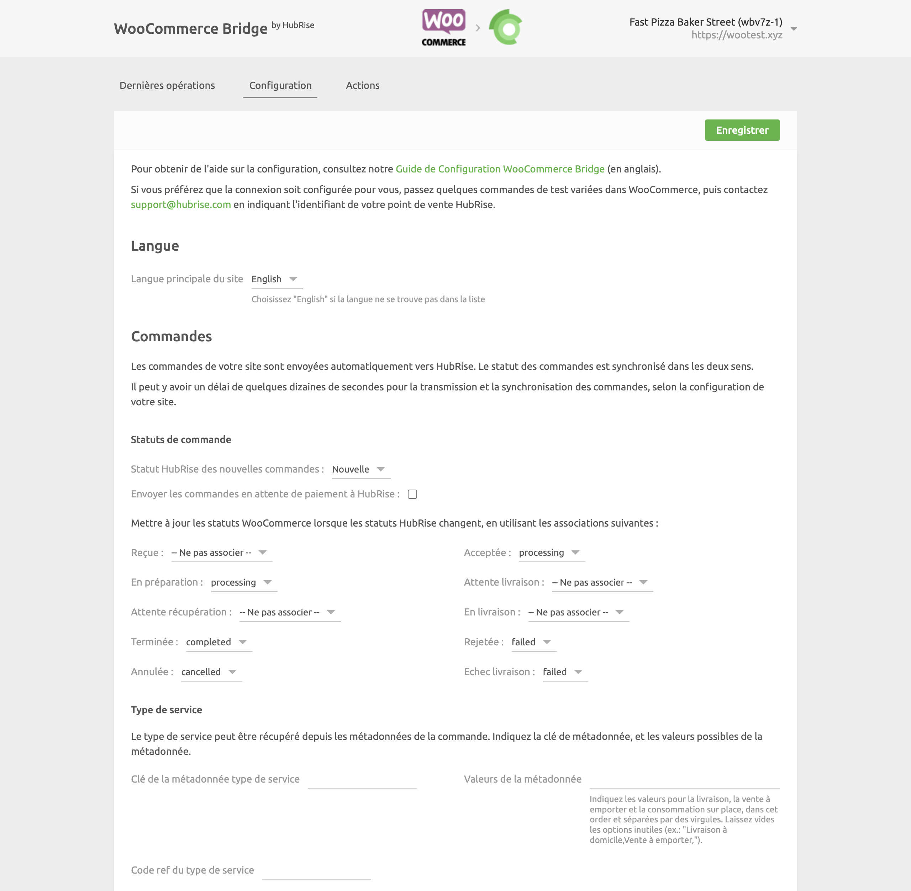

Dans WooCommerce Bridge, vous pouvez consulter les logs de toutes les opérations entre HubRise et WooCommerce, et accéder à la page de configuration de l'intégration.

## Dernières opérations

Il s'agit de la page qui s'affiche lorsque vous ouvrez WooCommerce Bridge. Elle affiche les dernières opérations d'API échangées entre HubRise, WooCommerce et WooCommerce Bridge.

Les opérations peuvent soit être liées à une commande spécifique, soit être des requêtes système génériques exécutées par WooCommerce Bridge.

Chaque ligne de la page affiche les informations suivantes sur une opération :

- **HEURE** : date et heure de la commande.
- **COMMANDE** : identifiant HubRise de la commande, pour les opérations liées à la commande.
- **DESCRIPTION** : description facultative pour les opérations qui ne sont pas liées à une commande spécifique. Cette colonne peut être vide, ou afficher `Requête système` ou `Envoi catalogue`.
- **STATUT** : statut de la commande. La valeur `OK` indique que la commande a bien été transmise. Si un problème survient, un code d'erreur s'affichera en rouge, tel que `400`.

Le libellé **Requête système** indique que l'opération n'est pas liée à une commande spécifique.

Cliquez sur une ligne pour afficher une page avec les logs associés à l'opération.

### Opération de commande

Sélectionnez une opération de commande dans la liste de la page principale pour afficher tous les logs des requêtes d'API échangées entre HubRise et WooCommerce via WooCommerce Bridge.

Les requêtes sont classées par ordre chronologique inverse, et celles liées au même événement de commande (commande reçue, commande annulée, etc.) sont regroupées.

Dans les logs, chaque ligne contient les informations suivantes :

- **Heure** : date et l'heure d'envoi de la requête.
- **Direction** : applications qui envoient et reçoivent la requête, selon le format Origine → Destination.
- **Point de terminaison** : statut de la requête. La valeur `OK` indique que la requête a bien été reçue. Dans le cas contraire, un message précise le type d'erreur survenue.

Cliquez sur une requête pour la développer et afficher le détail de ses logs et sa réponse.

Les logs constituent un puissant outil de débogage en cas d'incident. Pour comprendre comment lire ces logs, voir [Comprendre les logs HubRise](/docs/hubrise-logs/overview).

### Opération de requête système

Les pages de requête système fournissent des informations de débogage utiles aux équipes d'assistance. Cependant, elles ont généralement peu d'intérêt pour les autres utilisateurs.
La mise en page est identique à celle d'une page de commande.

Les requêtes système sont généralement envoyées par WooCommerce Bridge pour informer HubRise d'une modification de la configuration ou pour récupérer les informations les plus récentes. Par exemple, nous pourrions observer une requête de mise à jour du callback de WooCommerce Bridge après un changement de configuration.

## Actions

Pour accéder à la page des actions, cliquez sur **Actions** en haut de l'écran. Si le lien n'apparaît pas, terminez d'abord la configuration de WooCommerce Bridge.

Depuis la page des actions, vous pouvez envoyer le catalogue vers WooCommerce. Pour plus de détails, voir [Envoyer le catalogue](/apps/woocommerce/push-catalog).

## Configuration {#configuration}

Pour accéder à la page de configuration de WooCommerce Bridge, cliquez sur **Configuration** en haut de l'écran. Cette page vous permet de personnaliser le comportement de WooCommerce Bridge. Pour plus de détails, voir [Configuration](/apps/woocommerce/configuration).

## Langue et navigation

Dans le coin supérieur droit de la page, vous pouvez cliquer sur la flèche pour développer le menu. De là, vous pouvez alterner l'affichage de la page en anglais ou en français.

Un clic sur le logo de WooCommerce ou de HubRise en haut de n'importe quelle page de WooCommerce Bridge vous ramène à la page **Dernières opérations**.
