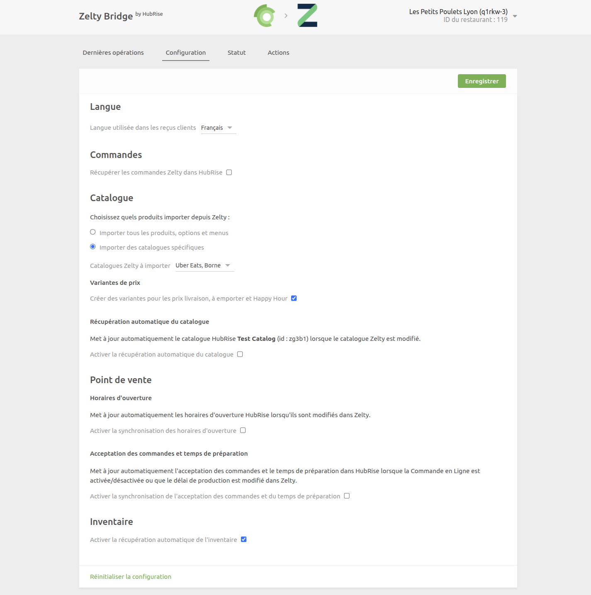
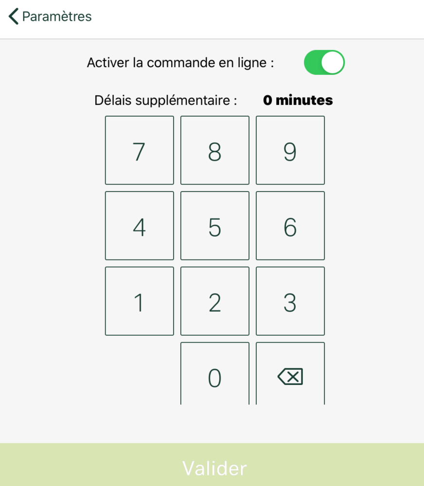
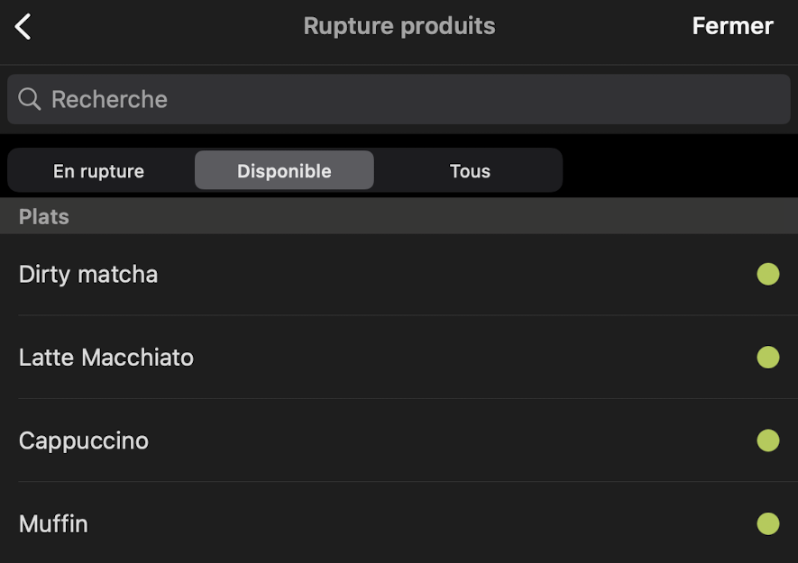

La page de configuration vous permet de personnaliser le comportement de Zelty Bridge selon vos besoins. Elle est divisée en plusieurs sections pour faciliter la navigation.

## Langue

Choisissez la langue à utiliser pour les éléments génériques tels que `Adresse par défaut`. Ces noms peuvent apparaître dans votre logiciel de caisse et sur les reçus des clients.

## Commandes

### Récupérer les commandes Zelty dans HubRise

Activez l'option **Récupérer les commandes Zelty dans HubRise** pour recevoir dans HubRise les commandes créées directement dans Zelty. Cela permet de centraliser toutes vos commandes, qu'elles proviennent de votre caisse ou d'autres canaux, dans un seul système.

Cette fonctionnalité est utile si vous utilisez :

- Des solutions de paiement à table connectées à HubRise
- Des systèmes d'analyse de données qui nécessitent toutes vos commandes
- D'autres applications qui ont besoin d'accéder à l'ensemble de vos ventes

## Catalogue {#catalogue}

### Choisissez quels produits importer depuis Zelty

Vous avez deux options pour l'import du catalogue :

- **Importer tous les produits, options et menus** : Sélectionnez cette option pour importer tous votre carte Zelty dans HubRise.
- **Importer des catalogues spécifiques** : Choisissez cette option si vous souhaitez importer uniquement certains catalogues. Une liste déroulante apparaîtra pour vous permettre de sélectionner les catalogues à importer.

### Variantes de prix

Cochez l'option **Créer des variantes pour les prix livraison, à emporter et Happy Hour** pour importer ces tarifs dans HubRise. Lorsque cette option est activée, Zelty Bridge créera automatiquement une variante de catalogue HubRise par tarif.

### Récupération automatique du catalogue

Cochez l'option **Activer la récupération automatique du catalogue** pour que votre catalogue HubRise soit automatiquement mis à jour lorsque vous le publiez depuis le back-office Zelty.

Lorsque cette option est activée, vous pouvez déclencher une mise à jour du catalogue directement depuis le back-office Zelty. Pour plus de détails, consultez [Récupérer le catalogue](/apps/zelty-bridge/pull-catalog#via-zelty-bo).

## Point de vente

### Horaires d'ouverture

Activez l'option **Activer la synchronisation des horaires d'ouverture** pour que vos horaires définis dans Zelty soient automatiquement transmis à HubRise et à toutes vos applications connectées.

Cette option synchronise les **Horaires d'ouverture du restaurant** depuis le back-office Zelty (et non les horaires de livraison). La synchronisation est déclenchée automatiquement lorsque vous modifiez vos horaires dans Zelty :

1. Dans le back-office Zelty, allez dans **Configuration** > **Horaires**
2. Modifiez vos horaires d'ouverture
3. Cliquez sur **Sauvegarder**

Les nouveaux horaires sont alors immédiatement envoyés à HubRise.

### Acceptation des commandes et temps de préparation

Activez l'option **Activer la synchronisation de l'acceptation des commandes et du temps de préparation** pour synchroniser automatiquement :

- Le statut d'acceptation des commandes : indique si vous acceptez actuellement les commandes en ligne sur votre site Web et vos plateformes de livraison
- Le temps de préparation additionnel : le retard à ajouter au temps de préparation standard

Ces paramètres sont gérés depuis votre caisse Zelty :

1. Dans Zelty Caisse, allez dans **Paramètres** > **Commandes en ligne**
2. Utilisez le bouton **Activer la commande en ligne** pour accepter ou refuser les commandes
3. Définissez le **Délai supplémentaire** en minutes
4. Cliquez sur **Valider**

La synchronisation est déclenchée immédiatement lorsque vous cliquez sur **Valider**. Ces informations sont utilisées par les plateformes de commande en ligne et de livraison pour informer les clients et gérer les attentes de livraison.

## Inventaire

### Activer la récupération automatique de l'inventaire {#inventory-sync}

Activez l'option **Activer la récupération automatique de l'inventaire** pour synchroniser automatiquement les ruptures de stock entre Zelty et HubRise.

Cette fonction synchronise l'état de rupture de stock de vos produits et options, et non les quantités d'inventaire. La gestion se fait depuis votre caisse Zelty :

1. Dans Zelty Caisse, allez dans **Paramètres** > **Rupture produits**
2. Utilisez les onglets **En rupture**, **Disponible** ou **Tous** pour filtrer l'affichage
3. Cliquez sur le bouton vert à droite de chaque produit pour basculer sa disponibilité

La synchronisation est déclenchée immédiatement lorsqu'un produit ou une option est marqué(e) en rupture ou remis(e) en stock. Cette synchronisation permet à vos applications connectées de refléter en temps réel la disponibilité de vos produits.

## Enregistrer la configuration

Pour valider vos modifications, cliquez sur le bouton **Enregistrer** en haut de la page. Les changements prennent effet immédiatement.

## Réinitialiser la configuration

Si vous avez besoin de repartir de zéro, utilisez le lien **Réinitialiser la configuration** en bas de la page. Cette action :

- Efface tous vos paramètres actuels
- Vous ramène à la page de saisie de la clé API
- Ne supprime pas les logs d'opérations

---

**REMARQUE IMPORTANTE :** La réinitialisation de la configuration nécessite de ressaisir votre clé API Zelty.

---
