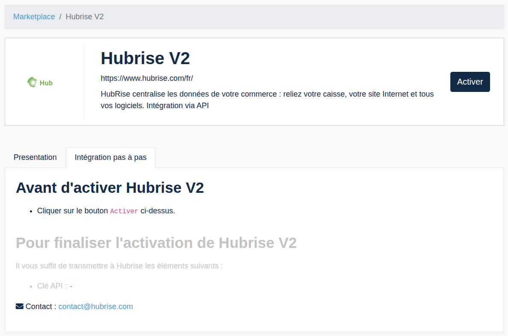
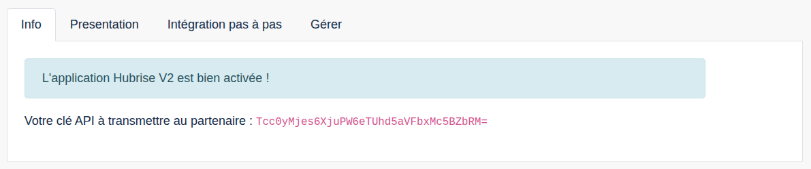

---

**REMARQUE IMPORTANTE :** Si vous ne possédez pas encore de compte HubRise, rendez-vous sur la [page d'inscription à HubRise](https://manager.hubrise.com/signup). L'inscription ne prend qu'une minute !

---

## Activer l'intégration HubRise dans Zelty

Avant de connecter Zelty Bridge à HubRise, vous devez activer l'intégration et obtenir votre clé API depuis le back-office Zelty. Voici comment procéder :

1. Depuis le back-office Zelty, ouvrez la page [Marketplace > Hubrise V2](https://bo.zelty.fr/marketplace/hubrise-v2/status).
2. Cliquez sur **Activer**.

3. L'application HubRise V2 est maintenant activée et votre clé API s'affiche immédiatement.

4. Copiez cette clé API, vous en aurez besoin pour l'étape suivante.

## Connecter Zelty Bridge

Pour connecter Zelty Bridge à HubRise, procédez comme suit :

1. Connectez-vous à votre [compte HubRise](https://manager.hubrise.com).
2. Dans le menu déroulant, sélectionnez le point de vente que vous souhaitez connecter.
3. Sélectionnez **CONNEXIONS**, puis **Voir les apps disponibles**.
4. Sélectionnez **Zelty Bridge** dans la liste des applications.
5. Cliquez sur **Connecter**.
6. Cliquez sur **Autoriser** pour autoriser Zelty Bridge à accéder à votre point de vente enregistré sur HubRise. Si votre compte possède plusieurs points de vente, développez **Choisissez le point de vente**, sélectionnez le point de vente à connecter, puis cliquez sur **Autoriser**. Si le point de vente sélectionné possède plusieurs listes de clients ou catalogues, cliquez sur **Suivant** pour afficher les listes déroulantes correspondantes, puis sélectionnez les options souhaitées.
7. Vous êtes redirigé vers l'interface de configuration de Zelty Bridge.

8. Dans le champ **Clé API**, saisissez la clé API Zelty que vous avez copiée depuis la marketplace Zelty.
9. Cliquez sur **Terminer la configuration**.
10. La page de configuration complète s'affiche. Pour plus d'informations sur les différentes options disponibles, consultez la page [Configuration](/apps/zelty-bridge/configuration).
11. Une fois la configuration terminée, vous pouvez cliquer sur **Enregistrer** pour enregistrer vos paramètres.

Votre logiciel de caisse Zelty est maintenant connecté à HubRise !

## Donner accès au support Zelty

Pour faciliter la résolution d'éventuels problèmes, nous vous recommandons de donner accès à l'équipe Zelty à votre compte HubRise. Bien que le support principal soit assuré par HubRise, cet accès permettra une collaboration entre les deux équipes si nécessaire.

Pour donner accès à Zelty, procédez comme suit :

1. Depuis le back-office de HubRise, sélectionnez **CONFIGURATION** dans le menu de gauche.
2. Dans la section **Permissions**, ajoutez `support@zelty.com`.
3. Cliquez sur **Ajouter l'utilisateur**.
4. Dans le menu déroulant de choix d'un rôle prédéfini, sélectionnez **Partenaire Technique**.
5. Cliquez sur **Définir les permissions**.

---

**REMARQUE IMPORTANTE :** Pour des raisons de sécurité, il est fortement déconseillé de partager le nom d'utilisateur et le mot de passe de votre profil utilisateur HubRise.

---

## Déconnecter Zelty Bridge

Pour déconnecter Zelty Bridge, suivez ces étapes :

1. Depuis le back-office de HubRise, sélectionnez **CONNEXIONS** dans le menu de gauche.
2. Trouvez Zelty Bridge dans la liste des applications connectées.
3. Cliquez sur **Actions** > **Déconnecter**.
4. Confirmez la déconnexion.

Vous pouvez également désactiver l'intégration depuis Zelty :

1. Depuis le back-office Zelty, ouvrez la page [Marketplace > Hubrise V2](https://bo.zelty.fr/marketplace/hubrise-v2/status).
2. Dans le menu **Gérer**, cliquez sur **Désactiver**.

Si vous souhaitez seulement stopper temporairement la réception de commandes depuis HubRise, vous pouvez bloquer la connexion entre Zelty Bridge et HubRise au lieu de la déconnecter. Pour plus d'informations, voir [Bloquer ou déconnecter une application](/docs/connections#block-or-disconnect).
