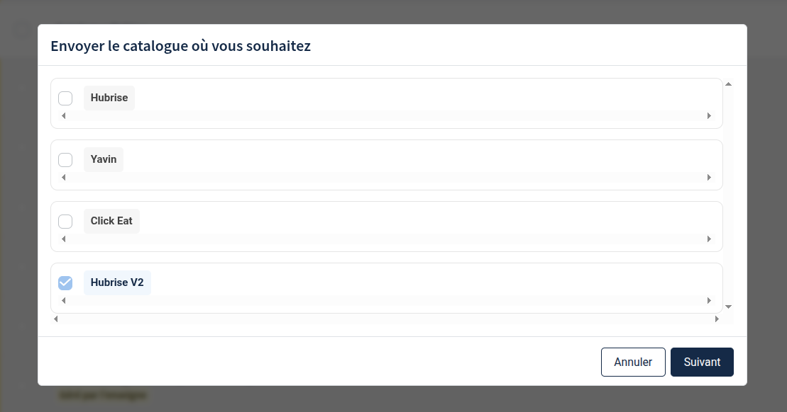

Avec Zelty Bridge, vous pouvez récupérer votre catalogue Zelty dans HubRise. Cette opération importe vos catégories, produits, options et menus depuis Zelty.

## Récupérer le catalogue dans HubRise

Il existe deux méthodes pour récupérer votre catalogue Zelty dans HubRise :

### Via Zelty Bridge

Pour récupérer votre catalogue via Zelty Bridge :

1. Ouvrez Zelty Bridge depuis votre back-office HubRise
2. Cliquez sur l'onglet **Actions**
3. Dans la section **Récupérer le catalogue depuis Zelty**, cliquez sur **Récupérer le catalogue**
4. Confirmez l'action

L'opération peut prendre quelques minutes selon la taille de votre catalogue.

### Via le back-office Zelty {#via-zelty-bo}

Si vous avez activé la récupération automatique du catalogue dans la [configuration](/apps/zelty-bridge/configuration#catalog), vous pouvez également déclencher l'import depuis le back-office Zelty.

Pour déclencher une mise à jour du catalogue depuis Zelty :

1. Ouvrez le back-office Zelty
2. Allez dans **La carte** > **Les catalogues**
3. Choisissez n'importe quel catalogue (pas nécessairement celui spécifié dans la configuration)
4. Cliquez sur les 3 points verticaux à droite
5. Sélectionnez **Envoyer vers**
6. Cochez **HubRise V2**
7. Cliquez sur **Suivant**

---

**REMARQUE IMPORTANTE :** Le catalogue HubRise existant sera écrasé par cette opération.

---

## Informations envoyées à HubRise

### Sélection du catalogue

La configuration choisie dans Zelty Bridge affecte les catégories et produits importés dans HubRise. Voir [Choisissez quels produits importer depuis Zelty](/apps/zelty-bridge/configuration#select-catalog).

#### Import de tous les produits

Lorsque vous choisissez d'importer tous les produits, options et menus :

- Les catégories dans HubRise sont créées à partir des **tags** Zelty.
- Le premier tag de chaque produit est utilisé comme catégorie dans HubRise.

Les produits sans tag sont placés dans une catégorie spéciale "Produits sans tag".

#### Import de catalogues spécifiques

Lorsque vous sélectionnez des catalogues spécifiques :

- Les catégories dans HubRise sont créées en fusionnant les **catégories** des catalogues Zelty sélectionnés.
- Seuls les produits, options et menus appartenant aux catalogues sélectionnés sont importés.

Si une catégorie est présente dans plusieurs catalogues, elle est fusionnée dans une seule catégorie HubRise. La structure hiérarchique de la première occurrence de la catégorie est conservée.

Si plusieurs catalogues sont sélectionnés, une variante de catalogue est créée pour chaque catalogue Zelty.

### Variantes

Zelty Bridge crée les variantes de catalogue suivantes :

- Lorsque l'option **Créer des variantes pour les prix livraison, à emporter et Happy Hour** est activée, Zelty Bridge crée des variantes pour chacun de ces tarifs.

- Lorsque plusieurs catalogues sont sélectionnés, Zelty Bridge crée une variante de catalogue pour chaque catalogue Zelty. Pour plus de détails, consultez [Choisissez quels produits importer depuis Zelty](/apps/zelty-bridge/configuration#select-catalog).

### Catégories

Les catégories Zelty sont importées avec les informations suivantes :

- Nom de la catégorie
- Code ref (identifiant unique Zelty)
- Description du tag ou de la catégorie, selon la méthode d'import
- Parent de la catégorie

Zelty Bridge peut également créer automatiquement deux catégories spéciales :

- "Produits cachés pour les menus" pour les produits sans catégorie utilisés dans des menus. Ces produits sont marqués avec le tag `deal_only` dans HubRise.
- "Produits sans tag" pour les produits sans tag dans Zelty, si l'option **Importer tous les produits, options et menus** est sélectionnée.

### Produits

Pour chaque produit Zelty, les informations suivantes sont importées :

- Nom du produit tel qu'affiché dans Zelty
- Description du produit
- Catégorie associée
- Code ref (identifiant unique du produit dans Zelty)
- Prix standards et, si activées, les variantes de prix (livraison, à emporter, Happy Hour)
- Taux de TVA pour consommation sur place, à emporter et livraison
- Listes d'options associées au produit
- Image principale du produit

Zelty n'a pas de notion de SKU multiple. Les produits sont donc créés dans HubRise avec une seule SKU.

### Options

Les options Zelty correspondent aux listes d'options dans HubRise. Elles sont importées avec leur structure complète :

- Nom de la liste d'options (par exemple "Taille", "Suppléments")
- Valeurs d'option disponibles avec leur nom, prix et code ref
- Contraintes de sélection (nombre minimum et maximum de sélections)

### Menus (Promotions)

Les menus Zelty sont convertis en promotions HubRise avec :

- Nom du menu tel qu'affiché dans Zelty
- Code ref (identifiant unique du menu)
- Prix total du menu
- Lignes du deal, pour chaque partie du menu :
  - Libellé de la ligne (par exemple "Entrée", "Plat principal")
  - Produits disponibles dans cette catégorie

### Inventaire

Si l'option **Activer la récupération automatique de l'inventaire** est activée dans la configuration, l'état de rupture de stock est également importé automatiquement après la récupération du catalogue. Pour plus de détails sur la synchronisation de l'inventaire, consultez la section [Inventaire](/apps/zelty-bridge/configuration#inventory-sync) de la page Configuration.
