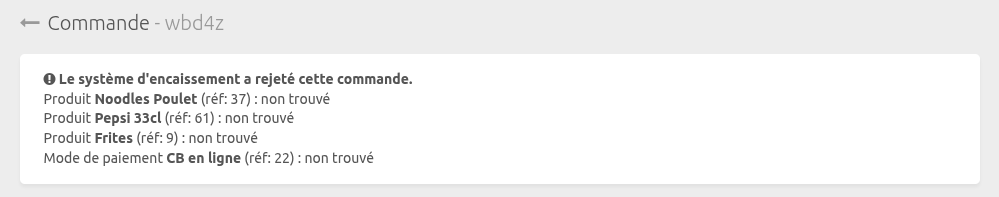

En connectant Zelty Bridge à HubRise, les commandes sont directement transmises à votre logiciel de caisse Zelty depuis toutes les solutions connectées à votre compte HubRise : plateformes de livraison de repas, commandes en ligne, bornes de commande, et bien plus encore.

Cette page décrit les informations envoyées par HubRise à votre logiciel de caisse Zelty.

## Articles {#items-and-options}

### Encodage des articles

Zelty Bridge transmet à votre logiciel de caisse les informations suivantes sur les articles de la commande :

- `sku_ref` : code ref de l'article, doit être numérique et correspondre à un produit dans Zelty.
- `price` : prix unitaire de l'article
- `quantity` : quantité d'articles dans la commande. Zelty gère la quantité en répétant l'article dans la commande. Par exemple, une commande de 3 pizzas identiques apparaîtra comme 3 lignes distinctes dans Zelty.
- `customer_notes` : notes de préparation spécifiques à l'article
- `options` : options et modificateurs associés à l'article

Les articles sans code ref ou avec des codes ref non numériques sont ignorés.

Notez que le nom du produit (`product_name`) et celui de la SKU (`sku_name`) ne sont pas transmis à Zelty, qui utilise uniquement le code ref pour identifier les articles.

Les articles avec un code ref valide mais inconnu de Zelty génèrent une erreur de validation. Pour plus d'informations, consultez [Commandes rejetées](#rejected-orders).

### Encodage des options

Pour chaque option ou modificateur de la commande, Zelty Bridge transmet :

- `ref` : code ref de l'option, doit être numérique et correspondre à une valeur d'option dans Zelty.
- `price` : prix unitaire de l'option
- `quantity` : quantité de l'option

Les options sans code ref ou avec des codes ref non numériques sont ignorées.

Comme pour les articles, les options sont transmises à Zelty sans nom, seul le code ref étant utilisé pour les identifier. Si le code ref de l'option n'existe pas dans Zelty, la commande sera rejetée. Voir [Commandes rejetées](#rejected-orders).

## Promotions

Les promotions (deals) dans HubRise sont envoyée comme des menus à Zelty :

- Le menu doit avoir un code ref numérique (`ref`). Les menus sans code ref ou avec des codes ref non numériques sont ignorés.
- Chaque ligne de promotion dans HubRise est associée à une rubrique de menu dans Zelty. Si le menu contient 3 rubriques dans Zelty, la promotion doit contenir autant de lignes dans HubRise. Les lignes de promotion HubRise sont associées aux rubriques de menu Zelty dans l'ordre où elles apparaissent.

Si le code ref du menu n'existe pas dans Zelty, la commande sera rejetée. Voir [Commandes rejetées](#rejected-orders).

## Frais additionnels

Les frais dans HubRise (livraison, service, etc.) sont envoyés comme des articles dans Zelty :

- `ref` : code ref, doit être numérique et correspondre à un article dans Zelty.
- `price` : montant

Les mêmes règles s'appliquent que pour les articles, concernant les codes ref.

## Remises

Zelty Bridge transmet les remises de la commande HubRise comme suit :

- `ref` : code ref de la remise, doit être numérique et correspondre à une remise dans Zelty.
- `amount` : montant de la remise

Contrairement à HubRise, Zelty n'accepte qu'une seule remise par commande. Si plusieurs remises sont appliquées dans HubRise :

- Seul le champ `ref` de la première remise est pris en compte
- Le montant envoyé est la somme des montants de toutes les remises

Si le code ref de la remise n'existe pas dans Zelty, la commande sera rejetée. Voir [Commandes rejetées](#rejected-orders).

## Paiements

Zelty Bridge transmet les informations de paiement de la commande HubRise :

- `ref` : code ref du mode de paiement, doit être numérique et correspondre à une méthode de paiement dans Zelty.
- `amount` : montant du paiement

Comme HubRise, Zelty prend en charge les paiements multiples.

Les paiements sans code ref ou avec un code ref non numérique sont ignorés. Si le code ref du mode de paiement n'existe pas dans Zelty, la commande sera rejetée. Voir [Commandes rejetées](#rejected-orders).

## Statuts de commande

### Envoi de la commande

Lorsqu'une commande est envoyée à Zelty, Zelty Bridge informe HubRise en mettant à jour le statut de la commande :

- `accepted` : la commande a été acceptée par Zelty
- `rejected` : la commande a été rejetée (code ref manquant, erreur de format, etc.). Voir [Commandes rejetées](#rejected-orders).

### Lorsque le statut change dans HubRise

Zelty Bridge réagit aux changements de statut suivants dans HubRise :

- `in_preparation` : démarre la production de la commande (impression tickets, affichage écrans)
- `cancelled` et `completed` : clôture la commande si elle est entièrement payée. Zelty ne permet pas de clôturer une commande qui n'est pas payée.

Les autres statuts HubRise ne déclenchent aucune action dans Zelty.

## Modification des commandes

Lorsqu'une commande existante est modifiée dans HubRise, Zelty Bridge transmet les nouveaux articles et paiements à Zelty.

Cette fonctionnalité permet d'intégrer des solutions de commande ou de paiement à table, où une commande initiale est créée dans HubRise, puis des articles ou paiements supplémentaires sont ajoutés ultérieurement.

En revanche, Zelty ne permet pas de supprimer des articles ou des paiements d'une commande existante. Les suppressions effectuées dans HubRise sont donc ignorées.

## Types de service

Zelty prend en charge les trois valeurs possibles de `service_type` dans la commande HubRise : `delivery`, `collection` et `eat_in`.

Pour les commandes en livraison, Zelty Bridge détermine le type de livraison de la manière suivante :

- Si le `service_type_ref` de la commande est `LIV_PARTENAIRE`, la commande est considérée comme livrée par un partenaire.
- Si l'adresse de livraison est présente et que l'ID client est renseigné, la commande est considérée comme livrée par le restaurant.
- Si aucune de ces conditions n'est remplie, la commande est considérée comme livrée par un partenaire.

## Informations client

### Client enregistré

Si le client a un identifiant HubRise (`id`), Zelty Bridge :

1. Crée ou met à jour le client dans Zelty
2. Associe la commande au client Zelty
3. Crée l'adresse de livraison si nécessaire

Les informations client synchronisées incluent :

- `first_name` : prénom
- `last_name` : nom de famille
- `company_name` : nom de la société
- `phone` : numéro de téléphone (converti au format E.164)
- `email` : adresse e-mail
- `sms_marketing` : consentement marketing SMS
- `email_marketing` : consentement marketing e-mail
- `birth_date` : date de naissance
- `loyalty_cards` : le champ `ref` de la première carte de fidélité est transmis comme identifiant de fidélité (si disponible). Le solde de la carte de fidélité n'est pas synchronisé.

### Client invité

Pour les commandes sans identifiant client, Zelty Bridge transmet :

- `first_name` et `last_name` : concaténés en un seul champ
- `phone` : numéro de téléphone, concaténé avec `phone_access_code` si disponible

Pour les livraisons uniquement :

- `address_1`, `postal_code`, `city` : adresse de livraison
- `address_2`, `delivery_notes` : transmis comme complément d'adresse
- `latitude` et `longitude` : coordonnées GPS

### Gestion des adresses

Zelty Bridge extrait automatiquement le numéro de rue du début de `address_1` (ex: "12 bis" dans "12 bis rue de la Paix"). Les champs HubRise utilisés sont :

- `address_1` : adresse principale (numéro et rue extraits automatiquement)
- `address_2` : complément d'adresse
- `postal_code` : code postal
- `city` : ville
- `delivery_notes` : notes de livraison
- `latitude` et `longitude` : coordonnées GPS

## Informations supplémentaires

### Autres champs transmis

Les informations suivantes de la commande HubRise sont également envoyées à Zelty, avec la correspondance suivante :

- `collection_code` : numéro d'affichage de la commande
- `expected_time` : heure attendue de la commande
- `customer_notes` : commentaire de la commande
- `custom_fields.restaurant.table_name` : numéro de table pour les commandes sur place
- `created_by` : si la commande vient d'une plateforme de commande (Uber Eats, Deliveroo, ou Just Eat), le nom de la plateforme est transmis comme source de la commande.
- `channel` : source de la commande. Seules les valeurs `web`, `mobile`, `kiosk`, et `pos` sont prises en charge, les autres sont ignorées.
- `connection_name` : marque virtuelle

### Informations de TVA

Si disponible, le taux de TVA (`tax_rate`) est transmis pour chaque article.

## Commandes rejetées {#rejected-orders}

Lorsqu'une commande est rejetée par Zelty, un message d'erreur détaillé est affiché dans le back-office HubRise. Pour voir ce message :

1. Dans le back-office HubRise, allez dans **Commandes**.
2. Cliquez sur la commande concernée.
3. Le message d'erreur apparaît en haut de la page, sous le titre de la page.

Lorsque ce message apparaît, la commande n'est pas visible dans Zelty.

Les causes de rejet les plus fréquentes sont des erreurs de codes ref. Pour résoudre ces erreurs, vérifiez que tous les codes ref sont correctement configurés dans vos applications connectées. Consultez la page [Associer les codes ref](/apps/zelty-bridge/map-ref-codes) pour plus de détails.
