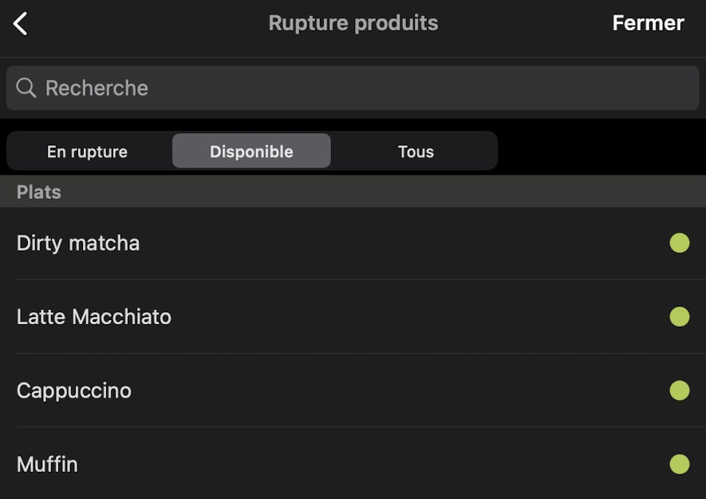

Avec Zelty Bridge, vous pouvez synchroniser automatiquement l'état de votre inventaire entre Zelty et HubRise. Cette fonctionnalité permet de maintenir à jour la disponibilité de vos produits sur toutes vos applications connectées.

## Configuration

Pour activer la synchronisation de l'inventaire, activez l'option **Activer la récupération automatique de l'inventaire** dans la page de configuration de Zelty Bridge. Pour plus d'informations sur l'activation de cette option, consultez la section [Inventaire](/apps/zelty-bridge/configuration#inventory-sync) de la page Configuration.

## Synchronisation automatique

La synchronisation d'inventaire de Zelty Bridge gère uniquement les ruptures de stock, et non les quantités d'inventaire. La gestion des ruptures de stock se fait depuis votre caisse Zelty :

1. Dans Zelty Caisse, allez dans **Paramètres** > **Rupture produits**
2. Utilisez les onglets pour filtrer l'affichage :
   - **En rupture** : affiche uniquement les produits en rupture
   - **Disponible** : affiche uniquement les produits disponibles
   - **Tous** : affiche tous les produits
3. Cliquez sur le bouton vert à droite de chaque produit pour basculer sa disponibilité

Si la synchronisation est activée, elle est déclenchée immédiatement lorsqu'un produit ou une option est marqué(e) en rupture ou remis(e) en stock.

## Synchronisation manuelle

Si vous avez activé la synchronisation d'inventaire, l'état des stocks est également mis à jour lorsque vous :

- Récupérez le catalogue depuis Zelty depuis la page **Actions**.
- Déclenchez une mise à jour du catalogue depuis le back-office Zelty (si la récupération automatique du catalogue est activée).
- Déclenchez une synchronisation manuelle de l'inventaire depuis la page **Actions**. Pour plus d'informations, consultez la section [Récupérer l'inventaire depuis Zelty](/apps/zelty-bridge/user-interface#pull-inventory).
