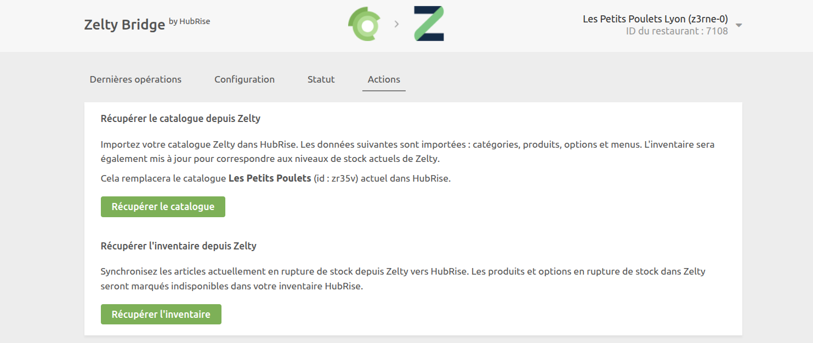

Dans Zelty Bridge, vous pouvez consulter les logs de toutes les opérations entre HubRise et Zelty, accéder à la configuration et effectuer des actions manuelles de synchronisation.

## Dernières opérations

Il s'agit de la page qui s'affiche lorsque vous ouvrez Zelty Bridge. Elle contient les dernières opérations d'API échangées entre HubRise, Zelty et Zelty Bridge.

Ces opérations peuvent être liées à une commande spécifique ou être des requêtes système génériques exécutées par Zelty Bridge.

Chaque ligne de la page affiche les informations relatives à une opération :

- **HEURE** : date et heure de l'opération
- **COMMANDE** : identifiant HubRise de la commande, pour les opérations de commande
- **DESCRIPTION** : description facultative pour les opérations qui ne sont pas liées à une commande spécifique. Cette colonne peut afficher `Requête système`, `Récupération du catalogue`, `Synchronisation inventaire`, etc.
- **STATUT** : statut de l'opération. La valeur `OK` indique que l'opération s'est bien déroulée. Dans le cas contraire, un code d'erreur s'affiche en rouge.

Cliquez sur une ligne pour afficher une page avec les logs détaillés associés à l'opération.

### Opération de commande

Sélectionnez une opération de commande dans la liste de la page principale pour afficher tous les logs des requêtes d'API échangées entre HubRise et Zelty via Zelty Bridge.

Les requêtes sont classées par ordre chronologique inverse, et celles liées au même événement de commande (commande reçue, mise à jour du statut, etc.) sont regroupées.

Dans les logs, chaque ligne contient les informations suivantes :

- **Heure** : date et heure d'envoi de la requête
- **Direction** : applications qui envoient et reçoivent la requête, selon le format Origine → Destination
- **Point de terminaison** : endpoint de l'API appelé
- **Statut** : La valeur `OK` indique que la requête a bien été reçue. Dans le cas contraire, un message précise le type d'erreur survenue.

Cliquez sur une requête pour la développer et afficher le détail des échanges (payload envoyé et réponse reçue).

Les logs constituent un puissant outil de débogage en cas d'incident. Pour comprendre comment lire ces logs, voir [Comprendre les logs HubRise](/docs/hubrise-logs/overview).

### Opération de requête système

Une page de requête système se présente de la même manière qu'une page de commande.

Les requêtes système sont généralement envoyées par Zelty Bridge pour :

- Synchroniser le catalogue
- Mettre à jour l'inventaire
- Récupérer les informations du restaurant

Ces pages fournissent des informations de débogage utiles aux équipes d'assistance.

## Configuration

Pour accéder à la page de configuration de Zelty Bridge, cliquez sur **Configuration** en haut de l'écran.

Cette page vous permet de personnaliser le comportement de Zelty Bridge. Pour plus de détails, voir [Configuration](/apps/zelty-bridge/configuration).

## Statut {#status}

La page **Statut** affiche les informations récupérées depuis l'API Zelty concernant votre restaurant et votre intégration.

Pour voir le statut actuel, vous devez rafraîchir la page en cliquant sur **Rafraîchir** en haut à droite. La date de **Dernière mise à jour** est alors actualisée.

### Restaurant

Cette section affiche les informations de votre restaurant Zelty :

- Nom du restaurant
- Adresse complète
- Statut d'acceptation des commandes (Activée/Désactivée)
- Temps de préparation et de livraison configurés dans Zelty

### Méthodes de paiement

Cette section liste toutes les méthodes de paiement configurées dans Zelty avec leurs codes ref respectifs.

Les applications connectées à HubRise doivent utiliser l'un de ces codes ref pour permettre à Zelty d'identifier la méthode de paiement utilisée par le client. Consultez la documentation de l'application correspondante pour savoir comment configurer les codes ref de paiement.

## Actions

Pour accéder à cette page, cliquez sur **Actions** en haut de l'écran.

Vous pouvez effectuer les actions suivantes :

### Récupérer le catalogue depuis Zelty

Cliquez sur **Récupérer le catalogue** pour importer votre catalogue Zelty dans HubRise. Le catalogue spécifié dans votre configuration sera remplacé par les données importées.

L'inventaire sera également mis à jour par cette action, mais uniquement si l'option **Activer la récupération automatique de l'inventaire** est activée dans la [configuration](/apps/zelty-bridge/configuration#inventory-sync).

### Récupérer l'inventaire depuis Zelty

Cliquez sur **Récupérer l'inventaire** pour synchroniser les ruptures de stock depuis Zelty vers HubRise.

Cette action mettra à jour la disponibilité de vos produits et options dans HubRise en fonction de l'état actuel de votre inventaire Zelty.

## Langue et navigation

En haut à droite de l'écran, vous pouvez voir le nom de votre restaurant et son ID Zelty.

Un clic sur le logo de Zelty ou de HubRise en haut de n'importe quelle page de Zelty Bridge vous ramène à la page **Dernières opérations**.
