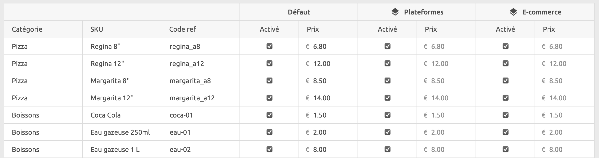
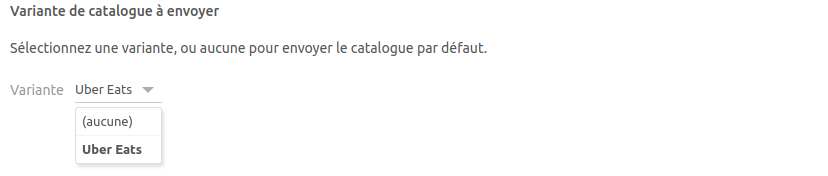

[//]: # "Photo credits: https://pixabay.com/vectors/watercolor-yellow-orange-red-green-4111953/"

Nous avons lancé les variantes de catalogue, qui permettent de gérer un seul catalogue sur plusieurs canaux et points de vente, tout en conservant la possibilité de personnaliser les prix et la disponibilité pour chaque canal et point de vente. Cette fonctionnalité vous fera non seulement gagner du temps, mais elle garantira également la cohérence et la précision sur l'ensemble de vos canaux de vente.

Dans cet article de blog, nous évoquons ce que sont les variantes de catalogue, les modifications de l'API pour les développeurs et comment les intégrations existantes ont été mises à jour.

## En quoi consistent les variantes de catalogue ?

Avec les variantes de catalogue, vous pouvez créer des règles de tarification et de disponibilité pour vos articles, en fonction du contexte ou de la plateforme sur laquelle ils sont vendus, et sans avoir à gérer des catalogues distincts.

Vous pouvez définir autant de variantes que vous le souhaitez dans un catalogue. Pour chaque variante, vous pouvez spécifier :

- **Des dépassements de prix** au niveau des SKU et des options.
- **Des restrictions** au niveau des SKU, des options, des promotions, des remises et des frais.

Par exemple, si vous souhaitez proposer un prix de pizza différent sur les plateformes de livraison de repas par rapport à votre site internet, vous pouvez créer une variante `Plateformes de livraison` et définir des dépassements de prix pour les SKU et les options qui doivent avoir un tarif différent. De même, vous pouvez désactiver des promotions ou options pour certaines variantes en utilisant des restrictions.

Chaque variante a un nom descriptif et une référence unique. Dans les applications qui utilisent le catalogue, les variantes seront généralement référencées par leur nom, et non par leur référence. Les références utilisées n'ont donc pas une grande importance. Il peut s'agir d'`1`, `2`, `3`, etc., ou de `Plateformes de livraison`, `Mon site`, etc.

L'association entre un canal/point de vente spécifique et une variante est réalisée en dehors du catalogue, dans les applications utilisant le catalogue. Chaque variante peut donc être utilisée dans plusieurs contextes, ce qui évite d'avoir à créer une variante pour chaque combinaison canal/point de vente.

Imaginons par exemple que vous souhaitiez différencier les prix entre les plateformes de livraison de repas à Paris et celles en dehors de Paris, ainsi que ceux de votre site internet. Au lieu de créer une variante distincte pour chaque combinaison de plateforme et point de vente, vous pouvez simplement créer trois variantes : `Plateformes de livraison Paris`, `Plateformes de livraison hors Paris` et `Mon site`, que vous associerez chacune à la combinaison canal/point de vente appropriée.

## Modifications de l'API

Les catalogues HubRise peuvent maintenant inclure un tableau `variants` au même niveau que le tableau `categories`. Il contient un objet par variante, et chaque objet présente une `ref` unique et un nom (`name`) non vide :

```json
{
  "data": {
    "variants": [
      {
        "ref": "1",
        "name": "Plateformes de livraison de repas"
      }
    ],
    ...
  }
}
```

Les variantes définies peuvent être utilisées dans les tableaux `price_overrides` et les objets `restrictions` au niveau du SKU, des options et des promotions. Exemple :

```json
{
  "data": {
    "variants": [
      {
        "ref": "1",
        "name": "Plateformes de livraison de repas"
      },
      {
        "ref": "2",
        "name": "Kiosque"
      }
    ],
    "categories": [...],
    "products": [
      {
        "name": "Reine jambon",
        "category_ref": "pizza",
        "skus": [
          {
            "price": "6,80 EUR",
            "price_overrides": [
              {
                "variant_refs": ["1"],
                "price": "8,00 EUR"
              }
            ]
          }
        ]
      },
      {
        "name": "Expresso",
        "category_ref": "boissons",
        "skus": {
          "price": "1,50 EUR",
          "restrictions": {
            "variant_refs": ["2"]
          }
        }
      }
    ]
  }
}
```

Dans cet exemple :

- Le prix de la pizza "Reine jambon" est de 6,80 € par défaut, mais il passe à 8,00 € lorsqu'il est commandé via les plateformes de livraison de repas.
- L'article "Expresso" est uniquement disponible lorsqu'il est commandé via le kiosque.

Les modifications apportées à l'API sont visibles dans notre [documentation sur l'API ](/developers/api/catalogs) et dans [Postman collection](https://drive.google.com/drive/folders/1fn5u-4sY0-bnrxJY9RFPvpCu0bANGNBd?usp=sharing).

***

**REMARQUE IMPORTANTE :** Les champs `service_types` et `service_type_refs` dans `restrictions` et `price_overrides` sont obsolètes. Ils continueront à fonctionner encore un peu, mais nous vous recommandons de passer à `variant_refs` dès que possible.

***

## Mise à jour de Catalog Manager

[Catalog Manager](/apps/catalog-manager/overview) est une application gratuite fournie avec HubRise. Elle permet de voir et de modifier vos catalogues.

Nous avons ajouté un nouveau mode **Grille** dans lequel vous pouvez créer des variantes, personnaliser les prix et désactiver des articles pour certaines variantes.



## Mise à jour des intégrations

Nous avons mis à jour nos intégrations avec Uber Eats, Deliveroo, Just Eat, Shopify, WooCommerce et Glovo. Pour utiliser les variantes avec ces intégrations, vous devez d'abord mettre à jour votre catalogue dans HubRise, puis ouvrir la configuration du bridge. Vous pourrez sélectionner la variante dans le menu déroulant, ou choisir **(aucune)** pour synchroniser le catalogue par défaut.


