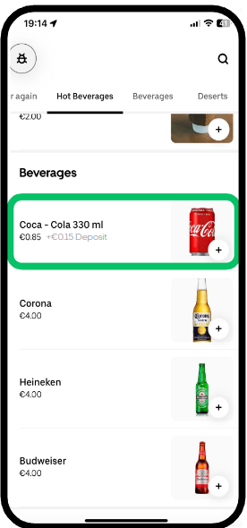
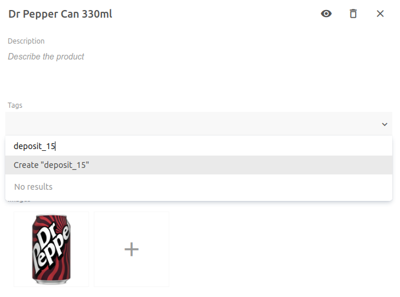

[//]: # "Photo credits: Pixabay - https://pixabay.com/photos/soda-cola-pepsi-drink-ice-can-4531147/"

As of February 1st, 2024, Ireland will introduce a Deposit Return Scheme (DRS) to promote sustainability by recycling, repurposing, and reusing beverage packaging. This scheme affects restaurants and grocery partners, who must add a deposit to all in-scope products on their menus. At HubRise, we're committed to supporting this initiative by integrating the deposit scheme into our platform.

## What is the Deposit Return Scheme?

The Deposit Return Scheme aims to reduce waste and increase recycling rates by introducing a deposit on certain beverage containers. Customers will pay a deposit on eligible products, which can be refunded when the packaging is returned to a Reverse Vending Machine.

The scheme applies to plastic, aluminum, and steel containers between 150ml and 3L in size. There are two deposit amounts: €0.15 for containers between 150ml and 500ml, and €0.25 for containers between 501ml and 3L.

## HubRise Support for the Deposit Return Scheme

We've added support for the Deposit Return Scheme to our integrations with Uber Eats, Deliveroo, and Just Eat. Our integrations now recognise product tags such as `deposit_15` and `deposit_25` and set the corresponding deposit amount when syncing the menu.

### Uber Eats Integration

For Uber Eats, the deposit amount is visible to customers in the app.



When you receive an order from Uber Eats, the deposit amount is included in the item price. In the example above, you would receive an order for a Coca-Cola 330ml priced at €1.00, with the €0.15 deposit already included.

### Deliveroo Integration

In Deliveroo orders, we pass the deposit as an additional option on the product. For example, an order for a Coca-Cola 330ml would contain a separate line item for the €0.15 deposit.

If you use an EPOS integration, you will need to create a product option for the deposit, and configure the ref code for the deposit in the Configuration page of Deliveroo Bridge.

[//]: # ""

### Just Eat Integration

For Just Eat, we also pass the deposit as an additional option on the product, similar to Deliveroo.

If you use an EPOS integration, you should also configure the ref code for the deposit in the Configuration page of Just Eat Flyt Bridge.

## Configuring Deposits with Catalog Manager

To configure deposits in HubRise, you can use our Catalog Manager free tool. Identify the products that require a deposit and add `deposit_15` or `deposit_25` tags, depending on the deposit amount. You should not increase the product price - the deposit amount will be added automatically.



Note that tags can only be set at the product level in Catalog Manager. If you have products with SKUs that each require different deposit amounts, you should list them as separate products.

## API Integration

For EPOS systems integrated with HubRise via API, developers should ensure that each beverage product or SKU that requires a deposit is correctly tagged with a `deposit_15` or `deposit_25` tag.

Tags can be set at either the product or SKU level, with the SKU tag taking precedence over the product tag.

```json
{
  "products": [
    {
      "name": "Coca-Cola 330ml",
      "description": "Example of product with deposit tag set up at product level",
      "tags": [
        "deposit_15"
      ],
      ...
    },
    {
      "name": "Pepsi",
      "description": "Example of product with two SKUs and deposit tags set up at SKU level",
      "skus": [
        {
          "name": "330ml",
          "tags": [
            "deposit_15"
          ],
          ...
        },
        {
          "name": "1.5L",
          "tags": [
            "deposit_25"
          ],
          ...
        }
      ]
    }
  ]
}
```

No other code changes are required to support the Deposit Return Scheme. The deposit amount will either be automatically added to the item price (Uber Eats), or passed as an option (Deliveroo and Just Eat).

For further assistance, please refer to our API documentation, or contact our integration support team directly.
