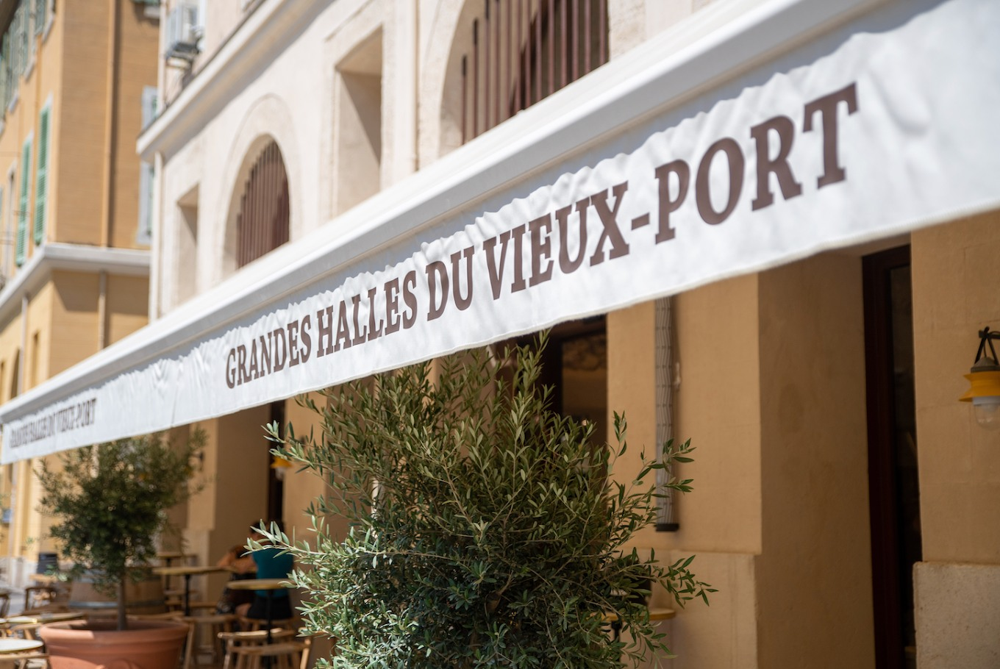
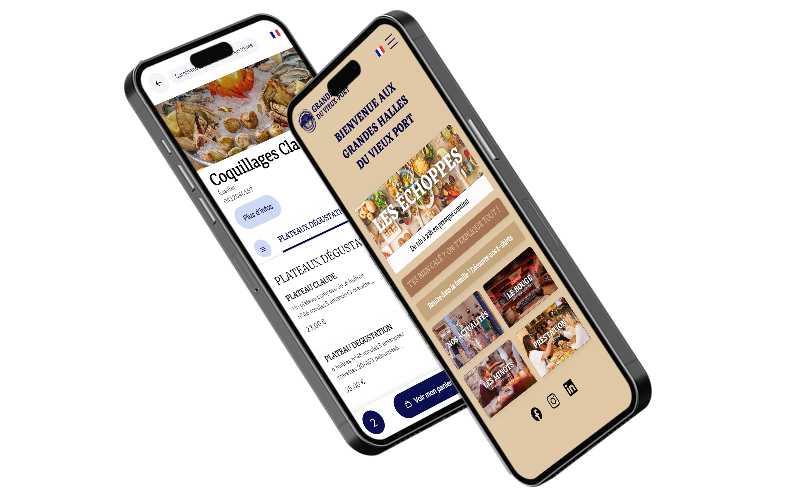

En moins de deux ans, l'établissement niché en plein coeur de Marseille est devenu un emblème de la scène culinaire méditerranéenne. Il faut dire que l'on n'y retrouve pas moins de 11 restaurants, des échoppes comme on les appelle ici, ainsi que 4 centres de profit boissons, de quoi satisfaire toutes les envies et tous les appétits. Mais plus qu'un food court, les Grandes Halles du Vieux Port, c'est d'abord et avant tout un lieu de vie, d'échange et de partage, où l'on se retrouve en famille ou entre amis pour “boire, manger et tchater”.

**La priorité absolue ici, c'est l'expérience client : quelle que soit l'affluence, elle se doit d'être fluide, agréable et sans entrave. C'est dans cette optique que les 3 amis co-fondateurs ont choisi de miser sur le digital. Les Grandes Halles, c'est en effet un concept hybride où le client a le choix de commander directement au comptoir ou en ligne, via une marketplace dédiée créée par DOOD et connectée via HubRise à Kezia II et Jalia, les logiciels de caisse JDC utilisés par les échoppes.**

Nous revenons avec Louis Cuntz - chargé de développement des Grandes Halles - sur la mise en place de ce partenariat technologique tripartite DOOD - JDC - HubRise.

## Quels étaient les principaux objectifs qui vous ont motivés à proposer une solution de commande à table ou de click & collect ?

L'objectif principal était clairement de limiter le flux dans nos halles. Selon la météo et la programmation événementielle, comme lors de la coupe du monde de rugby par exemple, on peut avoir plus de 1000 clients par jour. En offrant la possibilité de passer commande et de payer en ligne, on limite les trajets table - échoppe, ce qui génère plus de confort pour les clients, et libère les flux au niveau des comptoirs.

## Quelle part de vos clients utilise ce service de commande et quel est le profil type de ceux qui le plébiscitent ?

Les plus grands utilisateurs de notre webapp sont les familles avec enfants d'une part et la clientèle étrangère d'autre part. Pour les premiers, la commande à table rend un grand service aux parents qui peuvent consulter les menus et commander tout en restant confortablement installés sur leur chaise, plutôt que de naviguer dans les Halles d'une échoppe à l'autre. Les clients internationaux, plus habitués à ces solutions digitales, sont également de grands utilisateurs. Il faut dire qu'avec la webapp, ils ont accès à tous les menus et à toutes les infos en anglais. On constate aussi une plus grande utilisation lors de certains grands événements, donc lors de fortes affluences.
Pour autant, nos clients continuent de commander au comptoir et aujourd'hui, nous sommes à un taux d'adoption inférieur à 50%... Ce qui nous va bien ! Nous avons en effet à cœur de garder nos clients au sein des Halles. C'est un vrai lieu de vie et même un lieu de balade pour certains, qui apprécient le côté design et esthétique des lieux et qui aiment profiter de l'ambiance qui y règne. Le digital n'est pas le cœur de notre concept, c'est plutôt un accessoire qui se met au service de l'expérience client, et le pari est réussi !

## Concrètement et du point de vue utilisateur, comment se déroule une commande à table ?

Il suffit de scanner le QR code mis à disposition sur chaque table pour accéder à la boutique en ligne, une marketplace sur laquelle on peut consulter les menus des 11 échoppes, constituer le panier de son choix, passer une seule et unique commande et effectuer un seul paiement même si plusieurs échoppes sont concernées. L'interface est intuitive et le processus extrêmement simple; c'est même plutôt ludique puisqu'en plus des menus, les clients peuvent accéder à différents onglets, dont un qui est dédié aux plus jeunes avec PacMan, idéal pour faire patienter les enfants. Lorsque la commande est prête, le client reçoit une notification, puis il n'a plus qu'à aller retirer sa commande au comptoir.

## Et du point de vue des échoppiers ?

Une fois la commande validée par le client, elle arrive directement sur la caisse Kezia II ou Jalia du restaurateur, qui la valide et confirme sa prise en charge. Le client reçoit alors une notification de prise en charge de sa commande. C'est le premier statut. Une fois la commande préparée et prête à être retirée, le restaurateur clique sur “commande prête” dans son interface de gestion. Le client reçoit alors une nouvelle notification l'informant du nouveau statut de sa commande, qu'il peut venir retirer au comptoir.
Point essentiel de ce processus : lorsqu'une commande concerne plusieurs échoppes, DOOD et le logiciel de caisse communiquent entre eux, afin de dispatcher intelligemment la commande et le paiement entre les différents points de vente.

## Comment cette communication a-t-elle été rendue possible ?

C'est là qu'entre en jeu la notion d'intégration. DOOD et Kezia sont deux prestataires indépendants et leurs solutions ne sont initialement pas conçues pour communiquer entre elles et encore moins pour échanger des données. C'est ce que permet HubRise : il joue le rôle de passerelle et fait la jonction entre DOOD pour la marketplace et JDC pour les logiciels de caisse Kezia II et Jalia.

## Pourquoi avez-vous choisi DOOD pour le développement et le déploiement de votre marketplace ?

D'abord, pour son expérience auprès d'autres food court, qui est vraiment un concept de restauration à part. DOOD propose aussi une fonctionnalité qui était essentielle pour nous : le multi basket, c'est-à-dire la possibilité pour le client de consommer sur différentes échoppes en n'effectuant qu'une seule commande et un seul paiement. Le fait que l'on puisse disposer d'une interface totalement personnalisée à notre image, qui soit intuitive et disponible en version multilingues était aussi un point clé qui a pesé dans la balance. Au final, la solution proposée par DOOD répondait à tous nos enjeux et problématiques, c'est-à-dire être capable de faire face aux flux constants de visiteurs, améliorer l'expérience client et optimiser le quotidien de nos équipes.

## En quoi cette webapp permet-elle d'optimiser le quotidien des échoppiers ?

Cela fluidifie le processus de commande à tous points de vue. Les clients qui choisissent la commande à table sont autonomes, ce qui réduit les files d'attente au niveau des comptoirs et désengorge donc l'intérieur des halles, en particulier sur les périodes de rush. Cela libère du temps aux équipes, qui peuvent mieux se consacrer à la préparation des commandes. Les clients sont donc plus rapidement servis, ce qui contribue à améliorer leur niveau de satisfaction. Sans compter que cela influe positivement sur les taux de rotation et donc sur le renouvellement de la clientèle. Même si notre positionnement, c'est plutôt d'inviter nos clients à rester le plus possible pour profiter de l'ambiance des lieux en continu et découvrir l'ensemble de nos services et prestations. Après tout, notre promesse, c'est quand même “Boire, manger, tchatcher ! À n'importe quelle heure de la journée” !

<Inset>
**Felix, un client embHALLÉ par les HALLES !**

“Manger, boire, tchater” c'est la promesse des Grandes Halles du Vieux Port et c'est justement ce que sont venus faire Felix et ses 2 amis d'enfance en ce dimanche midi. C'est une belle journée d'hiver comme la Provence en a le secret, et le vieux port de Marseille bourdonne de vie. Les Halles sont bondées mais on y circule bien et l'atmosphère décontractée met rapidement les trentenaires à leur aise. Après avoir commandé un verre au comptoir du Bar Central, ils prennent place sur la grande terrasse inondée de soleil, aux côtés d'une clientèle cosmopolite.
Tout en bavardant et en sirotant leur verre, ils parcourent les cartes digitales des 11 échoppes grâce au QR code qu'ils se sont amusés à scanner. C'est d'ailleurs depuis son smartphone que l'un d'entre eux commande un plateau de fruits de mer de chez Coquillages Claude. Pour Félix et son ami, ce sera une pizza et un burger, commandés directement aux comptoirs du Grill des Halles et de la 500 Degrés Pizza, “parce que c'est sympa aussi de flâner et de se balader dans ce lieu de vie : un vrai micro quartier dans le quartier !” précise Felix.
Si l'endroit les invite à la détente et au partage, il est aussi un véritable spectacle en soi, aussi vivant et animé que peut l'être la cité Phocéenne. Heureux d'avoir choisi ce lieu pour leurs joyeuses retrouvailles, les trois amis se promettent d'ailleurs d'y revenir bientôt… L'occasion peut-être de tester de nouvelles saveurs culinaires et de profiter de l'un des nombreux événements festifs organisés aux Halles !
</Inset>
