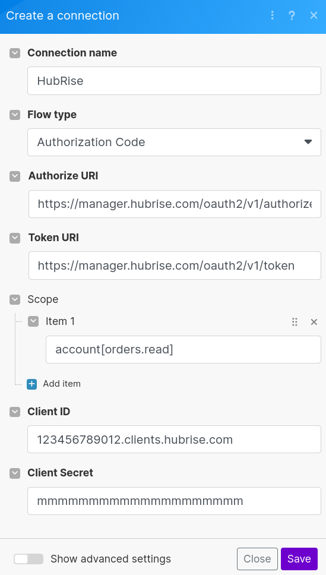
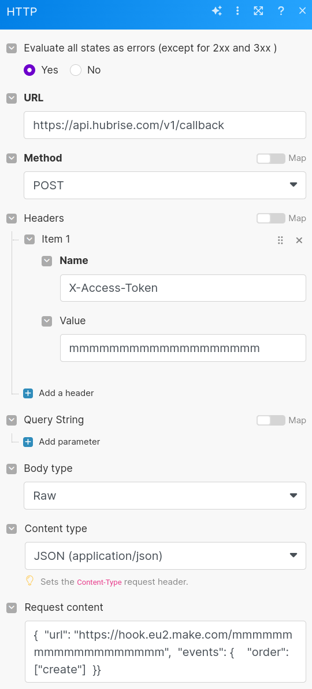
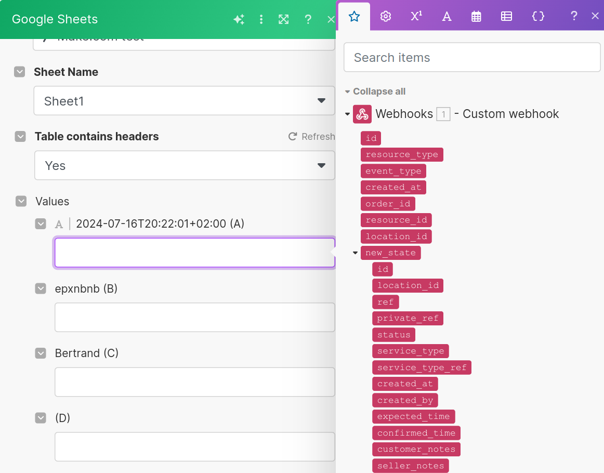
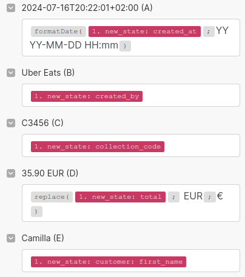
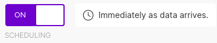
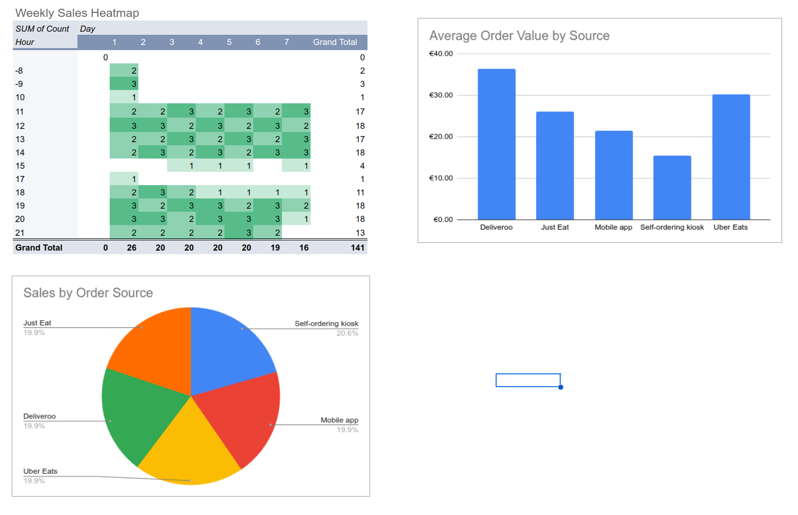

[//]: # "Photo credits: Dall-E"

HubRise's open API enables you to feed your order, customer or product data into any third-party tool with an API.

In this post, we will set up a dashboard in Google Sheets using HubRise order data, allowing you to track your Uber Eats, Deliveroo, and other orders in one place. This guide is suited for semi-technical users.

While we are focusing here on a simple example, the principles apply to more complex integrations. Our goal is to show you the basics and encourage you to explore further.

## Prerequisites

Before we begin, make sure you have:

1. A HubRise account ([sign up](https://manager.hubrise.com/signup))
2. A Make.com account ([sign up](https://www.make.com/en/register)) - This will be used to set up a webhook connected to Google Sheets. It can be replaced with any other similar automation tool.
3. A Google account to access Google Sheets

Free plans for HubRise and Make.com are sufficient for testing.

## Step 1: Create a HubRise OAuth 2.0 Client

We'll start by setting up a client in HubRise. This client will allow Make.com to access your HubRise data.

1. Log in to your HubRise back office.
2. Click on **Developer** in the main menu.
3. Select **Create an OAuth 2.0 client**.
4. Choose a name for your client (e.g., "Make.com") and click **Create**.
5. Once created, click **Download** next to client secret.
6. Take note of the client ID and secret from the downloaded JSON file.

## Step 2: Set Up OAuth 2.0 Connection in Make.com

Now that we have our HubRise client, let's set up a connection with your HubRise account.

1. Log in to Make.com.
2. Create a new scenario and name it "Register webhook".
3. Add a new module and search for "Make an OAuth 2.0 request". Click to add it to your scenario.
4. Click **Create a connection**.
5. Set up the OAuth 2.0 connection with the following parameters:
   - Connection name: Choose a name (e.g., "HubRise")
   - Flow Type: Authorization Code
   - Authorization URI: `https://manager.hubrise.com/oauth2/v1/authorize`
   - Token URI: `https://manager.hubrise.com/oauth2/v1/token`
   - Scope > Item 1: `account[orders.read]`
   - Client ID: [Your HubRise client ID from Step 1]
   - Client Secret: [Your HubRise client secret from Step 1]
     
6. Click **Save** to create the connection.
7. Authorise the connection when prompted.

## Step 3: Retrieve the Access Token

Due to a current limitation in Make.com, we need to manually retrieve the access token.

1. In the HubRise back office, open **Connections**.
2. Find the connection you created in Step 2 and click **Actions** > **View logs**.
3. In the new page, expand **Connection details**.
4. Click **show** next to "Access token" and copy the token to a safe place - we will need it in Step 5.

## Step 4: Create a Webhook in Make.com

Next, we'll set up a webhook in Make.com to receive order data from HubRise.

1. In Make.com, create a new scenario named "Receive orders".
2. Add a **Webhooks** > **Custom webhook** module.
3. Click **Create a webhook** and configure it as follows:
   - Webhook name: Choose a name (e.g., "HubRise")
   - IP restriction: Leave empty
4. Copy the webhook URL to a safe place - we will need it in the next step.

## Step 5: Register the Webhook with HubRise

We need to provide HubRise with the URL it should send the order data to. We'll do this by registering our webhook via the HubRise API.

1. Open the scenario "Register webhook" from Step 2.
2. Delete the "Make an OAuth 2.0 request" module - we no longer need it.
3. Add a new **HTTP** > **Make a request** module.
4. Configure it as follows:
   - URL: `https://api.hubrise.com/v1/callback`
   - Method: POST
   - Headers: Add `X-Access-Token` with the value of the token from Step 3
   - Body type: Raw
   - Content type: JSON
   - Request content (replace `[Make.com webhook URL]` with the actual URL from Step 4):
     ```json
     {
       "url": "[Make.com webhook URL]",
       "events": {
         "order": ["create"]
       }
     }
     ```
     
5. Save the scenario and click **Run once**.

## Step 6: Verify the Configuration

Let's first quickly verify that our webhook has been correctly registered.

1. Open your HubRise back office.
2. Verify the creation of the webhook:
   - Open **Connections**.
   - Find the Make.com connection and click **Actions** > **View logs**.
   - Expand the **Connection details** section.
   - Check that the webhook URL appears here, and that the correct events are registered.

We are now going to inject a test order and check that it is received in Make.com.

1. Open your HubRise back office.
2. Click **Connections**.
3. Click **View available apps**.
4. Connect the **Developer tools** app.
5. Open the app and inject a test order.

Verify that the order was received by the webhook:

1. Open Make.com.
2. Click **Webhooks**.
3. Check that the webhook you created has received an event. Look for a label indicating the number of events received next to a truck icon.

## Step 7: Complete the Order Processing Scenario

With all the pieces in place, we can now complete our Make.com scenario to process incoming orders and log them in Google Sheets.

1. In Make.com, open the scenario "Receive orders" from Step 4.

2. Click the webhook module, then click **Redetermine data structure**.

3. Inject a new test order. This will allow Make.com to capture the incoming data structure.

4. Click **Run once** to activate the webhook.

5. Add a **Google Sheets** module to the right of the webhook module. Configure it as follows:

   - Select the **Add a Row** action.
   - Connect your Google account if you haven't already.
   - Select the "Spreadsheet ID" and the "Sheet Name" where you want to log the orders.
   - In the "Values" section, map the incoming data from the webhook to your spreadsheet columns. If the data capture was successful, you should see the available fields over a red background when you click on any value:
     
     If you don't see similar fields, try re-determining the data structure again.
   - Here's an example mapping:
     
     - A: `{{formatDate(1.new_state.created_at; "YYYY-MM-DD HH:mm")}}`: order creation
     - B: `{{1.new_state.created_by}}`: order source
     - C: `{{1.new_state.collection_code}}`: order short ID
     - D: `{{replace(1.new_state.total; "EUR" ; "€")}}`: order total as a monetary value
     - E: `{{1.new_state.customer.first_name}}`: customer's first name

6. Save your scenario and toggle the "Scheduling" switch to activate it.
   

Note: After making any changes, save the scenario and schedule it off and on again to apply the changes.

## Step 8: Test the Integration

Let's put our integration to the test. Open **Developer tools** and inject test orders. If your integration is successful, the orders will appear in your Google Sheet almost instantly.

## Step 9: Build Your Dashboard

You can now build your customised dashboard within Google Sheets, by adding pivot tables, pie charts, or any other component you find useful.

Here is a simple example - you can create much more complex analyses since all the order data is now available in Google Sheets:



And of course, your dashboard will be updated automatically as new orders come in!

## Exploring New Ideas

Congratulations, you have successfully set up your first custom HubRise integration!

This is just the beginning of what you can achieve with HubRise. Here are some ideas to expand on this foundation:

- Collect order items for product sales analysis
- Segment analyses by location (if you have multiple locations)
- Set up notifications for high-value orders or specific conditions
- Integrate with other apps available in Make.com

While we have used Make.com in this guide, you can apply similar principles with other automation platforms like Zapier or n8n. You can even build your own solution using a programming language if you want to give it a try.

Happy automating!
