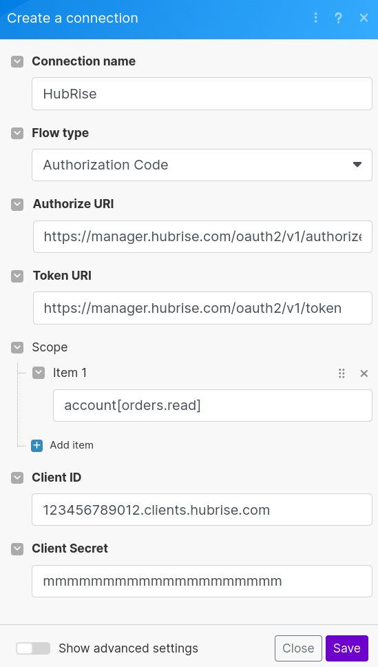
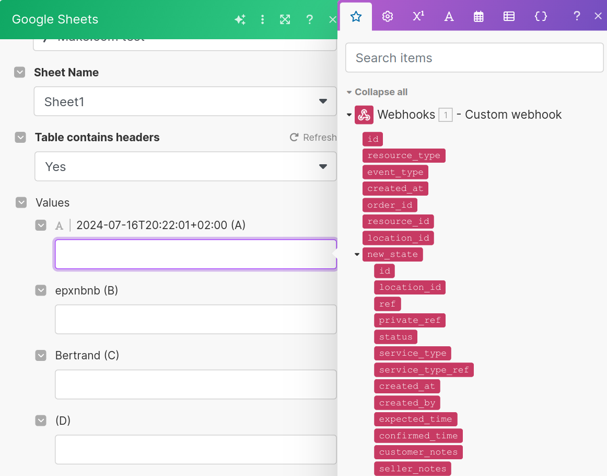
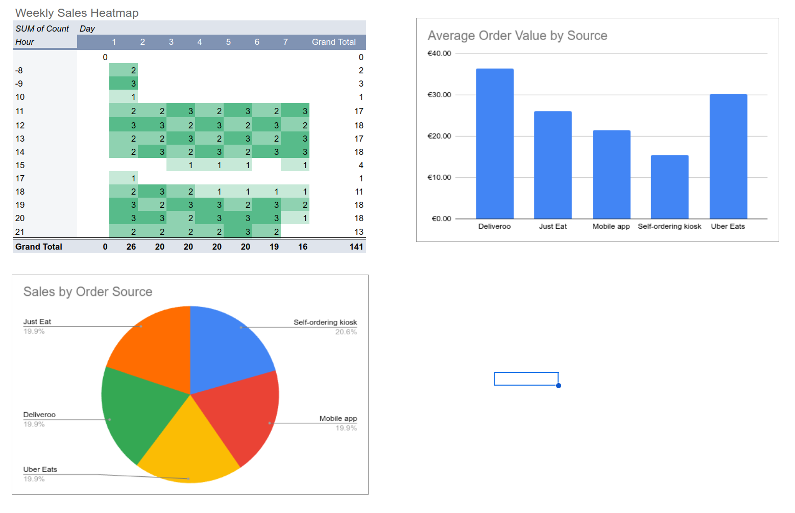

[//]: # "Photo credits: Dall-E"

L'API ouverte de HubRise permet d'envoyer vos données clients, produits et de commande vers n'importe quel service muni d'une API. Vous pouvez créer des tableaux de bord, des listes de clients, déclencher des campagnes de marketing basées sur l'historique des commandes ou transmettre des données vers des outils de business intelligence.

Dans cet article, nous allons découvrir comment créer un tableau de bord dans Google Sheets avec les données de commande HubRise, et regrouper en un seul endroit les commandes Uber Eats, Deliveroo, etc. Ce guide est adapté aux utilisateurs ayant quelques connaissances techniques.

Il ne s'agit que d'un exemple simple, mais les principes décrits ici s'appliquent à des intégrations plus complexes. L'objectif est de vous présenter les bases et vous encourager à explorer plus avant.

## Prérequis

Avant de commencer, vous devez disposer des éléments suivants :

1. Un compte HubRise ([créer un compte](https://manager.hubrise.com/signup))
2. Un compte Make.com ([créer un compte](https://www.make.com/en/register)), utilisé pour configurer un crochet Web connecté à Google Sheets. Il peut être remplacé par n'importe quel outil d'automatisation similaire.
3. Un compte Google pour accéder à Google Sheets

Les formules gratuites HubRise et Make.com suffisent pour cet exemple.

## Étape 1 : Créer un client OAuth 2.0 HubRise

Vous allez tout d'abord créer un client dans HubRise. Celui-ci permettra à Make.com d'accéder à vos données HubRise.

1. Connectez-vous à votre back-office HubRise.
2. Cliquez sur **Développeur** dans le menu principal.
3. Sélectionnez **Créez un client OAuth 2.0**.
4. Choisissez un nom pour votre client (par exemple, "Make.com") et cliquez sur **Créer**.
5. Une fois le client créé, cliquez sur **Télécharger** à côté du secret du client.
6. Notez l'ID et le secret du client indiqués dans le fichier JSON téléchargé.

## Étape 2 : Créer une connexion OAuth 2.0 sur Make.com

À présent que vous disposez d'un client HubRise, créez une connexion à votre compte HubRise.

1. Connectez-vous à Make.com.
2. Créez un scénario et nommez-le "Enregistrer crochet Web".
3. Ajoutez un nouveau module et recherchez "Make an OAuth 2.0 request" (Lancer une requête OAuth 2.0). Cliquez pour l'ajouter à votre scénario.
4. Cliquez sur **Create a connection** (Créer une connexion).
5. Créez la connexion OAuth 2.0 avec les paramètres suivants :
   - Connection name : choisissez un nom pour la connexion (par exemple, "HubRise").
   - Flow Type : code d'autorisation
   - Authorization URI : `https://manager.hubrise.com/oauth2/v1/authorize`
   - Token URI : `https://manager.hubrise.com/oauth2/v1/token`
   - Scope > Item 1 : `account[orders.read]`
   - Client ID : [ID du client HubRise issu de l'étape 1]
   - Client Secret : [secret du client HubRise issu de l'étape 1]
     
6. Cliquez sur **Save** (Enregistrer) pour créer la connexion.
7. Lorsque vous y êtes invité, autorisez la connexion.

## Étape 3 : Récupérer le jeton d'accès

En raison d'une limitation actuelle dans Make.com, le jeton d'accès doit être récupéré manuellement.

1. Dans le back office de HubRise, ouvrez **Connexions**.
2. Trouvez la connexion créée à l'étape 2 et cliquez sur **Actions** > **Voir les logs**.
3. Sur la page qui s'affiche, développez **Infos sur la connexion**.
4. Cliquez sur **afficher** à côté de "Jeton d'accès" et copiez le jeton dans un endroit sûr - il sera demandé à l'étape 5.

## Étape 4 : Créer un crochet Web dans Make.com

Configurez à présent un crochet Web dans Make.com afin de recevoir les données de commande de HubRise.

1. Dans Make.com, créez un scénario et nommez-le "Recevoir des commandes".
2. Ajoutez un module **Webhooks** > **Custom webhook**.
3. Cliquez sur **Create a webhook** (Créer un crochet Web) et configurez-le comme suit :
   - Webhook name : choisissez un nom pour le crochet Web (par exemple, "HubRise").
   - IP restriction : laissez le paramètre vide.
4. Copiez l'URL du crochet Web dans un endroit sûr - il sera demandé à l'étape suivante.

## Étape 5 : Enregistrer le crochet Web avec HubRise

Vous devez fournir à HubRise l'URL à laquelle il doit envoyer les données de commande. Pour cela, enregistrez votre crochet Web via l'API HubRise.

1. Ouvrez le scénario "Enregistrer crochet Web" créé à l'étape 2.
2. Supprimez le module "Make an OAuth 2.0 request" - il n'est plus requis.
3. Ajoutez un nouveau module **HTTP** > **Make a request** (Lancer une requête).
4. Configurez-le comme suit :
   - URL : `https://api.hubrise.com/v1/callback`
   - Method : POST
   - Headers : ajoutez `X-Access-Token` avec la valeur du jeton de l'étape 3.
   - Body type : Raw
   - Content type : JSON
   - Request content (remplacez `[URL du crochet Make.com]` par l'URL de l'étape 4) :
     ```json
     {
       "url": "[URL du crochet Make.com]",
       "events": {
         "order": ["create"]
       }
     }
     ```
     
5. Enregistrez le scénario et cliquez sur **Run once** (Exécuter une fois).

## Étape 6 : Vérifier la configuration

Vérifiez d'abord rapidement que le crochet Web a été correctement mis en place.

1. Ouvrez votre back-office HubRise.
2. Vérifiez que le crochet Web a bien été créé :
   - Ouvrez **Connexions**.
   - Trouvez la connexion Make.com et cliquez sur **Actions** > **Voir les logs**.
   - Développez la section **Infos sur la connexion**.
   - Vérifiez que l'URL du crochet Web apparaît ici, et que les événements corrects sont enregistrés.

Injectez maintenant une commande de test et vérifiez qu'elle est reçue dans Make.com.

1. Ouvrez votre back-office HubRise.
2. Cliquez sur **Connexions**.
3. Cliquez sur **Voir les apps disponibles**.
4. Connectez l'application **Developer Tools**.
5. Ouvrez l'application et injectez une commande de test.

Vérifiez que la commande a été reçue par le crochet Web :

1. Ouvrez Make.com.
2. Cliquez sur **Webhooks** (Crochets Web).
3. Vérifiez que le crochet Web que vous avez créé a reçu un événement. Cherchez une étiquette indiquant le nombre d'événements reçus à côté d'une icône de camion.

## Étape 7 : Finaliser le scénario de traitement de la commande

Tous les éléments étant en place, vous pouvez maintenant finaliser le scénario Make.com afin de traiter les commandes entrantes et les enregistrer dans Google Sheets.

1. Dans Make.com, ouvrez le scénario "Recevoir des commandes" créé à l'étape 4.

2. Cliquez sur le module de crochet Web, puis sur **Redetermine data structure** (Redéterminer la structure de données).

3. Injectez une nouvelle commande de test. Cela permet à Make.com de capturer la structure de données entrante.

4. Cliquez sur **Run once** (Exécuter une fois) pour activer le crochet Web.

5. Ajoutez un module **Google Sheets** à droite du module de crochet Web. Configurez-le comme suit :

   - Sélectionnez l'action **Add a Row** (Ajouter une ligne).
   - Connectez votre compte Google si ce n'est pas déjà fait.
   - Sélectionnez l'ID et le nom de la feuille de calcul ("Spreadsheet ID" et "Sheet Name") où vous souhaitez consigner les commandes.
   - Dans la section "Values" (Valeurs), associez les données entrantes du crochet Web aux colonnes de votre feuille de calcul. Si la capture de données a réussi, vous devriez voir les champs disponibles sur un fond rouge lorsque vous cliquez sur une valeur :
     
     Si vous ne voyez pas de tels champs, essayez de redéterminer à nouveau la structure de données.
   - Voici un exemple de mappage :
     
     - A : `{{formatDate(1.new_state.created_at; "YYYY-MM-DD HH:mm")}}`: création de la commande
     - B : `{{1.new_state.created_by}}`: source de la commande
     - C : `{{1.new_state.collection_code}}` : ID court de la commande
     - D : `{{replace(1.new_state.total; "EUR" ; "€")}}` : valeur monétaire totale de la commande
     - E : `{{1.new_state.customer.first_name}}` : prénom du client

6. Enregistrez votre scénario et basculez l'interrupteur "Scheduling" (Programmation) pour l'activer.
   

Remarque : Après toute modification, enregistrez le scénario et programmez-le à nouveau pour appliquer les changements.

## Étape 8 : Tester l'intégration

Testez à présent l'intégration. Ouvrez pour cela **Developer tools** et injectez des commandes de test. Si l'intégration est réussie, les commandes apparaîtront presque instantanément dans votre feuille de calcul.

## Étape 9 : Créer votre tableau de bord

Vous pouvez maintenant créer votre tableau de bord personnalisé dans Google Sheets en ajoutant des tableaux croisés dynamiques, des graphiques en secteurs ou tout autre composant que vous trouvez utile.

Ci-dessous un exemple simple - vous pouvez créer des analyses beaucoup plus complexes puisque toutes les données de commande sont maintenant disponibles dans Google Sheets :



Votre tableau de bord sera bien sûr automatiquement mis à jour à mesure que de nouvelles commandes arrivent.

## Pour aller plus loin

Félicitations, vous avez configuré votre première intégration personnalisée HubRise !

Ce n'est qu'un aperçu de ce que vous pouvez réaliser avec HubRise. Voici quelques idées à développer sur cette base :

- Récupérer les articles d'une commande pour analyser les ventes des produits
- Segmenter les analyses par point de vente (si vous en avez plusieurs)
- Configurer des notifications pour les commandes d'un montant élevé ou autres conditions spécifiques
- Effectuer une intégration avec d'autres applications disponibles dans Make.com

Nous avons utilisé Make.com dans ce guide, mais vous pouvez appliquer les mêmes principes à d'autres plateformes d'automatisation comme Zapier ou n8n ; vous pouvez même créer votre propre solution en utilisant un langage de programmation.

Bonne automatisation !
