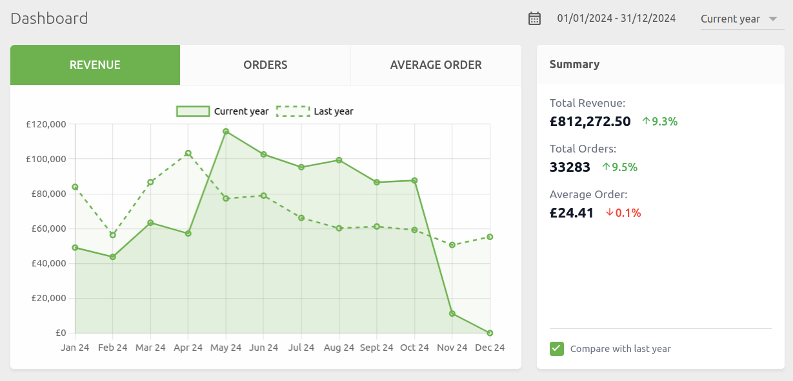
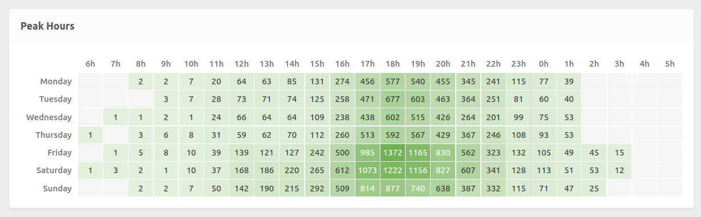
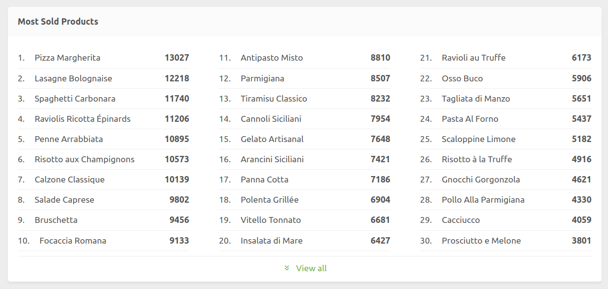

[//]: # "Photo credits: HubRise"

Many of you have asked for better ways to visualise your sales data. We have updated your dashboard to make it more comprehensive whilst keeping it easy to use. This new version brings long-awaited features such as peak hours analysis and best-selling products ranking, whilst maintaining its ease of use and fast execution.

## A Modernised Interface

The first thing you'll notice is the modernised interface. The main chart displays your revenue in a clear and intuitive way, with the ability to compare your performance with the previous period. A click on "Compare with last year" displays a reference line that lets you evaluate your progress.

The "Summary" section on the right gives you a quick overview of your situation, with total revenue, number of orders and average basket, each accompanied by its evolution when comparison is enabled.

Finally, new to this dashboard, you can now select the analysis period. Choose from predefined periods or set a custom date range by clicking to the right of the calendar icon.

## Detailed Revenue Analysis

Three charts let you analyse your revenue by sales channel, by connection name (for virtual brands), and by location. This view helps you understand the contribution of each revenue source.

## Peak Hours Analysis

One of the most requested features makes its appearance: peak hours visualisation. This chart reveals your activity peaks based on weekday and time. No more approximations: you can now optimise your staff schedules, promotions and procurement based on precise data.

## Best-Selling Products Ranking

The new ranking of your best-selling products helps you optimise your menu and identify evolving consumption trends. As with other charts, you can filter the data by location or period.

The default view shows the top 30 products, but you can get the complete list with one click on "View all".

## Unmatched Speed

We have made display speed an absolute priority. Our new dashboard loads in a fraction of a second, even when analysing a complete history spanning several years.

This speed is essential, as our experience shows that a dashboard is only truly used when its operation is smooth. If you're used to working with other market solutions, the difference will pleasantly surprise you.

## What's Next?

This new dashboard is available now with no action required on your part. Simply log in to your back office to discover these new features.

We continue to evolve HubRise to offer you an increasingly rich and pleasant experience. Don't hesitate to contact us with your suggestions for improvement.
