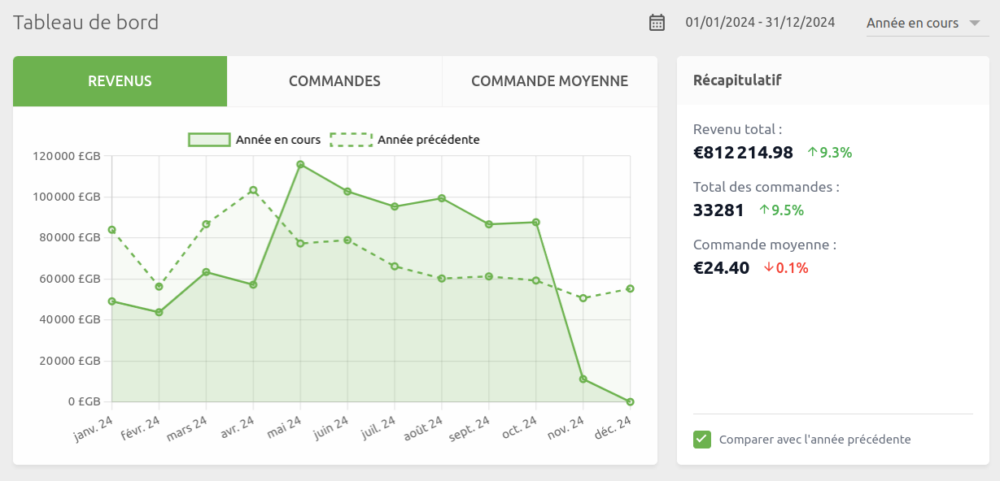
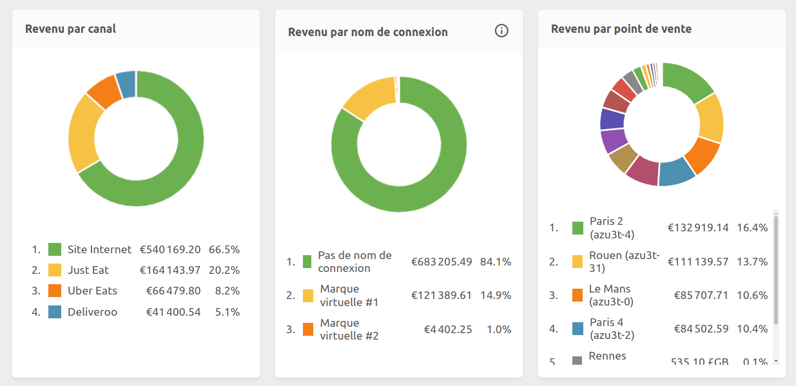
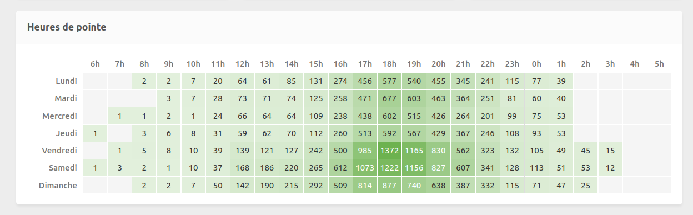
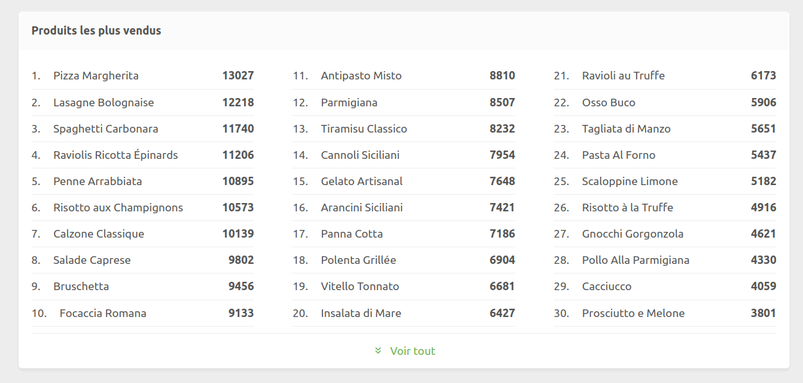

[//]: # "Photo credits: HubRise"

Vous avez été nombreux à nous demander de pouvoir mieux visualiser vos données de vente. Nous avons donc mis à jour votre tableau de bord pour le rendre plus complet tout en le gardant simple d'utilisation. Cette nouvelle version apporte des fonctionnalités attendues comme l'analyse des heures de pointe et le classement des produits les plus vendus, tout en conservant sa simplicité d'utilisation et sa rapidité d'exécution.

## Une interface modernisée

La première chose que vous remarquerez est l'interface modernisée. Le graphique principal affiche vos revenus de manière claire et intuitive, avec la possibilité de comparer vos performances avec la période précédente. Un clic sur "Comparer avec l'année précédente" fait apparaître une ligne de référence qui vous permet d'évaluer votre progression.

La section "Récapitulatif" à droite vous donne une vision rapide de votre situation, avec le revenu total, le nombre de commandes et le panier moyen, chacun accompagné de son évolution si la comparaison est activée.

Enfin, nouveauté de ce tableau de bord, vous pouvez désormais sélectionner la période d'analyse. Choisissez parmi des périodes prédéfinies ou en définissez une plage de dates personnalisée en cliquant à droit de l'icône du calendrier.

## Analyse détaillée des revenus

Trois graphiques vous permettent d'analyser vos revenus par canal de vente, par nom de connexion (pour les marques virtuelles), et par point de vente. Cette vue vous aide à comprendre la contribution de chaque source de revenus.

## Analyse des heures de pointe

L'une des fonctionnalités les plus demandées fait son apparition : la visualisation des heures de pointe. Ce tableau révèle vos pics d'activité en fonction du jour de la semaine et de l'heure. Fini les approximations : vous pouvez maintenant optimiser vos plannings d'équipe, vos promotions et vos approvisionnements en vous basant sur des données précises.

## Classement des produits les plus vendus

Le nouveau classement de vos produits les plus vendus vous aide à optimiser votre carte et à identifier l'évolution des tendances de consommation. Comme pour les autres graphiques, vous pouvez filtrer les données par point de vente ou par période.

La vue par défaut affiche les 30 produits les plus vendus, mais vous pouvez obtenir la liste complète en un clic sur "Voir tout".

## Une rapidité inégalée

Nous avons fait de la rapidité d'affichage une priorité absolue. Notre nouveau tableau de bord se charge en une fraction de seconde, même lors de l'analyse d'un historique complet sur plusieurs années.

Cette rapidité est essentielle, car nos retours d'expérience montrent qu'un tableau de bord n'est véritablement utilisé que lorsque son utilisation est fluide. Si vous avez l'habitude de travailler avec d'autres solutions du marché, la différence vous surprendra agréablement.

## Et maintenant ?

Ce nouveau tableau de bord est disponible dès maintenant et sans action requise de votre part. Connectez-vous simplement à votre back-office pour découvrir ces nouvelles fonctionnalités.

Nous continuons à faire évoluer HubRise pour vous offrir une expérience toujours plus riche et agréable. N'hésitez pas à nous contacter pour nous faire part de vos suggestions d'amélioration.
