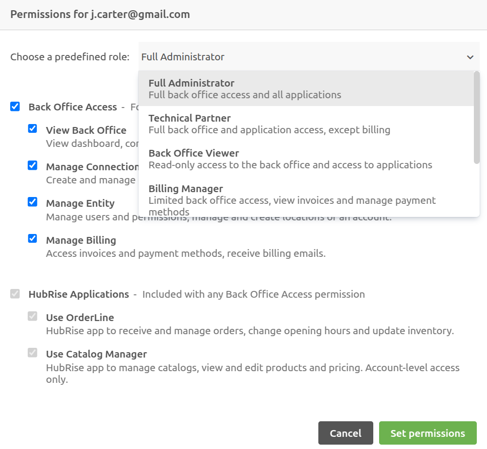
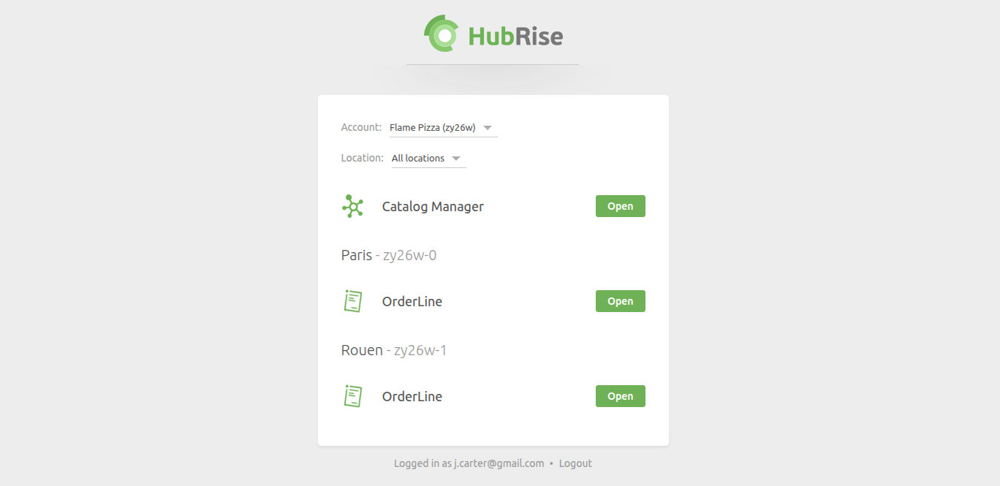

[//]: # "Photo credits: https://pixabay.com/photos/castle-bridge-love-locks-padlock-3480601/"

HubRise has introduced a new permissions system that provides more control granularity. The old system, with just two roles, lacked flexibility. Now, predefined roles and custom permissions allow you to fine-tune user access at both the account and location level.

## Predefined Roles and Custom Permissions

Instead of a fixed set of roles, you can now choose from predefined roles or assign custom permissions.

Predefined roles simplify access management, but if none fit your needs, you can customise permissions as needed.

For example, an accountant who only needs access to invoices can be assigned the **Billing Manager** role. A technical partner may need to manage integrations but not receive invoices or handle user management. In this case, a predefined role like **Technical Partner** may be appropriate, or you can create a custom role by disabling the **Manage Entity** permission.

For a detailed breakdown of roles and settings, see our [Permissions documentation](/docs/permissions).

## Restricted Access Users

Some employees only need to manage orders without accessing your HubRise back office. To address this, we have introduced **restricted access users**. This feature can also be used to limit a user's access to Catalog Manager.

When a restricted access user logs in, they are redirected to the **Portal page**, where they can only open the applications assigned to them.

## App Link Integration in Third-Party Software

We've also introduced **direct app access links**, allowing software editors to embed OrderLine or Catalog Manager directly into their platform. These links are structured as follows:

- OrderLine: `https://orderline.hubrise-apps.com?location_id=LOCATION_ID`
- Catalog Manager: `https://catalog-manager.hubrise-apps.com?account_id=ACCOUNT_ID`

Replace `LOCATION_ID` and `ACCOUNT_ID` with the appropriate values from your HubRise account.

These links will work as long as the user has the necessary app permissions. If OrderLine or Catalog Manager have not been pre-connected, the connection will happen automatically when the user opens the link.

## Get Started

The new permissions system is already in place. You can review and update user roles from the **SETTINGS > Permissions** section in your HubRise back office.
