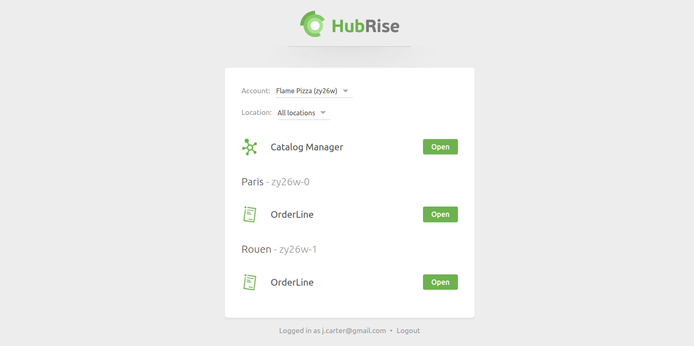

[//]: # "Photo credits: https://pixabay.com/photos/castle-bridge-love-locks-padlock-3480601/"

HubRise has introduced a new permissions system that provides more control granularity. The old system, with just two roles, lacked flexibility. Now, predefined roles and custom permissions allow you to fine-tune user access at both the account and location level.

## Predefined Roles and Custom Permissions

Instead of a fixed set of roles, you can now choose from predefined roles or assign custom permissions.

Predefined roles cover common use cases:

- **Full Administrator** – Full access to the back office and all applications.
- **Technical Partner** – Same as Full Administrator but without billing access.
- **Back Office Viewer** – Read-only access to the back office and applications.
- **Billing Manager** – Limited to invoices and payment settings.

For example, if a restaurant's accountant only needs access to invoices, they can be assigned the **Billing Manager** role. If a user needs to access the back office but not manage users, you can opt for a custom role and untick the **Manage Entity** permission.

## App-Only Users

Another improvement is app-only users, who can access OrderLine and Catalog Manager but not the main HubRise back office. When they log in, they see the newly introduced **Portal page**, which allows them to access the apps assigned to them without entering the back office.

This can be particularly useful for staff who only need to manage orders or products without accessing other business data.

## App Link Integration in Third-Party Software

We've also introduced **direct app access links**, allowing software editors to embed OrderLine or Catalog Manager directly into their platform. These links are structured as follows:

- OrderLine: `https://orderline.hubrise-apps.com?location_id=LOCATION_ID`
- Catalog Manager: `https://catalog-manager.hubrise-apps.com?account_id=ACCOUNT_ID`

Replace `LOCATION_ID` and `ACCOUNT_ID` with the appropriate values from your HubRise account.

These links will work as long as the user has the necessary app permissions. If OrderLine or Catalog Manager have not been pre-connected, the connection will happen automatically when the user opens the link.

## Get Started

The new permissions system is already in place. You can review and update user roles from the **SETTINGS > Permissions** section in your HubRise back office.

For a detailed breakdown of roles and settings, see our [Permissions documentation](/docs/permissions).
