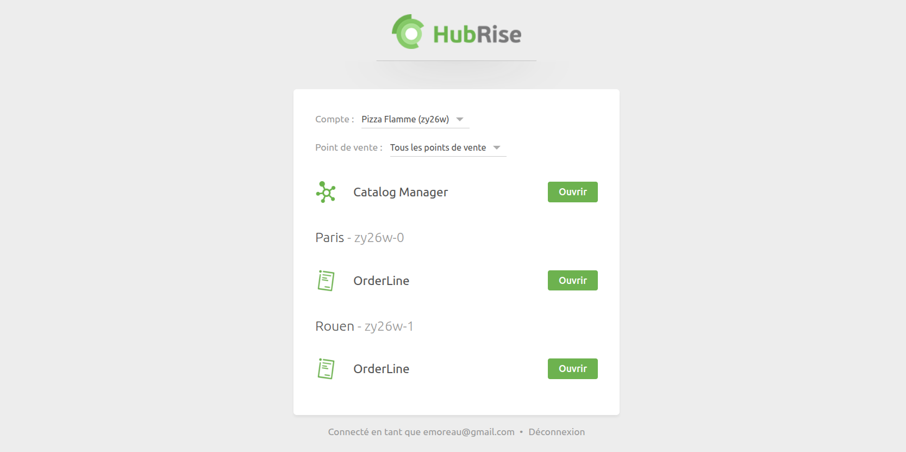

[//]: # "Crédits photo: https://pixabay.com/photos/castle-bridge-love-locks-padlock-3480601/"

HubRise vient d'introduire un nouveau système de permissions offrant un contrôle plus granulaire sur l'accès des utilisateurs. L'ancien système, limité à deux rôles, manquait de flexibilité. Désormais, les rôles prédéfinis et les permissions personnalisées permettent d'affiner les accès utilisateur au niveau du compte et du point de vente.

## Rôles prédéfinis et permissions personnalisées

Au lieu d'être limité à deux rôles, vous pouvez désormais choisir parmi des rôles prédéfinis ou attribuer des permissions personnalisées.

Les rôles prédéfinis simplifient la gestion des accès, mais si aucun ne correspond à vos besoins, vous pouvez personnaliser les permissions selon vos besoins.

Par exemple, un comptable ayant uniquement besoin d'accéder aux factures aura le rôle **Responsable comptabilité**. Un partenaire technique peut avoir besoin de gérer les intégrations sans recevoir les factures ni gérer les utilisateurs. Dans ce cas, le rôle prédéfini **Partenaire technique** peut convenir, ou vous pouvez créer un rôle personnalisé en désactivant la permission **Gérer l'entité**.

Pour une présentation détaillée des rôles et paramètres, consultez notre [documentation sur les permissions](/docs/permissions).

## Utilisateurs à accès restreint

Certains employés n'ont besoin que de gérer les commandes sans accéder à votre back-office HubRise. Pour cela, nous avons introduit les **utilisateurs à accès restreint**. Cette fonctionnalité peut également être utilisée pour restreindre l'accès d'un utilisateur à Catalog Manager.

Lorsqu'un utilisateur à accès restreint se connecte, il est redirigé vers la **page Portail**, où il peut ouvrir uniquement les applications qui lui sont attribuées.

## Intégration des liens d'application dans d'autres logiciels

Nous avons également introduit les **liens d'accès direct aux applications**, permettant aux éditeurs de logiciels d'intégrer OrderLine ou Catalog Manager directement dans leur plateforme. Ces liens sont structurés comme suit :

- OrderLine : `https://orderline.hubrise-apps.com?location_id=LOCATION_ID`
- Catalog Manager : `https://catalog-manager.hubrise-apps.com?account_id=ACCOUNT_ID`

Remplacez `LOCATION_ID` et `ACCOUNT_ID` par les valeurs appropriées de votre compte HubRise.

Ces liens fonctionnent tant que l'utilisateur dispose des permissions nécessaires pour l'application. Si OrderLine ou Catalog Manager n'ont pas encore été connectés, la connexion s'effectuera automatiquement lors de l'ouverture du lien.

## Mise en place

Le nouveau système de permissions est déjà en place. Vous pouvez consulter et mettre à jour les rôles des utilisateurs depuis la section **CONFIGURATION > Permissions** de votre back-office HubRise.
