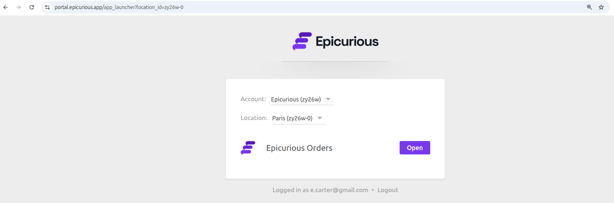

Some of our partners need ready-to-use tools they can offer under their own brand. Others want to expand their product offering without diverting resources into building niche features. HubRise White Label allows selected partners to provide our solutions as their own, with their logo, domain, and branding.

## Who is HubRise White Label for?

HubRise White Label is designed for software vendors, resellers, and chains that want to integrate additional tools into their ecosystem. This programme was built to address the needs of:

- Startups that need a polished tool today but plan to build their own later. OrderLine and Catalog Manager both use our public API, so they can be used as a temporary solution while an in-house product takes shape.
- Mature software vendors who want to offer additional tools but find some features too niche to justify building themselves. White Label lets them expand their product line without draining development resources.
- Any partner looking for seamless integration. Many already recommend HubRise tools to their customers, but now they can make them a direct part of their product, keeping users within their own ecosystem.

## What Can Be Branded?

With HubRise White Label, you can customise:

- [OrderLine](/apps/orderline/overview) – Order management for locations
- [Catalog Manager](/apps/catalog-manager/overview) – Product catalogue management
- White Label Portal – A centralised login page under your domain

Your customers log in via your domain, see your logo, and interact with a product that feels fully integrated into your system.

## How It Works

Setting up your White Label solution is simple:

1. Choose a name, domain, and colours.
2. Configure your DNS settings.
3. We handle SSL certificates and setup.

Your branded apps will be available in two business days, ready for your customers.

## Available Now

HubRise White Label is available for selected partners. If you’re interested, [contact your partnership manager](mailto:contact@hubrise.com) to get started.

For more details, check our [HubRise White Label documentation](/docs/white-label).
