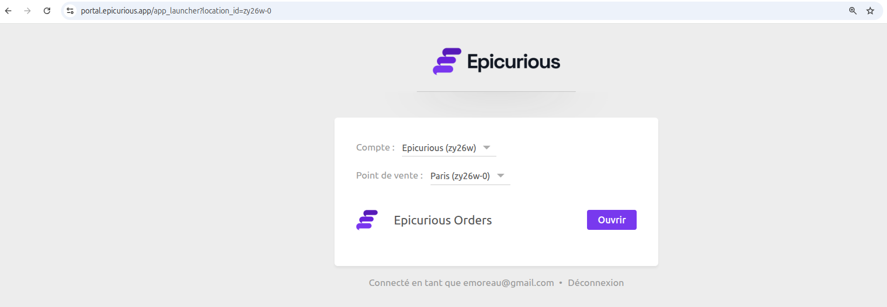

[//]: # "Crédits photo: HubRise"

Certains de nos partenaires avaient besoin d'outils prêts à l'emploi à proposer sous leur propre marque. D'autres souhaitaient enrichir leur offre sans mobiliser de ressources de développement sur des fonctionnalités de niche. HubRise Marque Blanche permet à des partenaires sélectionnés d'offrir nos solutions sous leur propre marque, avec leur logo, nom de domaine et couleurs.

Le programme HubRise Marque Blanche est conçu pour les éditeurs de logiciels, revendeurs et chaînes. Il répond à plusieurs besoins :

- **Startups** ayant besoin d'un outil clé en main aujourd'hui, mais prévoyant de développer leur solution plus tard. OrderLine et Catalog Manager utilisent notre API publique, ce qui permet de les utiliser comme solution temporaire en attendant le développement d'un produit interne équivalent.
- **Éditeurs de logiciels matures** souhaitant proposer des outils supplémentaires mais trouvant certaines fonctionnalités trop spécifiques pour justifier un développement en interne. La Marque Blanche leur permet d'élargir leur offre sans détourner leurs ressources de développement.
- **Revendeurs de logiciels** cherchant à diversifier leurs sources de revenus. Beaucoup recommandent déjà les outils HubRise à leurs clients ; ils peuvent désormais les intégrer directement à leur offre.
- **Chaînes** souhaitant proposer une suite complète d'outils sous leur propre marque à leurs franchisés ou établissements.

## Quels éléments peuvent être personnalisés ?

Avec HubRise Marque Blanche, vous pouvez personnaliser :

- [OrderLine](/apps/orderline/overview) – Centralisation des commandes pour les points de vente
- [Catalog Manager](/apps/catalog-manager/overview) – Gestion des catalogues produits
- Portail Marque Blanche – Une page de connexion centralisée sur votre nom de domaine

Vos clients se connectent via votre nom de domaine, voient votre logo et bénéficient d'une expérience homogène avec votre environnement.

Pour plus d'informations, consultez notre [documentation sur HubRise Marque Blanche](/docs/white-label).

## Comment ça fonctionne ?

Le programme Marque Blanche est facile à mettre en place :

1. Choisissez un nom, un nom de domaine et une charte graphique.
2. Configurez vos paramètres DNS.
3. Nous gérons les certificats SSL et l'installation.

Vos applications personnalisées seront disponibles sous deux jours ouvrés, prêtes à être utilisées par vos clients.

## Disponible dès maintenant

HubRise Marque Blanche est disponible pour des partenaires sélectionnés. Si vous êtes intéressé, contactez votre Responsable Partenariat ou écrivez-nous à contact@hubrise.com pour démarrer.
