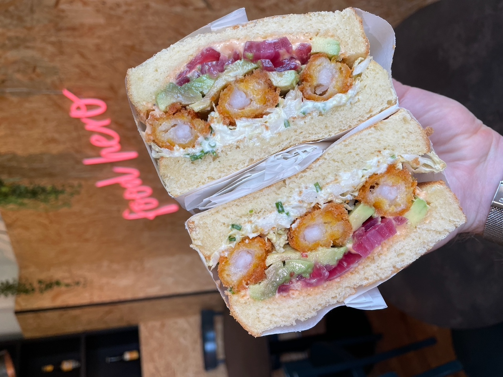

## A Swiss Dark Kitchen with Orchestrated Growth

[Food Hero](https://foodherogroup.ch/english.html) is the story of a Dark Kitchen born in a time of crisis, now a model of technological efficiency. In Switzerland, [Gael di Giusto](https://www.linkedin.com/in/gael-di-giusto-7a8a4349/?) runs 10 restaurant brands from a single location, thanks to a connected infrastructure built from the ground up for agility.

At the heart of the system: HubRise, the middleware that makes it easy to integrate business tools.

## From La Manufacture to Food Hero: Growth Built For Delivery

It all began in 2016, with the opening of [La Manufacture](https://www.lamanufacture-restaurant.com/gundeli-en.html): a cosy spot in Basel serving gourmet burgers, tartines, brunches, and homemade bagels. Gael and his brother developed an artisanal, home-cooked cuisine.
When the pandemic hit, the team accelerated its digital shift. An online ordering site was launched with [LivePepper](https://www.livepepper.com), followed soon after by a mobile app from the same provider.

**In June 2021, a new milestone is reached: a second location is opened, exclusively dedicated to delivery**. The goal was to build a business model optimised for delivery, and viable in uncertain times.

That was the birth of Food Hero: a sales point with no dining area, initially hosting 7, then 10 brands. Among them: **Gringos** (Mexican), **Waku Waku** (Japanese sandwiches), **MOB** (Californian burgers), and **Nonna** (fresh pasta). A model designed to appeal to families, groups, and businesses.

© Food Hero

## A Tech Stack Designed for Agility

Running 10 brands, each with multiple ordering channels, can quickly become a logistical nightmare. That’s where Food Hero’s connected ecosystem comes into play.
Building on tools that had already proven effective at La Manufacture, Gael added others, tailored to the new Dark Kitchen model, to maximise efficiency from production to delivery.

- [LivePepper](https://www.livepepper.com) for the Food Hero white label and multi-brand online ordering website, and mobile app,
- The platforms Uber Eats, Just Eat Takeaway, and Smood with a dedicated page for each of the brands,
- [Lightspeed K Series](https://www.lightspeedhq.com) as the EPOS system, used to register walk-in or phone orders,
- [TicknCook](https://tickncook.com) for the Kitchen Display System, to simplify the management of different workstations by sending only the information relevant to each one,
- [Captain.ai](https://www.captain.ai) to manage delivery, internal drivers, and customer tracking,
- [Expedy](https://www.expedy.io/en) to automate receipt printing in Food Hero kitchens or at licensed partner sites,
- and finally [HubRise to connect](https://www.hubrise.com/apps) all these solutions together, for centralising menus, and ensuring that the orders, their statuses, inventories and opening hours are synchronised, with a single click, from one interface.

> “Each brand has its own Uber Eats account, Just Eat... We manage over 40 of them. Without HubRise, we’d have to re-enter everything manually. Now, orders go straight into the till and kitchen screens. ”

## One Menu, 10 Brands, Seamless Management

One of the standout features of Gael’s setup, is the ability to order dishes from multiple brands in a single order—via a unified site built by LivePepper. Today, a single menu, synchronised via HubRise, makes everything easier to manage.

> “We hide specific items depending on the brand. If there’s a stock issue—fries, for example—we can remove them from all menus with one click. ”

This approach also allows for real-time availability management while ensuring consistency across platforms.

## Cross-Brand Orders and In-House Delivery

One of the standout features of Gael’s setup, is the ability to order dishes from multiple brands in a single order—via a unified site built by LivePepper.

> “Whether you're with friends or at the office—someone wants a burrito, someone else a burger— no problem, it's all-in-one. ”

On the delivery side, Food Hero uses Captain.ai and its own fleet (e-bikes, cars). Customers can track their orders live on a map.
Uber Eats still brings in the largest order volumes, but their own site is gaining ground, thanks to word of mouth and direct customer interactions. Increasing orders through their white-label site designed by LivePepper, is a strategic goal.

## Events, Brand Licensing, and Growth Plans

Food Hero isn’t limited to digital. For the summer, the team set up a rooftop kitchen at a local club, serving a mixed-brand menu.
Another growth area: brand licensing.

> “We offer branding, recipes, and processes. No long-term commitment: partners can stop every three months if they like. ”

HubRise plays a central role in this development. Thanks to its integration with Expedy, each partner site can print incoming orders locally, while the Food Hero team handles sales reports and accounting remotely through their usual tools.

## A Tailor-Made Collaboration with HubRise

Over time, Gael has refined his production tools with partners like TicknCook.

> “When we started in 2021, TicknCook was just launching. We worked closely together to shape or refine features like routing items to hot or cold stations, the parcel prep table, and so on.  ”

Nothing was left to chance. Gael tested several tools and integration solutions with their ecosystem, including Deliverect. But in the end, HubRise won out, offering the right mix of features, responsiveness, and cost.

> “HubRise added licence management at our request. We get answers within a day. And honestly, setup was super simple. Invisible to the end customer, but essential for multiple brands and tools to work together seamlessly. ”

Food Hero shows what a well-designed digital ecosystem can achieve: experiment, grow, scale—without complicating operations. HubRise is the backbone. Invisible to the end customer, but essential for multiple brands and tools to work together seamlessly.

___

To stay informed about new integrations to the ecosystem of integrated apps, follow HubRise on [LinkedIn](https://www.linkedin.com/company/hubrise).

___