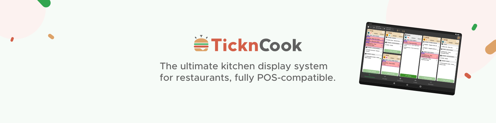

## The client request that changes everything
HubRise receives regular requests from restaurateurs who want to digitise their operations. Among them, one recurring demand for which he can’t find a suitable solution:

> "Do you have a kitchen screen connected to HubRise?"

No player on the French market. Restaurateurs struggle with paper tickets, but no simple solution is available.
Antoine Monnier, founder of HubRise, has the API, he’s used to working with restaurateurs and understands the need, but he’s missing the developer.

## The meeting with Thomas, TicknCook co-founder
Thomas, a passionate freelance developer is looking for new challenges. Antoine sets out the need:

> “Create a kitchen screen, or Kitchen Display System (KDS), that integrates seamlessly with HubRise.”

Thomas is immediately won over by the idea. Within a few weeks, TicknCook version 0.01 sees the light of day.

> “Antoine had identified the need; I had the technical skills. I wanted to test the market with a very simple first version.” — Thomas Rondepierre, co-founder, [TicknCook](https://tickncook.com/en/).

## The first steps
For the visual identity, Thomas turns to Karen, who runs a communications agency. She creates TicknCook’s brand identity without thinking she would later become a partner in the venture.
Version 0.01 is around. The first feedback start coming in. The concept works. Even though it’s a very limited first version, it allows Thomas to gather valuable insights that will later help improve TicknCook.
But at that time Thomas remains focused on his freelance work. TicknCook goes into sleep mode.

## COVID: the unexpected accelerator
March 2020. The pandemic hits. The restaurant industry shifts into turbo-mode digitisation. Thomas receives more and more requests for TicknCook.
Restaurants are desperately looking for solutions to better manage kitchen production that has become more complex and faster-paced. They have to adopt, in urgency, multiple sales channels, including online ordering solutions and food delivery platforms such as Uber Eats, deal with staff shortages, and satisfy demanding customers. In this new environment, paper tickets in the kitchen become increasingly obsolete. It’s also the birth of many dark kitchens around the world, for whom the HubRise + TicknCook solution, very simple and quick to set up, fits perfectly.

The time has come to step up a gear.

## The team comes together
Late 2021. Thomas considers surrounding himself with a team to accelerate TicknCook’s development. Conveniently, he’s used to working with Karen’s communications agency, and on software publishing projects with Baptiste. The three freelancers know each other and trust one another.

> “Thomas suggested turning TicknCook into a real startup. We’d already worked together; we knew we worked well as a team.” — Karen Texier, co-founder, [TicknCook](https://tickncook.com/en/).

Early 2022, the new TicknCook version is launched.

## Immediate take-off thanks to HubRise
From launch, sign-ups flood in. HubRise’s advantage kicks in fully: instead of developing dozens of integrations, TicknCook instantly inherits the entire ecosystem: EPOS solutions, delivery platforms, various ordering systems like LivePepper… Everything works out of the box.

> “Without HubRise, we would have spent two years building integrations instead of developing our product. From day one, our customers had their orders on the screens.” — Thomas Rondepierre, co-founder, [TicknCook](https://tickncook.com/en/).

___

To keep up to date with new integrations in the ecosystem of integrated solutions, follow HubRise on [LinkedIn](https://www.linkedin.com/company/hubrise).

___

## Food Hero proves the concept
Summer 2021 already. Gaël di Giusto launches Food Hero, his Swiss multi-brand dark kitchen. The challenge? Managing 10 brands, 40+ stores on food ordering and delivery platforms.
Food Hero becomes the perfect testing ground for TicknCook connected via HubRise.
Result: 250 orders per day handled without a hitch. Each kitchen workstation sees only orders they need to process. Zero paper tickets.

> “We collaborated extensively with TicknCook to develop bespoke features, such as filters for each of the workstations.” — Gaël di Giusto, Food Hero.

----

[Discover the full blog post about Food Hero](https://www.hubrise.com/blog/dark-kitchen-food-hero)

----

## The snowball effect
Success, leads to more success. Other developers draw inspiration from the TicknCook model.
SOS Soirée integrates HubRise almost autonomously. Captain.ai joins the ecosystem. Each new app further strengthens it, building a complete suite of third-party tools.
The more integrations there are on HubRise, the more accessible TicknCook becomes. The better TicknCook performs, the more HubRise attracts new developers.

----

[Discover the full blog post about SOS Soirée](https://www.hubrise.com/blog/sos-soiree)

----

## Todays's success
TicknCook equips thousands of restaurants in around ten countries. Translated into six languages. From family-run pizzerias to international chains.
HubRise connects more than 100 applications in some twenty countries.

> “Thomas and his team have shown that a developer can build a global vertical solution by relying on our API.” — Antoine Monnier, founder, HubRise.

## The message to developers
The TicknCook story proves that a simple idea can go global. If you’ve identified a need in foodtech or any other local retail sector, HubRise can be your launchpad. Its API is documented, tested, proven by a hundred already connected solutions and thousands of connections.
Like Thomas in 2018, you may be at a turning point, about to launch a solution that will become a success story.

> “There’s a lot to do in foodtech, and today’s good ideas are tomorrow’s standards.” — Antoine Monnier, founder, HubRise.

---

Developer? Launch your application with HubRise!
See how on our [Developers page](/developers).

---