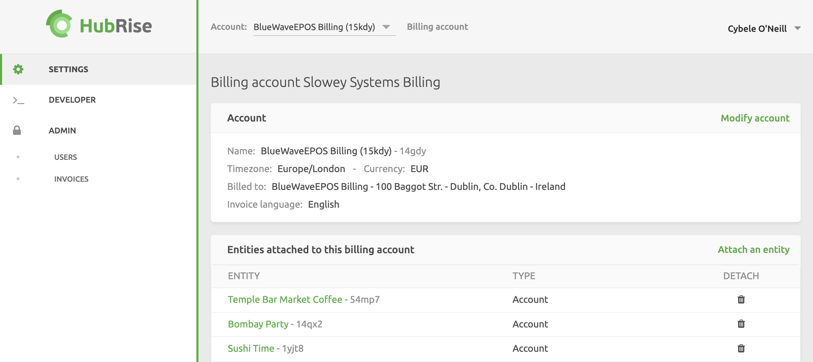

As a software provider, reseller, or consultant, you might choose to manage HubRise subscription payments on behalf of your clients for various reasons. These could include offering HubRise as a white-label service, accommodating your client's preference for a seamless service without receiving third-party invoices, or leveraging volume discounts on HubRise subscriptions.

To do this, you can easily include your payment details in your client's account. In this scenario, HubRise will send you separate monthly invoices for each account. If you have many such accounts on HubRise, you will not avail of volume discounts.

A better alternative is to ask HubRise to set up a **Billing Account** for your organisation. This special type of account is designed to handle subscriptions for multiple accounts and locations. Invoices generated for attached accounts or locations are consolidated into a single monthly invoice, allowing for volume discounts.

Users with a billing account can autonomously manage their billing information, add a payment method, and attach or detach accounts and locations.

In the following sections, **entity** will refer to either an account or a location.

## Attach Entities

You will generally attach accounts, unless you have a specific reason to attach a location.

To attach an entity to your billing account, follow these steps:

1. Log in to your [HubRise account](https://manager.hubrise.com).
1. Select your HubRise billing account. This account will have your company name followed by **Billing**.
1. Navigate to the **SETTINGS** page.
1. Click **Attach an entity**.
1. Choose to either **Attach an account** or **Attach a location**, depending on your needs.
1. Find the entity to attach from the **Select an account** or **Select a location** dropdown. This list will only display accounts and locations to which you have access to, and that are not already attached.
1. Click **Attach**.
1. Repeat the process as many times as needed.
1. Return to your **SETTINGS** page and check that all entities you attached are visible in the **Entities attached to this billing account** section.

---

**IMPORTANT NOTE**: When you attach an entity, any pending requests for payment for this entity will be transferred to your billing account.

---

## Detach Entities

When you detach an entity from your billing account, it will be billed separately, and you will no longer receive invoices for this entity.

To detach an entity from your billing account, follow these steps:

1. Log in to your [HubRise account](https://manager.hubrise.com).
1. Select your HubRise billing account. This account will have your company name followed by **Billing**.
1. Navigate to the **SETTINGS** page.
1. Section **Entities attached to this billing account**, click on the bin icon located on the far right side to detach entities.

---

**IMPORTANT NOTE**: When you detach an entity, any requests for payment already issued for this entity will remain attached to your billing account.

---

## Billing Information

The billing information of your billing account is used to generate invoices.

To configure this information, follow these steps:

1. Log in to your [HubRise account](https://manager.hubrise.com).
1. Select your HubRise billing account. This account will have your company name followed by **Billing**.
1. Navigate to the **SETTINGS** page.
1. Select **Modify account**.
1. Fill in the information required under **Billing details**.
1. Click **Update**.

For more information, see section [Edit Billing Information](#edit-billing-information).

## Add a Payment Method

The payment method of your billing account is used to pay the invoices generated for the attached entities.

To add a payment method to your billing account, follow these steps:

1. Log in to your [HubRise account](https://manager.hubrise.com).
1. Select your HubRise billing account. This account will have your company name followed by **Billing**.
1. Navigate to the **SETTINGS** page.
1. Click **Add payment method** and enter your credit card information. Credit cards must be valid to be accepted.
1. When finished, click **Save**.

For more information, see section [Add a Payment Method](#add-a-payment-method).
