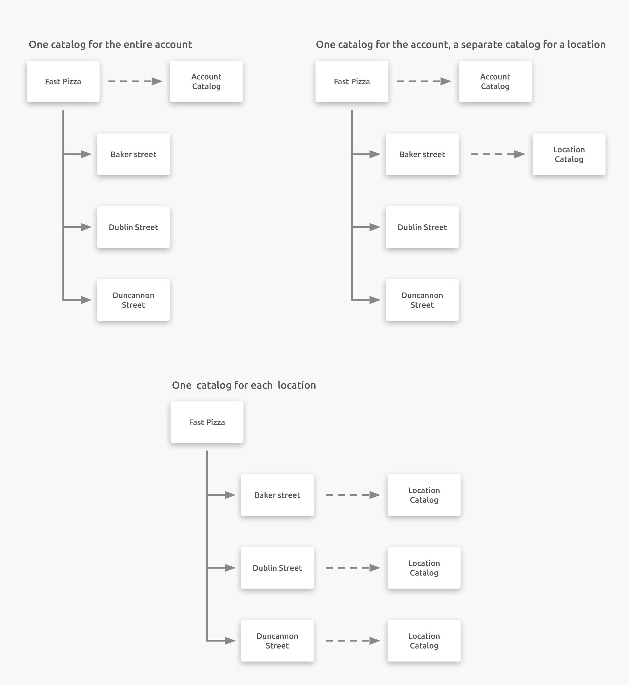

The **Catalogs** section in the **SETTINGS** page allows you to create, edit, or remove the catalogs used by your HubRise Account.

The rules for Catalogs are as follows:

- By default, Accounts define one Catalog named after the Account. Locations do not have a Catalog defined by default.
- An Account must have at least one Catalog. If you attempt to delete the last Catalog of an Account, an error notification will be displayed.
- You can create as many Catalogs as you need. For example:
  - You can create a test Catalog to be used without impacting production.
  - You can create Catalogs for a Location that offers different products than other Locations.

---

**IMPORTANT NOTE:** You can connect integrated apps to a specific Catalog to push data into it or pull data from it.
You can edit and manage products in a HubRise Catalog only from third party apps, or with the HubRise **Catalog Manager** connected to your HubRise Account.

Removing a catalog from HubRise does not affect the product list in third party apps.

---

## Add a Catalog

To add a catalog, follow these steps:

1. Select **SETTINGS**.
1. To add the Catalog at Account level, verify that **All locations** is selected. To add it to a Location, select the Location from the **Location** dropdown.
1. From the **Catalogs** section, click **Add a catalog**.
1. Enter the name for the catalog. If you only have one Catalog, we recommend using your Account or Location name. If you have multiple Catalogs, use a descriptive name, such as `Website` or `Food platforms`. Do not include `Catalog` in your catalog name. For example: use `Fast Pizza`, not `Fast Pizza Catalog`.
1. Click **Create** to save the new catalog.

## Catalog Details

The following information is displayed in the **SETTINGS** > **Catalogs** section:

- **Name**: The name of the catalog, followed by its unique identifier. This unique identifier does not change even if the name of the catalog is changed. For example: The catalog `Baker Street` would be displayed as `Baker Street - abc123`. If the catalog `Baker Street` is renamed to `Dunning Street`, it will be displayed as `Dunning Street - abc123`.
- **Created**: The date the catalog was created in HubRise.
- **Products**: The number of products included in this catalog. To view catalog details, see [Catalogs](/docs/data#catalogs).

To view the contents of a Catalog, click the name of the Catalog. It will connect you to the **DATA** > **Catalog** screen for the specific Catalog.

## Edit a Catalog Name

Catalogs can be renamed to reflect special needs, such as labeling a Catalog for testing purposes, or for the products offered by a specific Location or solution. Changing the name of a Catalog does not affect the apps that use it.

To change the name of a Catalog:

1. Select **SETTINGS**.
2. In the **Catalogs** section, click the edit icon <InlineImage width="15" height="15"></InlineImage> for the catalog to edit.
3. Enter the new name for the Catalog.
4. Click **Update** to save the new settings.

Changes to the Catalog in HubRise do not affect the list of products in connected apps. Changes to the products lists, descriptions, and prices are always performed by the connected app.

## Remove a Catalog

Catalogs can be removed from HubRise when the following criteria are met:

- There are no active connections to the Catalog from any app.
- The last Catalog available at Account level cannot be removed.

Removing a catalog from HubRise does not affect the product list in third party apps.

To remove a catalog:

1. Select **SETTINGS**.
1. In the **Catalogs** section, click the remove icon <InlineImage width="15" height="16"></InlineImage> for the catalog to delete.
1. Click **Delete** to confirm the removal of the catalog.
