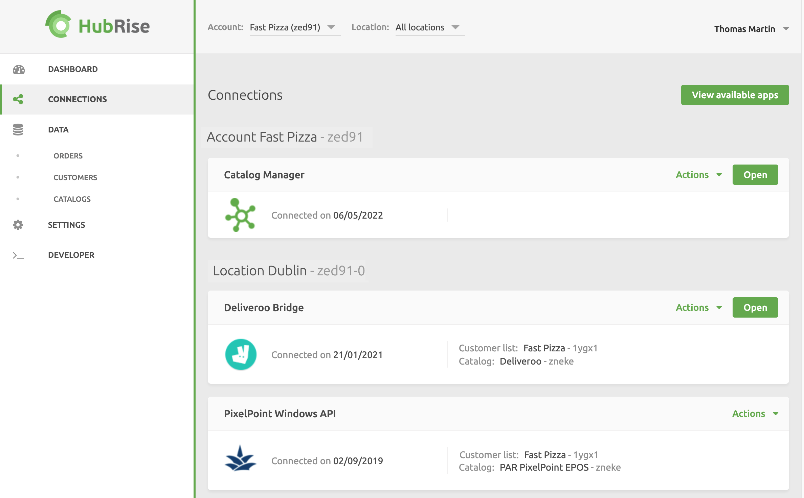
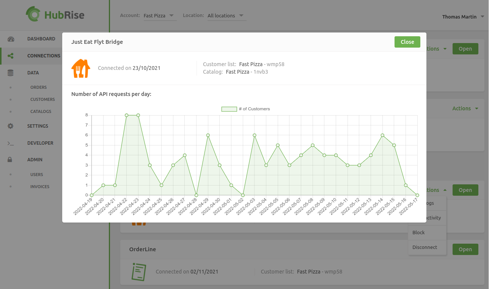
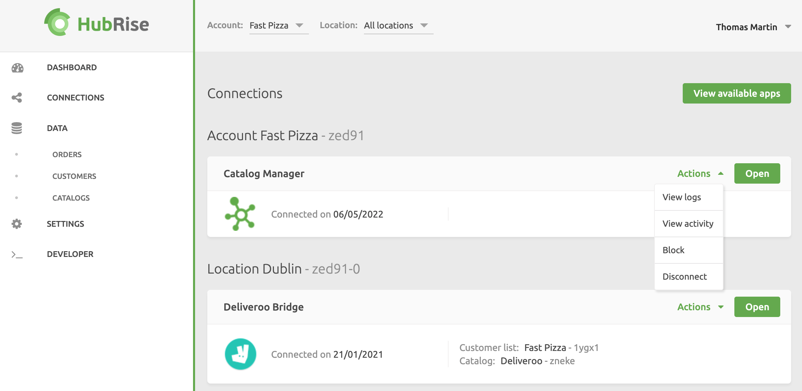

You can connect new apps and see apps connected to your HubRise Account from the **CONNECTIONS** page. From this page, you can also view apps activity and logs, and block or disconnect apps.

## Available Apps

HubRise is used to connect an ever growing ecosystem of solutions: EPOS, online ordering, food delivery platforms (including Deliveroo, Uber Eats and Just Eat), self ordering solutions, delivery management, delivery services, eMarketing (SMS/emailing), business intelligence, stock management, loyalty systems, and more. The number of compatible applications increases every month.

You can connect all apps available in the HubRise [Apps](/apps) page. If you cannot see an app you need to connect on this page, contact [contact@hubrise.com](mailto:contact@hubrise.com) to find out if an integration is planned.

## Connect a New App

Apps are connected to either a HubRise Account or Location. Connection level depends on the data you need to share with the app. For example, EPOS or online ordering systems typically connect to Locations, while marketing solutions connect to Accounts or Locations.

Some apps can be connected directly from the HubRise back office, while others require configuration from within the app before connection. For complete details, see the app documentation in the HubRise [Apps](/apps) page.

To connect a new app to your HubRise Account from the HubRise back office:

1. Log in to HubRise from the [HubRise Login page](https://manager.hubrise.com/login).
1. Click **CONNECTIONS** on the left navigation panel.
1. Select **View available apps**.
1. Select **All locations** or the **Location** to connect.
1. Select the app you want to install. If the app is not on this list, check the app documentation in the HubRise [Apps](/apps) page.
1. Check instructions for the specific app and click **Connect**. When installing a new app, you will be required to grant the app access to your HubRise Account.

Some apps must be connected at the **All locations** level, while others connect to a specific Location. The **Connect** button will be greyed-out if you have not selected the corresponding level.

---

**IMPORTANT NOTE**: If you need to connect multiple instances of the same app to a single HubRise location, see [Connecting Multiple Instances of the Same App](/docs/faqs/connect-multiple-instances-same-app).

---

## Open An App

Some apps can be accessed from HubRise. If so, you can open the app by clicking on **CONNECTIONS** and selecting **Open** for the specific app. The app will open in a new browser window.

## View Connection Activity

To display a line chart with the number of transactions made in the last 30 days, select **CONNECTIONS** > **Actions** > **View Activity**. This is a handy way to see if transactions are going through the connection.

---

**Related FAQ**: <Link to="/docs/faqs/check-connection-between-my-system-and-hubrise/">How Do I Check If the Connection Between My System and HubRise Is Working?</Link>

---

## View Connection Logs

Logs are stored for each app that has been connected. You can use logs to understand the communications between systems and detect issues.

To view logs for a connection, select **CONNECTIONS** > **Actions** > **View logs** for the specific app.

Logs record the requests from an app to HubRise. Each request is a transaction between an app and HubRise, such as an order, a new customer registration, or any other communication between an app and HubRise.

### General Information

At the top, the log page displays general information about the connection:

- **Access token**: The token used by the app to authenticate to HubRise.
- **Scope**: The connection permissions, such as whether the connection can access the Account or a single Location, what read/write access it has on the data, etc.
- **Customer list** and **Catalog**: Depending on the Scope, additional lines can display the ID for the resources that have been granted access to, such as the customer list and the catalog.

### Filter

Logs can be filtered by resource and method through the following process:

1. Select **Edit**.
1. Select the resources and methods that you want to display. To view all log records, uncheck all resources and methods, or click **Reset**.

### Logs

The logs page displays a summary list of requests in reverse chronological order.

Each log record includes:

- **Date**: The date and time of the request.
- **Resource**: The target of the request.
- **Method**: The HTTP method used in communicating the request.
- **Path**: The URL path for the request.
- **Response**: The HTTP response code.

You can see additional details by clicking on a log, including the request and the corresponding response.
To download either the request or response, select the download icon <InlineImage width="15" height="14"></InlineImage>. The selected request or response will be provided as a JSON file.

For more information, see [Understanding Logs in HubRise](/docs/hubrise-logs). For a complete reference on the HubRise API, see the [HubRise API Reference page](/developers/api/general-concepts).

---

**Related FAQ**: <Link to="/docs/faqs/check-connection-between-my-system-and-hubrise/">How Do I Check If the Connection Between My System and HubRise Is Working?</Link>

---

## Block or Disconnect App

Blocking an app temporarily prevents it from accessing HubRise API. At any time, you can unblock the app to restore access.

Disconnecting an app removes the connection between the app and HubRise. The app is notified of the disconnection, which may result in your account being reset or deleted on the app.

---

**IMPORTANT NOTE**: If you may use the app again, you should block it rather than disconnect it.

---

To block or disconnect an app from HubRise, follow these steps:

1. Go to **CONNECTIONS**.
2. Find the app you want, then click **Actions** > **Block** or **Disconnect**.
3. Click **Confirm**.

