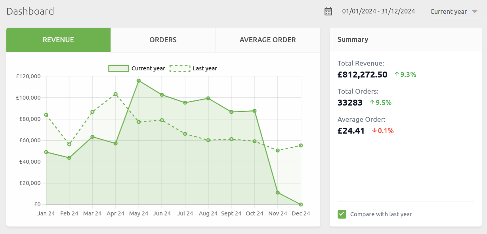
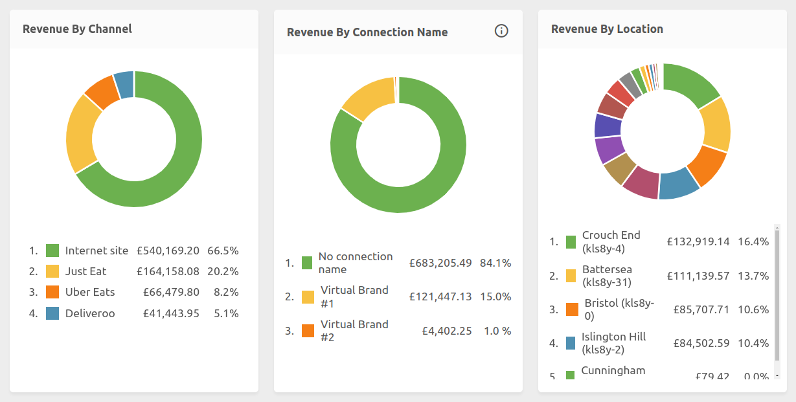
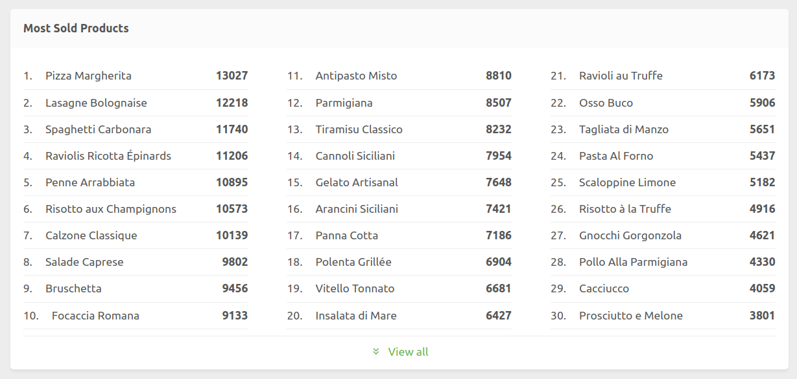

The Dashboard provides a comprehensive view of your business performance through an intuitive interface that displays your revenue trends, sales channel distribution, peak hours, and most-sold products.

## Interface Overview

You can access the Dashboard from the HubRise back office by clicking **Dashboard** in the left-hand menu.

Use the dropdown menu in the top bar to filter data by location, and select the time period using the date selector at the top right of the dashboard.

## Revenue And Trends

The line chart shows your revenue over time, with granularity adjusted according to the selected period's length. You can enable comparison with the previous period by clicking **Compare with (...)**.

The Summary section displays your performance indicators:

- Total revenue
- Number of sales
- Average basket

When comparison is enabled, each metric shows its evolution compared to the previous period. The previous period is adjusted to have the same length as the selected period and provide a fair comparison.

## Revenue Breakdown

Three charts break down your revenue:

- By sales channel (website, delivery platforms)
- By connection name (for virtual brands)
- By location

This multi-dimensional view helps you understand the contribution of each revenue source.

## Peak Hours Analysis

The peak hours table displays your sales volume by day of the week and time of day. This helps you identify your busiest periods to optimise your staffing, promotions, and procurement.

## Most-Sold Products

The products ranking shows your 30 most popular items. Click **View all** to display the complete list. Like all other views, you can filter this data by location and date range.

## Advanced Reporting

For more detailed analysis of your data, you can connect a specialised solution integrated with HubRise or integrate your own proprietary solution.
Technical partners offering detailed reporting are available in the HubRise website Apps page, under the [Operations and Inventory](/apps#operations-and-inventory) section.
