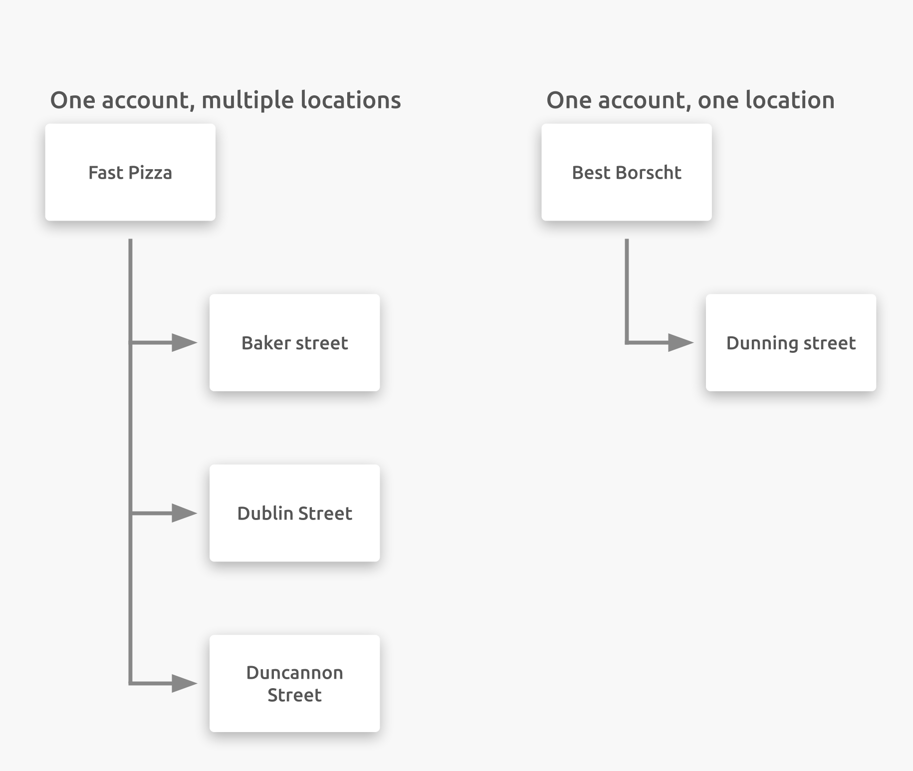
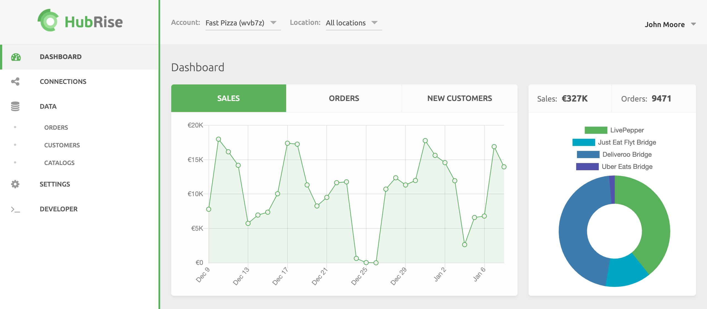

You can access HubRise from a web browser on any device: your desktop, tablet, or smartphone.

## Create a User Profile

To start using HubRise, create a User Profile. Registration is free, and only takes a minute. All you need is a name, email address, and secure password. Visit the [HubRise Registration page](https://manager.hubrise.com/signup) to create a new user profile.

---

**Related FAQ**: How Do I Create a User Profile for [Another Person](/docs/faqs/create-a-user-profile-for-another-person) or for [Another Business?](/docs/faqs/create-an-account-for-another-business-share-access)

---

## Create an Account {#create-account}

When you log in to HubRise for the first time, you will be asked to create an Account and a Location.
A HubRise Account identifies your brand, while a Location refers to the point of sales within this brand, typically the physical outlet.

- The **Account Name** is the name of your business or brand, for example `Fast Pizza`.
- The **Location Name** identifies your physical outlet, and could be the city, the area, or the street name. For example, if the location is the only one in London, the Location name could be `London`. If you have multiple locations in London, you could name them after their street address, for example `Baker Street`, `Dublin Street`, and `Duncannon Street`.

---

**IMPORTANT NOTE:** Make sure you select the correct **Currency** from the dropdown menu, as you will not be able to change it later.

---

A small business will have one Account with one Location, while a larger business will have one Account with multiple Locations. For more information, see [Accounts](/docs/account) and [Locations](/docs/locations).

A User Profile can have access to multiple Accounts. On the other hand, different User Profiles can have access to the same Account with different permission levels. For more information, see [Permissions](/docs/permissions).

## Set Language Preference

You can set the language for your HubRise session by clicking the down arrow <InlineImage width="28" height="21"></InlineImage> next to your name in the upper right hand corner, and selecting your preferred language. HubRise is available in English and French.

## Get Familiar With the Platform

The HubRise interface is organised into the following sections:

- **DASHBOARD**: Get an overview of your organisation's sales, orders, and new customers.
- **CONNECTIONS**: Connect new applications to your HubRise Account, and manage your existing connections.
- **DATA**: View orders, catalogs, customers and corresponding logs across your locations.
- **SETTINGS**: Add new locations, manage employee access and roles, view platform usage, check payment history or payment methods.
- **DEVELOPER**: Access for developers to integrate new applications with HubRise.

If you want to get an overall view of an Account's performance, select **All locations**. If you want to narrow results to one Location within an Account, select the Account then the corresponding Location.

- For users with access to multiple Accounts, click the down arrow <InlineImage width="28" height="21"></InlineImage> next to **Account** and select the Account to display.
- To display data on all Locations or for a specific Location, click the down arrow <InlineImage width="28" height="21"></InlineImage> next to **Location** and select either **All locations** or the specific location.

## Log In

To log in to HubRise, visit the [HubRise Login page](https://manager.hubrise.com/login) or the [HubRise home page](https://www.hubrise.com). Enter your email address and password, then click **Login**.

---

**Related FAQ**: [How Do I Check If I Already Have a User Profile in HubRise?](/docs/faqs/check-if-i-already-have-a-user-profile-in-hubrise)

---

## Log Out

To log out of HubRise, click the down arrow <InlineImage width="28" height="21"></InlineImage> next to your name in the upper right hand corner, then select **Log out**.

By default, you will be automatically logged out of your session after six months of inactivity.
