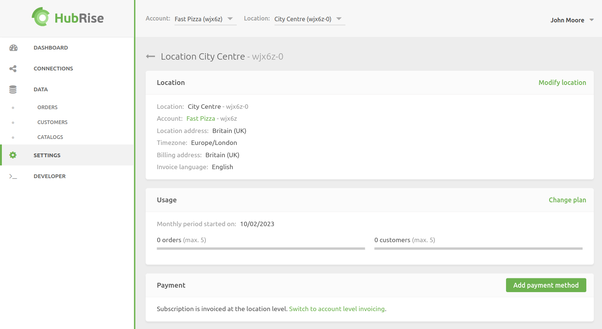
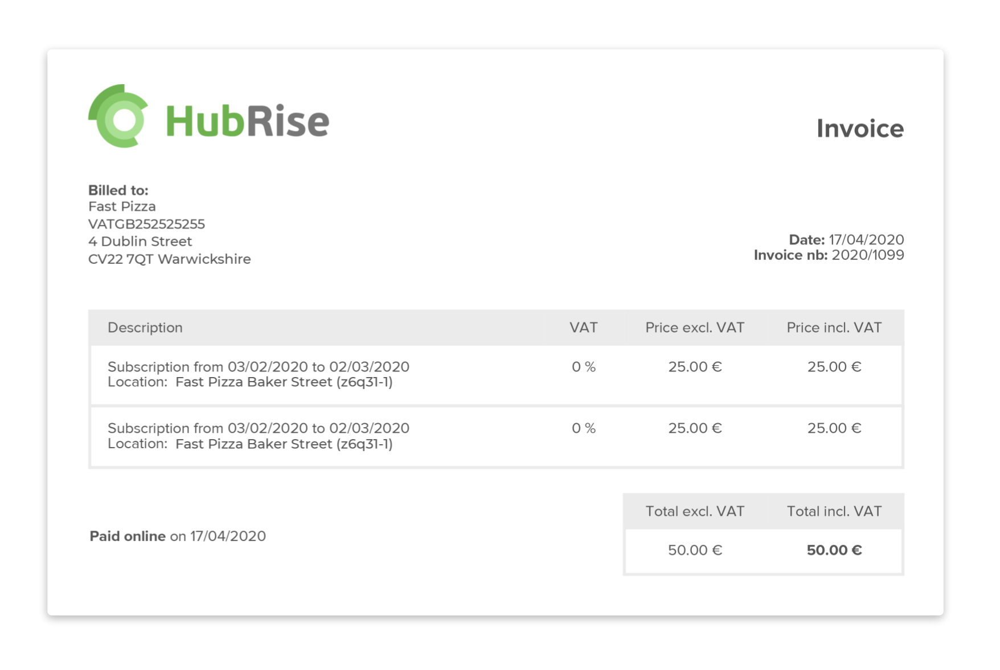

Accounts and Locations set up with a paid plan will pay a monthly subscription to HubRise when they exceed the free [usage](/docs/usage-plan#usage-plans) limit. For complete pricing information, see the [HubRise Price page](/pricing/).

You can set up your payment method in the **SETTINGS** > **Payment** section. You must have a credit card to automate payments. Direct debit is not available. Wire transfer is accepted for a minimum of 12 months usage.

Subscription payments are in EUR, regardless of the Account currency.

## Account or Location Payments

Your HubRise subscription can be invoiced at the Account level, or at the Location level.

Account level invoicing is the default and preferred choice. If you have multiple Locations, you can set up a single payment method and manage a single invoice for all your Locations.

However, if some of your Locations are not part of the same legal entity and need to be billed separately, you can set up Location level invoicing for these Locations. This will allow you to set up a separate payment method and receive a separate invoice for each Location.

### Switch To Location Level Invoicing

To set up Location level invoicing for a specific Location, follow these steps:

1. If you have access to multiple Accounts, select the **Account** containing the specific Location.
1. Select the Location from the **Location** dropdown.
1. Go to **SETTINGS**.
1. Under **Payment**, click **Switch to location level invoicing**.
   

### Switch To Account Level Invoicing

To set up Account level invoicing for a specific Location, follow these steps:

1. If you have access to multiple Accounts, select the **Account** containing the specific Location.
1. Select the Location from the **Location** dropdown.
1. Go to **SETTINGS**.
1. Under **Payment**, click **Switch to account level invoicing**.
   

With Account level invoicing, the Location billing cycle will match the Account billing cycle. If the current billing date for the Location is different from that of the Account, the following situations can happen:

- If the Location next billing date is before the Account next billing date, you immediately receive a prorated charge to align the Location next billing date to the Account's.
- If the Location next billing date is after the Account next billing date, nothing changes until the Account next billing date. At that point, you receive a prorated charge and the Location next billing date aligns with the Account's.

## Billing Cycles

Billing Cycles are a month in duration, and start on the same calendar day the Account is created. The start date of the Billing Cycle cannot be changed.

For example, if you open your HubRise Account on March 17, you will be billed on the 17th day of each month. The billing cycle of each Location will match.

## Edit Billing Information

Billing information included in invoices can be configured at the Account and Location levels.

1. Go to **SETTINGS**.
1. In the **Location** dropdown, select the Location you want to edit, or **All locations** to edit your Account billing information.
1. Click **Modify account** or **Modify location**.
1. Fill in the information required under **Billing details**.
1. Click **Update**.

## Add a Payment Method

To add or update a payment method at the Account level, follow these steps:

1. Go to **SETTINGS**.
1. If you have access to multiple Accounts, select the **Account**, then scroll down to the **Payment** section.
   
1. If there is no existing payment method, click **Add payment method**. If there is a previously set method, click **Change your payment method**.
1. Enter your credit card information. Credit cards must be valid to be accepted.
1. When finished, click **Save**.

To add or update a payment method at the Location level, follow these steps:

1. Go to **SETTINGS**.
1. If you have access to multiple Accounts, select the **Account** containing the specific Location.
1. Select the Location from the **Location** dropdown, then scroll down to the **Payment** section.
   
1. If there is no existing payment method, click **Add payment method**. If there is a previously set method, click **Change your payment method**.
1. Enter your credit card information. Credit cards must be valid to be accepted.
1. When finished, click **Save**.

## Remove a Payment Method

To remove a payment method, follow these steps:

1. Log in to your [HubRise account](https://manager.hubrise.com).
1. If you have access to multiple Accounts, select the relevant Account.
1. Go to **SETTINGS**.
1. To check for payment set at Account level, verify that **All locations** is selected. To check for payment set at Location level, select the Location from the Location dropdown.
1. In the Payment section, click **Delete** and **Confirm** in the dialog prompt.

---

**Related FAQ**: [How Do I Stop Paying For My Subscription?](/docs/faqs/stop-paying-subscription/)

---

## Process Requests for Payment

When you change your plan, the payment must be authorised before the credit card can be charged. Admin users will receive notifications reminding them to complete the payment process. For more information on notifications, see [Plan Notifications](/docs/usage-plan/#plan-notifications).

To process a Request for Payment from the notification:

1. Connect to your HubRise back office.
1. Ensure that a credit card is saved to your Account or Location. This can be verified on your **SETTINGS** page. If not, see the instructions in [Add a Payment Method](#add-a-payment-method).
1. Click **pay it online or download the PDF**, then click **Pay**. To check on all Requests for Payment, go to **SETTINGS**.

---

**Related FAQ**: [What Happens If My Free Plan Quota Is Exceeded?](/docs/faqs/free-plan-quota-exceeded-what-happens/), [How Do I Pay For My First Invoice?](/docs/faqs/pay-first-invoice/), [Can My Plan Be Paused During Setup and Test Phases?](/docs/faqs/pause-plan-during-setup-and-test-phases/)

---

## Payment Automation

For compliance with 3D Secure banking protocols, which enhance online payment security, the initial **Request for Payment** requires manual payment on HubRise. This means that you must connect to your HubRise account to pay. 

Once this initial payment is made, subsequent payments to HubRise will be automated until you change your usage plan or your payment method expires. For more information about HubRise usage plans, see [Usage and Plans](/docs/usage-plan/).

Occasionally, your bank may request 3D Secure authentication again. When this happens, an automated email will be sent to all HubRise account **Admin** users, prompting them to process the payment manually. If you are frequently asked to make manual payments, consider contacting your bank to request that they accept card debits from HubRise.

## Payment History

Admin users receive payment notifications and invoices via email. Invoices are also available for download from the HubRise back office.

To view your payments history:

1. Go to **SETTINGS**.
1. If you have access to multiple Accounts, select the **Account** you are interested in.
1. If payment is done at Account level, verify that **All locations** is selected. If payment is done at Location level, select the Location from the **Location** dropdown.
1. Under **Payment**, click on **Payment history**. Payments are listed in reverse historical order, with the most recent payments displayed first.

Payment history for Accounts will group Location payments for the date.

The first time you make a payment, the payment is identified as **Plan upgrade**. Subsequent payments will be listed with the date of the [billing period](docs/payment#billing-cycles). Once you have a valid payment method saved, payments are automated.

Details within each invoice can be viewed directly on the HubRise back office by clicking on the date. Each payment will display:

- **Date**: The payment date.
- **Amount excl. VAT**: The payment amount excluding value-added tax (VAT). HubRise being headquartered in France, VAT only applies to companies based in France and Monaco.
- **Description**: The period and locations covered by the payment.
- **Payment Method**: The payment method used.

Invoices can also be saved as PDF files by selecting the download icon <InlineImage width="15" height="14"></InlineImage>.

## Billing Accounts

As a software provider, reseller, or consultant, you might choose to manage HubRise subscription payments on behalf of your clients for several reasons. For instance, you might be offering HubRise as a white-label service, your client may prefer a full service without receiving invoices from a third party, or you might be seeking to take advantage of volume discounts on the HubRise subscription.

To do this, you can easily include your payment details in your client's account. In this scenario, HubRise will invoice you monthly for each of the accounts separately. If you have many such accounts on HubRise, you will not avail of volume discounts.

A better alternative would be for HubRise to create a **Billing Account** on HubRise for your organisation. The billing account is a special type of account that is used to attach other HubRise accounts and locations. Invoices generated from attached accounts or locations are combined into a single monthly invoice, and the volume discount will apply.

Partners are autonomous in the configuration of their billing account on HubRise. They should attach and detach entities as needed, provide billing details, and add a payment method.

### Attach Entities

To attach an entity to your billing account, follow these steps:

1. Log in to your [HubRise account](https://manager.hubrise.com).
1. Select your HubRise billing account. This account will have your company name followed by **Billing**.
1. Navigate to the **SETTINGS** page.
1. Click **Attach an entity**. 
1. Choose either the **Attach an account** or **Attach a location** option, depending on your needs.
1. Find the account you want to attach from the **Select an account** dropdown. This list will only display accounts and locations to which you have access and that are not already attached.
1. Click **Attach**. 
1. Repeat the process as many times as needed.
1. Return to your **SETTINGS** page and check that all entities you attached are visible in the **Entities attached to this billing account** section.

   

---

**IMPORTANT NOTE**: **Requests for Payment** will accumulate, and you will receive a monthly request for payment for all entities attached to your billing account. It is not possible to transfer a **Requests for Payment** that has already been issued on an account or location, prior to its attachment to your billing account.

---

### Detach Entities

To detach an entity from your billing account, and no longer be billed for it, follow these steps:

1. Log in to your HubRise **Billing** account, **SETTINGS** page.
1. Section **Entities attached to this billing account**, click on the bin icon located on the far right side to detach entities.

### Billing Details

To configure your billing information included in HubRise invoices, follow these steps:

1. Log in to your HubRise **Billing** account, **SETTINGS** page.
1. Select **Modify account**.
1. Fill in the information required under **Billing details**.
1. Click **Update**.

For more information, see section [Edit Billing Information](#edit-billing-information)

### Add a Payment Method

1. Log in to your HubRise **Billing** account, **SETTINGS** page.
1. Click **Add payment method** and enter your credit card information. Credit cards must be valid to be accepted.
1. When finished, click **Save**.

For more information, see section [Add a Payment Method](#add-a-payment-method)