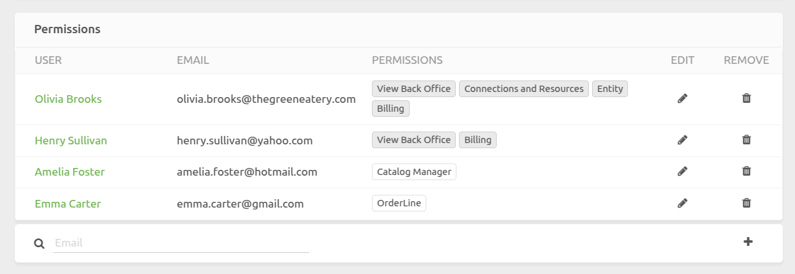
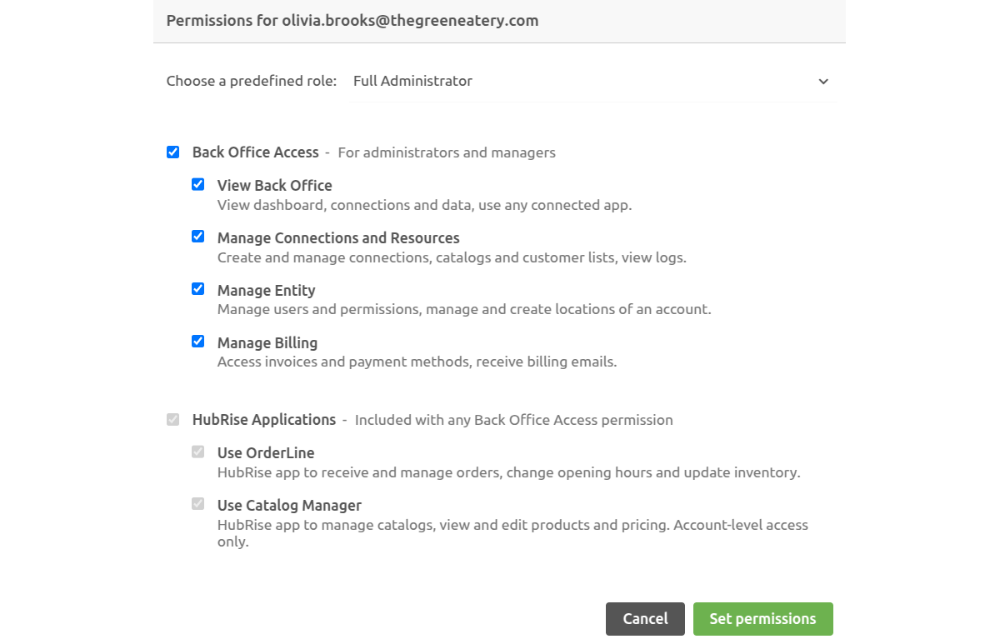
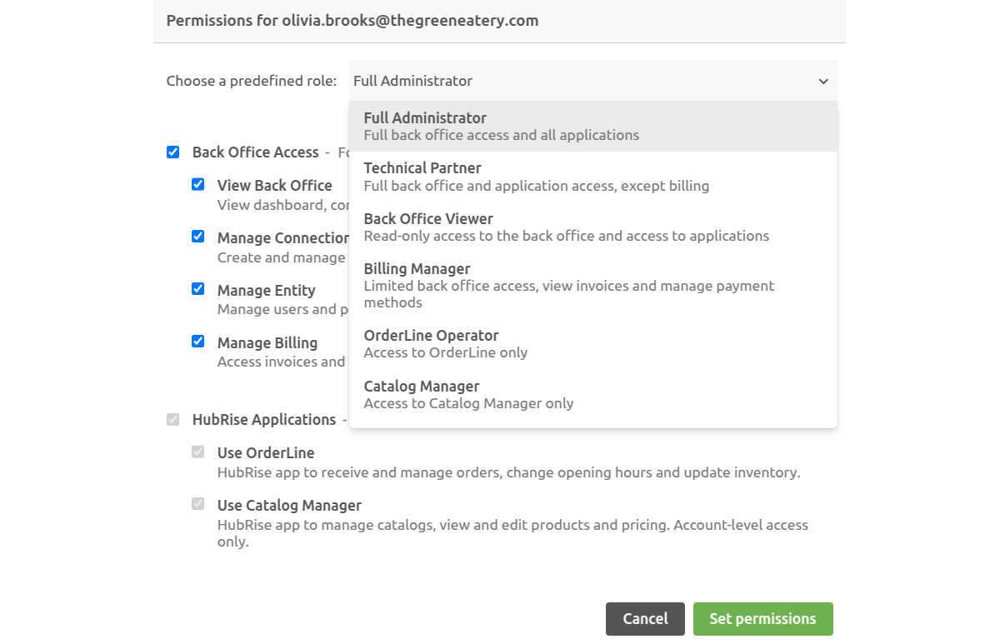
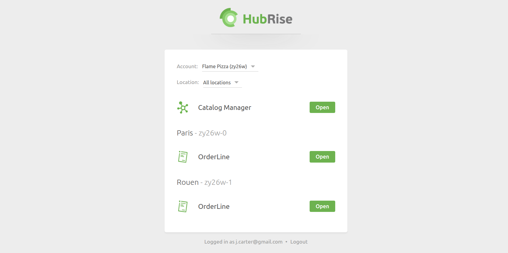
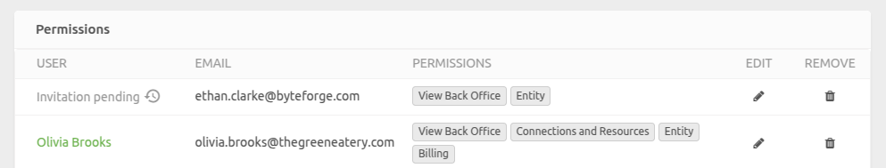
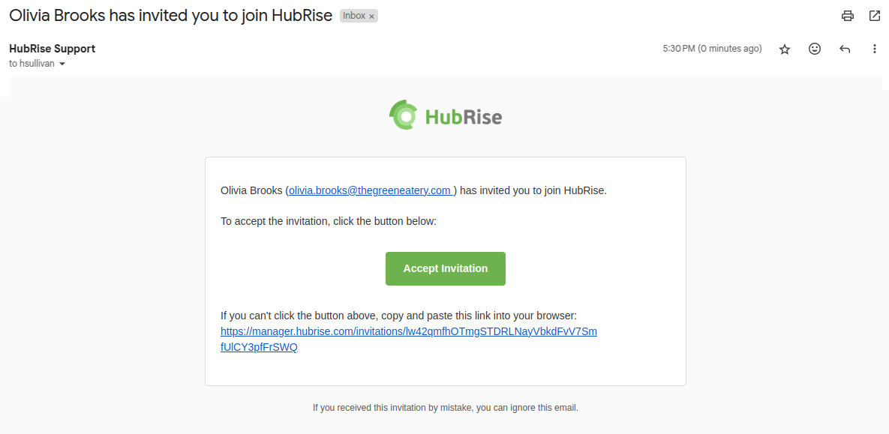
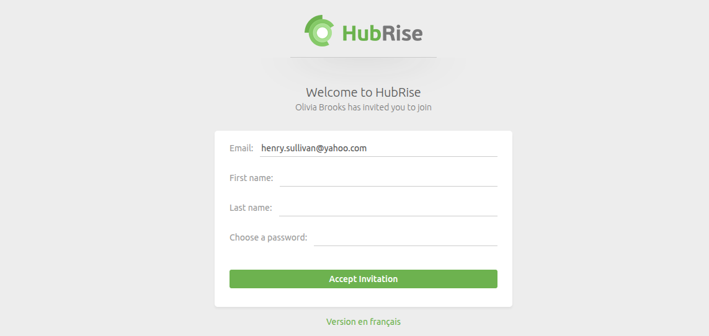

Permissions control the actions that a User can perform on an Account or Location in HubRise. You can manage user permissions from the **Permissions** section in the **SETTINGS** page.

## Roles and Permissions

HubRise offers flexible permission management. You can assign predefined roles or manually grant specific permissions to a User.

### Available Permissions

Permissions are divided into two categories:

#### Back Office Access (Privileged Access)

- `View Back Office`: Access the dashboard, connections, and data.
- `Manage Connections and Resources`: Create and manage connections, catalogs, and customer lists.
- `Manage Entity`: Manage users, permissions, and locations.
- `Manage Billing`: Access invoices and payment methods.

#### HubRise Applications (Restricted Access)

Access to specific HubRise applications can be granted individually:

- `Use OrderLine`: Allows order reception and updates, modification of opening hours, and product availability.
- `Use Catalog Manager`: Allows viewing and editing of product catalogs.

### Predefined Roles

HubRise provides predefined roles to simplify permission assignment:

- **Full Administrator**: Access to all features, including user management, connection settings, and invoicing.
- **Technical Partner**: Access to all features except invoicing.
- **Back Office Viewer**: Read-only access to the back office and all applications.
- **Billing Manager**: Limited back office access, including invoice viewing and payment method management.
- **OrderLine Operator**: Restricted access to the OrderLine application.
- **Catalog Manager**: Restricted access to the Catalog Manager application.
- **Custom Role**: Allows manual assignment of specific permissions to a User.

### Permission Assignment Rules

When assigning permissions to an Account or Location, the following rules apply:

- At least one User must have the `Manage Entity` permission on an Account.
- `Use Catalog Manager` is only available at the Account level.
- Any back office permission grants access to `Use OrderLine` and, if assigned at the Account level, `Use Catalog Manager`.
- `View Back Office` is required for any other back office permission.

## Portal Page

Users with the `Use OrderLine` or `Use Catalog Manager` permissions, without any back office permissions, are redirected to the **Portal page** upon login. From this page, they can only access their assigned applications.

This setup allows your employees to manage only orders or product catalogs without accessing your sensitive information.

## Add or Invite a User {#add-user}

Users with the `Manage Entity` permission can add or invite users, and assign specific permissions.

### Add an Already Registered User

If the user is already registered in HubRise:

1. Go to **SETTINGS** > **Permissions**.
2. Enter the user's email address next to the magnifying glass icon. Their name will appear automatically.
3. Select the permissions to assign.
4. Click **Add User**.

The user will be added immediately and will appear in the permissions list with their assigned access. No further action is required.

### Invite a New User

If the user does not yet exist in HubRise:

1. Go to **SETTINGS** > **Permissions**.
2. Enter the user's email address next to the magnifying glass icon. The message **No user found with this email** will appear, indicating that the user will be invited.
3. Select the permissions to assign.
4. Click **Add User**.

After clicking **Add User**:

- The user will appear in the permissions list with an **Invitation pending** marker:
  

- They will receive an invitation email with a link to create their password.
  

- The user must click the link in the email to set their password:
  

- Once the user sets their password, they will have access to HubRise with the assigned permissions.

### Resend an Invitation

If the user did not receive the invitation email or lost the link, you can resend the invitation:

1. In **SETTINGS** > **Permissions**, click the clock icon next to the **Invitation pending** label.
2. Confirm the resend.

## Modify a User's Permissions

1. In **SETTINGS** > **Permissions**, click the pencil icon next to the User, or click directly on their permissions.
2. Select a predefined role or configure a custom role by ticking/unticking the available permissions.
3. Click **Set Permissions**.

---

**IMPORTANT NOTE:** If you remove your own `Manage Entity` permission, you will need another User with this permission to reassign it to you.

---

## Remove a User {#remove-user}

1. In **SETTINGS** > **Permissions**, click the bin icon next to the User.
2. Confirm the removal.

An Account cannot be left without a User with the `Manage Entity` permission. If you need to remove the last User with this permission, first assign it to test@hubrise.com before proceeding.
