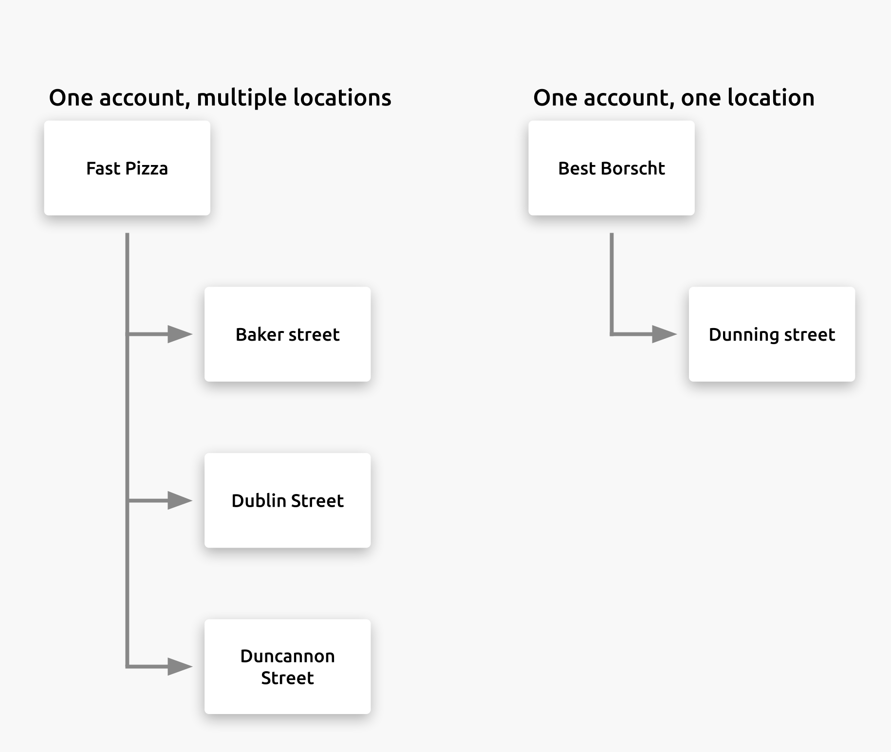

This page describes the basic HubRise concepts of user profile, account, and location, and will help you understand the rest of the documentation.

## User Profile

To use HubRise, you need a User Profile, identified by an email address and secure password. Anyone can create a User Profile, and the registration takes only a minute. Visit the [HubRise Registration page](https://manager.hubrise.com/signup) to create a new User Profile.

## Accounts and Locations

A HubRise Account identifies your brand, while a Location refers to the point of sales within this brand, typically the physical outlet.

For example, a small business might have one Account with one Location, while a larger business might have one Account with multiple Locations tied to the same Account.
For more information, see [Accounts](/docs/account/) and [Locations](/docs/locations/).

A User Profile can have access to multiple Accounts. On the other hand, different User Profiles can have access to the same Account with different permission levels. For more information, see [Permissions](/docs/permissions/).
