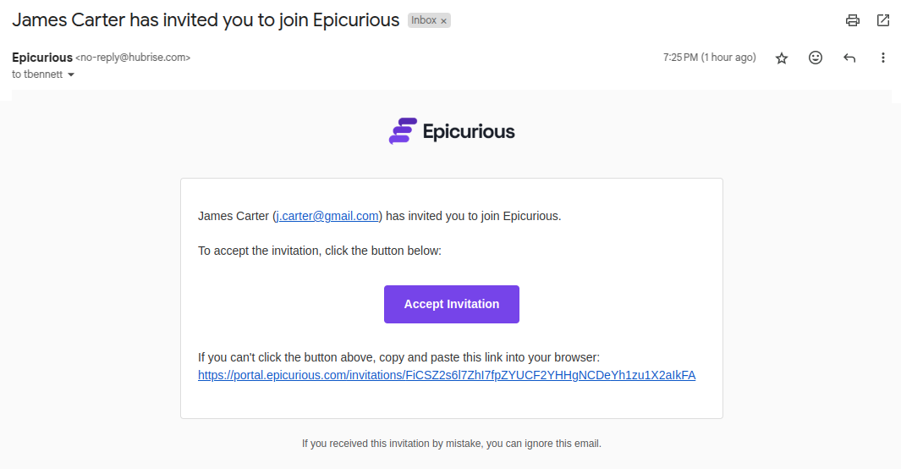

The **HubRise White Label** programme allows selected partners to offer HubRise solutions under their own brand. This programme is designed for software vendors, resellers, and chains with at least ten locations.

## What is HubRise White Label?

With HubRise White Label, partners can customise the appearance of certain HubRise applications to align with their visual identity. The following applications can be customised:

- [OrderLine](/apps/orderline/overview): an order centralisation application.
  

- [Catalog Manager](/apps/catalog-manager/overview): a product catalog management application.
  

- White Label Portal: A login interface for end users.

For each application, the following elements can be customised:

- Colours, name, logo, and favicon to reflect the partner’s visual identity.
- Domain name (such as _orders.flame-pizza.com_ ) to reassure end users.

However, the HubRise back office cannot be customised. It remains accessible to the partner’s internal teams, who can grant end users access to the white-label applications.

## Managing Users and Access

### Adding a User

To invite a user to your White Label environment, follow the steps outlined in the [Add a User](/docs/permissions#add-user) section.

- If the user does not yet exist in HubRise, they will receive a personalised email invitation with a link:
  

  They can click the link to accept the invitation, choose a password, and access your White Label environment:
  

- If they are already registered in HubRise, they will not receive an email but can immediately use their new permissions.

### Accessing the White Label Portal

Once logged in, the user lands on the White Label Portal, an interface under your brand that centralises access to available applications.


On this portal, the user sees the applications under the chosen name, with your favicon and colours. They can click an application to open it in a new tab. The available applications depend on their permissions:

- Catalog Manager, if the **Use Catalog Manager** permission is granted and an account is selected.
- OrderLine, if the **Use OrderLine** permission is granted.

### Testing the White Label Portal

To open the White Label Portal and test the user experience, log in to your HubRise account, go to the **CONNECTIONS** page, and click **White Label Portal** at the top right.

## Setup and Configuration

To activate HubRise White Label, contact your Partner Manager or email contact@hubrise.com.

For each application, the following information will be required:

- **Application Name**: The name displayed in the interface, e.g. _Flame Pizza Orders_.
- **Domain Name**: A custom subdomain for the application, e.g. _orders.flame-pizza.com_. You must own the main domain.
- **Primary Colour**: The dominant colour, mainly used for buttons and navigation elements. It must provide sufficient contrast on a white background.
- **Logo**: An image with a width/height ratio between 2:1 and 6:1, in PNG, JPEG, or WEBP format.
- **Favicon**: A 64x64 px image in PNG format.

Your Partner Manager will be able to advise you on the customisation of your applications.

### Configuring Subdomains

To make your applications accessible on your domain, you must configure a subdomain for each application. This is done through your domain provider’s management interface (e.g. GoDaddy, Namecheap, OVH, etc.).

Add a `CNAME` record for each application as shown below:

```
menus  300 IN CNAME catalog-manager.hubrise-apps.com.
orders 300 IN CNAME orderline.hubrise-apps.com.
portal 300 IN CNAME manager.hubrise.com.
```

Each line represents a DNS entry:

- The first field is the chosen subdomain (e.g. `menus`).
- The second field (`300`) is the cache duration (TTL) in seconds.
- `IN CNAME` indicates an alias pointing to another domain.
- The last field is the target address, which must be used as is.

For example, if your domain is _flame-pizza.com_, OrderLine will be accessible at _orders.flame-pizza.com_, and your White Label Portal at _portal.flame-pizza.com_.

Once the subdomains are added, inform your Partner Manager. They will generate SSL certificates for your applications within two business days, with no further action required on your part.
