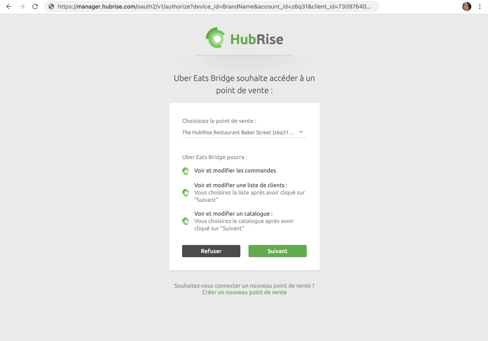
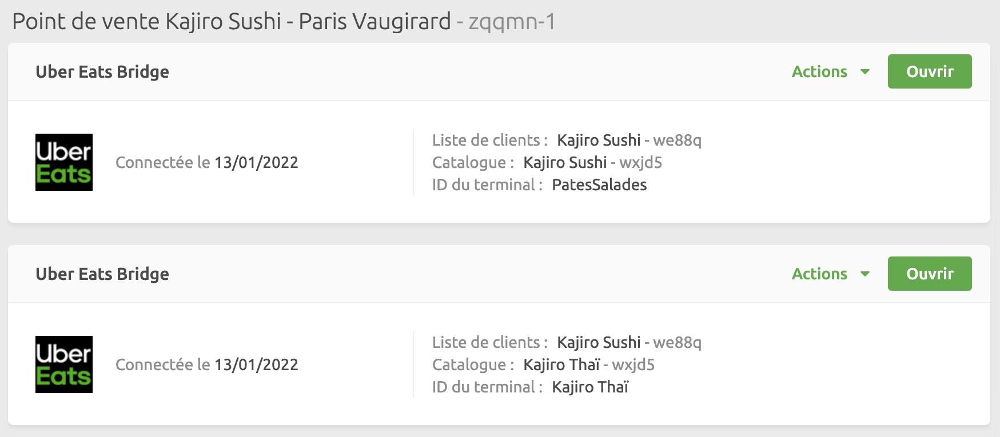

Dans certains cas, il se peut que vous ayez besoin de connecter plusieurs fois de la même application à un seul et même point de vente HubRise. Vous pouvez par exemple exploiter plusieurs magasins sur une plateforme de livraison de repas et souhaiter les connecter au même logiciel de caisse.

Pour connecter la première application, voir la rubrique [Connecter une nouvelle application](/docs/connections#connect). Si vous avez déjà connecté l'application, il est inutile d'accomplir à nouveau cette étape.

Pour connecter une deuxième fois la même application, procédez comme suit :

1. Connectez-vous à HubRise à partir de la [page de connexion à HubRise](https://manager.hubrise.com/login).
2. Cliquez sur **CONNEXIONS** dans la barre de navigation de gauche.
3. Sélectionnez **Voir les apps disponibles**.
4. Sélectionnez la même application que celle que vous avez installée précédemment, puis cliquez sur **Connecter**.
5. Sur la page d'autorisation, sélectionnez le point de vente HubRise correct dans le menu déroulant.
6. Cliquez sur l'adresse URL dans la barre de navigation et incluez l'instruction `device_id=NomDeLaMarque&` après la portion initiale de l'URL : `https://manager.hubrise.com/oauth2/v1/authorize?`, et avant `account_id=`. Le paramètre « NomDeLaMarque » dans l'instruction `device_id=NomDeLaMarque&` doit être remplacé par le nom de la marque. Pour plus d'informations, voir la rubrique [Règles de nommage](#naming-rules).
   
7. Puis, appuyez sur la touche Retour de votre clavier.
8. Cliquez sur **Autoriser** pour connecter l'application.
9. Suivez les instructions à l'écran pour configurer la nouvelle instance de l'application. Pour plus de détails, cliquez sur le lien **Afficher la documentation** de l'application correspondante sur la [page des applications HubRise](/apps).

Si votre application n'est pas présente sur la page des applications HubRise mais qu'elle se connecte correctement à HubRise à partir de son propre back-office, vous pouvez également la connecter plusieurs fois. Il vous suffit de procéder selon les étapes 5 et suivantes lorsque vous êtes redirigé vers la page d'autorisation.

---

**REMARQUE IMPORTANTE** : ce processus peut être répété indéfiniment en remplaçant à chaque fois la chaîne `device_id=n&` par une valeur `n` différente. L'attribution d'une valeur pertinente au paramètre `device_id` peut vous aider à différencier vos différentes instances sur la page **CONNEXIONS**. Lorsque vous choisissez cette valeur, suivez les règles de nommage décrites ci-dessous.

---

Une fois connectée, la nouvelle l'application apparaît sur la page **CONNEXIONS**.
Les différentes connexions de la même application se distinguent selon la valeur de l'identifiant de l'application que vous avez choisi au moment de la configuration.

## Règles de nommage {#naming-rules}

Pour identifier plus facilement les différentes connexions de la même application, vous pouvez choisir librement la valeur de l'identifiant de l'application lors de la configuration initiale.
Dans `device_id=NomDeLaMarque&`, « NomDeLaMarque » peut inclure une combinaison quelconque des caractères suivants :

- Lettres majuscules et minuscules
- Chiffres
- Traits de soulignement
- Tirets
- Parenthèses, crochets et accolades
- Points

Si vous souhaitez inclure un espace dans NomDeLaMarque pour des raisons de lisibilité, remplacez l'espace par un `+`. Par exemple, Papa John's Maroc deviendra `Papa+John's+Maroc`.
